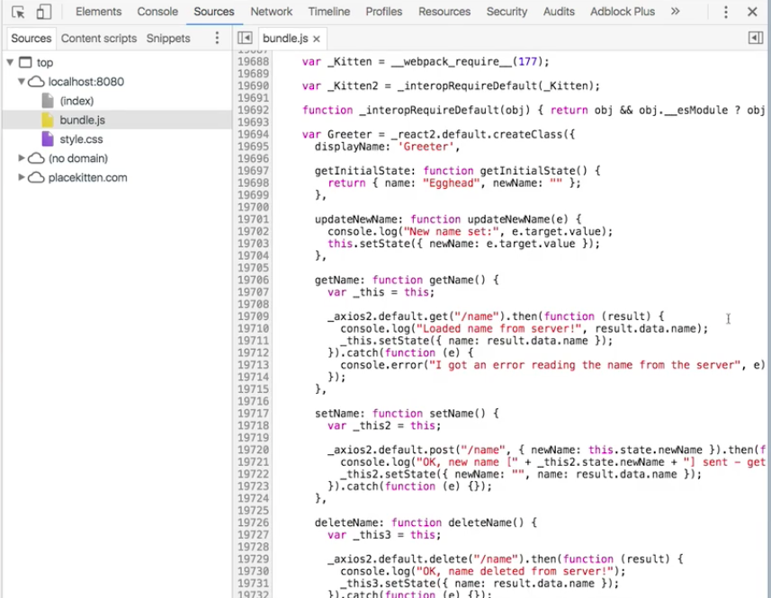
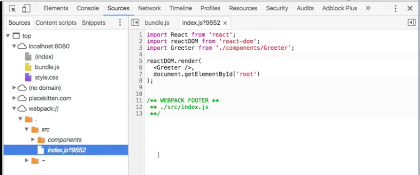
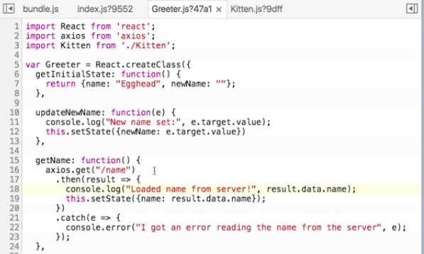

It's pretty cool how using today's tooling we can write really relatively little code in order to get some pretty powerful results. Looking at our little sample application here, this is a React application. I've got my index file, which is rendering what I'm calling my greeter. That's like saying, `Hello Egghead`, and allowing me to change my name. Then it embeds this kitten.

**index.js**
```html
import React from 'react';
import reactDOM from 'react-dom';
import Greeter from './components/Greeter';

reactDOM.render(
  <Greeter />,
  document.getElementById('root')
);
```

**Greeter.js**
```javascript
var Greeter = React.createClass({
  getIntitialState: function() {
    return {name: "Egghead", newName: ""};
  },

  ...
});
```

I've got 40 lines of code here. This is our complete application takes about a 100 lines of code to build. That's not very much code. That should be pretty easy to debug that when it's running.

If we for instance click this and we want to take a look at where this particular `console.log` statement came from, we can click the source. That pulls us over into our sources tab into bundle.js. It takes us to line, whoa, 19,710 to get to that particular console.log statement. What happened? How did we go from 100 lines of code to 19,000?



This is what we call in professional terms dependency hell. Not only do we have our code, we've pulled in `React`, we've pulled in `Axios`, we've pulled in all of their different dependencies. The thing that enables these modern frameworks to be so powerful is that they write a lot of code that you don't have to write. But that code still has to get written. **That code still has to be a part of what gets sent to the browser.**

The browser needs more than just our 100 lines in order to function. By using modern compilers, a lot of that stuff just gets bundled into a single optimized `bundle.js` file. That's what the browser sees. This can be really tricky to debug.

Fortunately there's a great technique that's available. Depending on your build tool, this will work a little bit differently, but the name for this is **source mapping**. If we go over here and we look at our `webpack.config.js`, we can actually provide a field here in the webpack configuration called `devtool`. It's got a variety of these available. Let's just use this one for now.

**webpack.config.js**
```javascript
module.exports = {
  devtool: '#eval-source-map',
  ...
}
```

This is going to create a source map for us so that when our application builds, it's going to provide a mapping from the giant `bundle.js` file to our elegant, small source files. Now that I've got that turned on, if I refresh my page, I'm going to see that I've actually got one more source here in my list of sources. This is stuff being provided by webpack itself. Webpack is now allowing me to look directly at my source files.



Here's that very nice, short `index.js` page. Here's our `Greeter.js`. Here's our `Kitten.js`. This looks just like what we have in our sources. This is great because if I then click get name from server,


now instead of sending me to line 19,710 in `bundle.js` instead it's sending me to line 18 of `Greeter.js`.



I click that, and you can see the source map allowed the texting here to get split up and organized and represented here in a much smaller unit so that it's easy for me to step through and understand where did this come from? What's calling it? By source mapping your JavaScript, **you can also source map your CSS if you're using something like Less or Sass**.

Including these files is really powerful for debugging. Chrome's `Sources` panel plays very nicely with them.