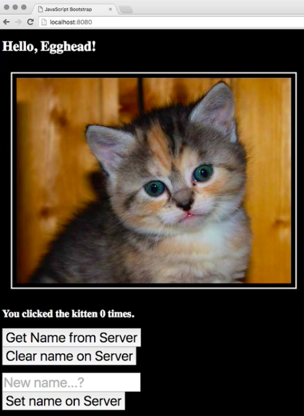
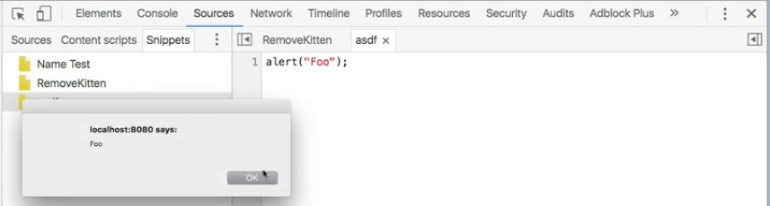
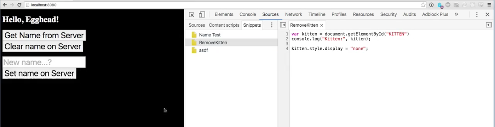
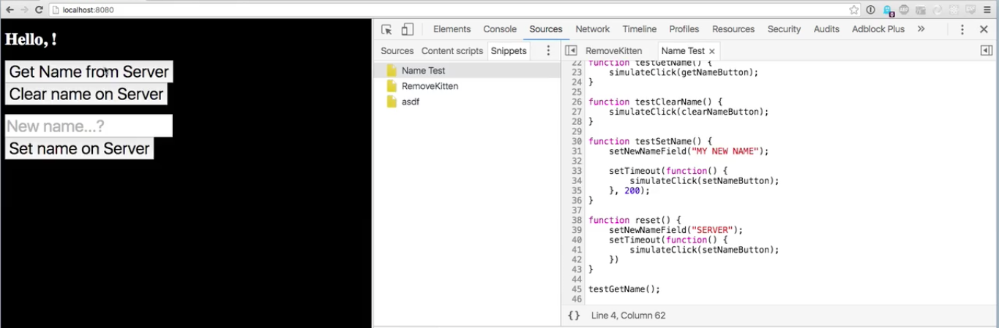
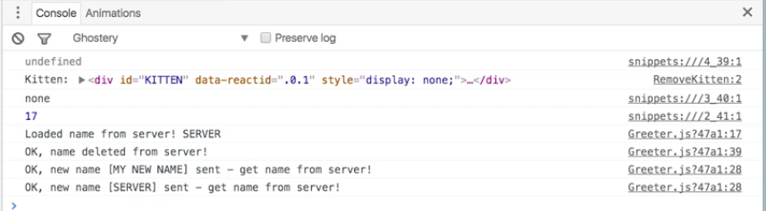
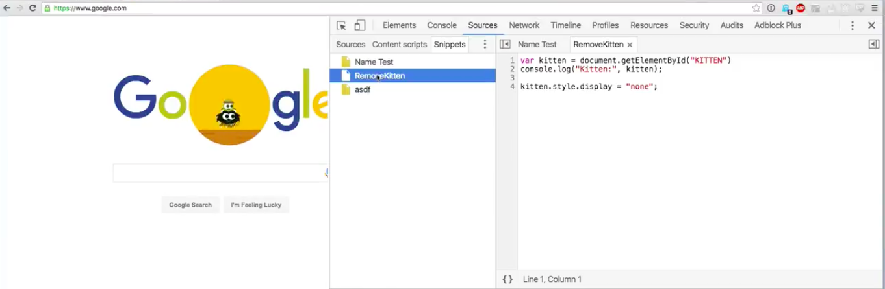

A lot of the times as you're building out a feature you find yourself performing repetitive behaviors to make sure that it's working the way that you expect. Maybe you're still in the discovery phase. You're not quite ready to write automated tests, but you're getting real tired of clicking get name from server, clear name on server, typing in a new name, making sure that that works, refreshing the page, trying some changes.

You've done this 30 times now, and you know you're going to do it another 30 before you're done. Is there any way that the dev tools can make your life easier? By the way, this kitten is distracting because you keep having to do this, **but you keep looking at the kitten**. What can we do? How can we leverage our tools to make us more productive as programmers?



Chrome is here to help you. If you open the `Sources` panel in your dev tools and you go over to the `Snippets` tab, you'll see I've written a couple of these code snippets. These are easy to create. You click new, you give it a name, and you write some code. Then you can save it and you can run it. You get your `alert`. That's great.



What kind of stuff can you put in here? I've got this one here which is going to select my kitten and set it `display` `"none"`. Now I'm no longer going to be distracted by that guy.

**RemoveKitten Snippet**
```javascript
var kitten = document.getElementById("KITTEN")
console.log("Kitten:", kitten);

kitten.style.display = "none";
```



I've also got one here which is going to get references to my various buttons that I'm working with. It's going to simulate some clicks and change events so that the dom gets updated as though I were clicking through and doing all these things in the order I've been doing them. But now instead of having to click through and focus on fields and stuff like that, all I have to do is right click that and click `run`.



You can see it's testing all of these different things. It's loading the name from the server. It's deleting it. It's setting a new name, and then it's resetting it to the initial default.



If you've got behaviors whether they're like simple little one off things that make your life easier or leave it up to your imagination...If you've got something that you might run as a piece of customization that you'd want to apply across a variety of pages. If I go over to `Google.com` and I open my dev tools and I go to sources and I go to snippets, you see I've still got all the same tools here.



These are not something that is limited to the website that you were looking at when you created them. These are tools that are here for you as a developer to bring to bear whenever you want. Of course some of these are going to work better than others in certain circumstances. But this is a cool way to store information and this is something that you can add into your general workflow and come up with creative ways to make your life better.

If you use snippets regularly and there's a cool trick that you've got, please feel free to leave a comment here and let us all know about it...