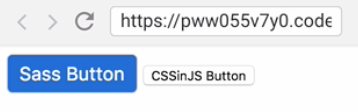
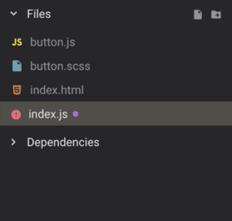
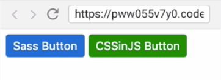

Instructor: 00:00 As you can see, we have two `buttons`. One is a `Sass button`, which is already implemented, and it is blue. The other one is `CSSinJS button`, and it is currently unstyled.

#### index.html
```html
<button class="sass-btn">Sass Button</button>
<button class="cssinjs-btn">CSSinJS Button</button>
```



Now, let's implement a `button` using `CSSinJS`, but let's have a look first at the `.sass-btn`.

00:20 We use `variables` in this example in order to demonstrate how you would structure a large application. 

#### button.scss
```scss
// _variables.scss
$btn-padding-y: 7px;
$btn-padding-x: 10px;
$font-size-base: 1rem;
$btn-border-radius: 5px;

// buttons.scss
.sass-btn {
  padding: $btn-padding-y $btn-padding-x;
  font-size: $font-size-base;
  border-radius: $btn-border-radius;
  color: #fff;
  background-color: #0069d9;
}
```

Now, let's re-implement the same button using CSSinJS. First of all, let's `create` the `button.js file`. 



Now, let's `import` this `button` in the main `index`. 

#### index.js
```javascript
import './button.scss'
import './button.js'
```

We had a bunch of variables in the Sass button. Let's write the same variables in JavaScript.

00:44 Two things you have to know about variables over here. In JavaScript, we have to use `const` `statement` in order to `declare` a `constant`. The second thing is we have to use `quotes` around the `values`. The reason is CSS is not native to JavaScript, which means JavaScript doesn't know about CSS primitives. We have to `define` them as `strings`.

#### button.js
```javascript
// constants.js
const paddingY = '7px'
const paddingX = '10px'
const baseFontSize = '1rem'
const borderRadius = '5px'
```

01:07 Now, let's `declare` the button style. As you can see, we have a `constant` for the `button`, and we have these `backticks` over here. Backticks allow us to write multi-line strings in JavaScript. They are also called template literals because they allow us to use variables in site.

01:25 Here, we have our `selector`. Here, we have our `CSS rule declaration`. As you can see, we use Tor and Tor-base in order to use the variables. This is called `interpolation`. 

```javascript
// buttons.js
const button = `
  .cssinjs-btn {
    padding: ${paddingY} ${paddingX};
    font-size: ${baseFontSize};
    border-radius: ${borderRadius};
    color: #fff;
    background-color: green;
  }
`
```

Now, as we have defined this `cssinjs-btn`, we have to render it. As you can see, we can render it really simple.

01:47 What do we do here? First thing, we create a `style tag`. Then, we insert this `style tag` into the `head` of the `document`. Then, we use `textContent setter` in order to `render` our `styles`.

```javascript
// Render styles.
document.head.appendChild(
  document.createElement('style')
).textContent = button
```

