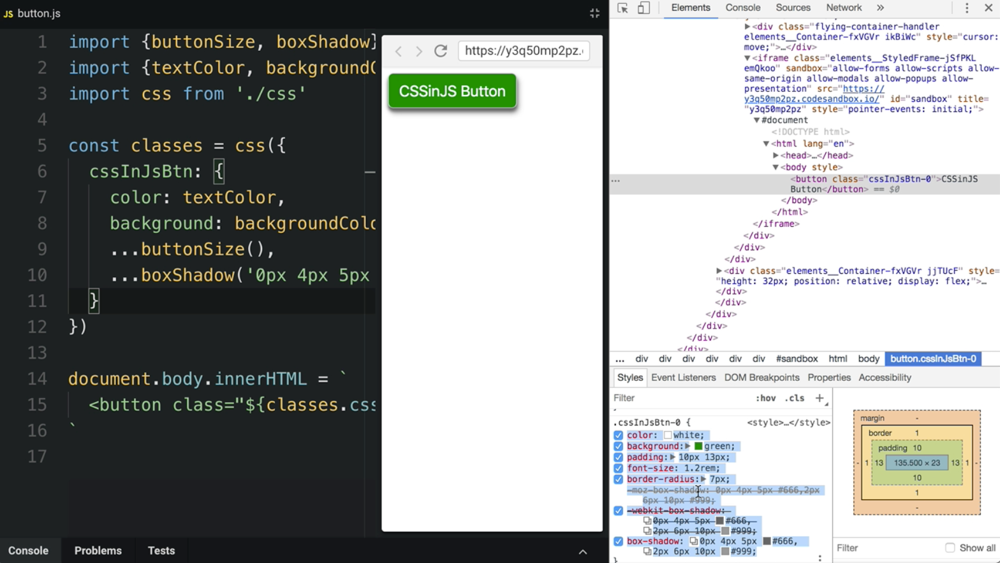

Instructor: 00:00 Sometimes, it is convenient to use both object literals and template string for the `CSSinJS` notation. For example, I could copy css directly from the `dev tools` and use it immediately in the code.


00:13 Now, I inserted this css from the `dev tools` into a template string literal. Obviously, it doesn't work yet because we are expecting an object here. 

#### button.js
```javascript
const classes = css({
  cssInJsBtn: `
    color: white;
    background: green;
    padding: 10px 13px;
    font-size: 1.2rem;
    border-radius: 7px;
    -moz-box-shadow: 0px 4px 5px #666,2px 6px 10px #999;
    -webkit-box-shadow: 0px 4px 5px #666, 2px 6px 10px #999;
    box-shadow: 0px 4px 5px #666, 2px 6px 10px #999;
  `
});
```

Let's make it work. Let's go back to `css.js` and make it accept a `cssString`.

00:30 This is the place where we iterate over the `styles` object, and we basically don't need to do this if our value is a string. If our declaration is of `type string`, let's just add our declaration to the `cssString`.

00:45 Otherwise, we are going to convert the object to a `cssString`. 

#### css.js
```javascript
export default styles => {
  const classes = {};
  let cssString = "";
  for (const name in styles) {
    classes[name] = name + "-" + counter++;
    const selector = "." + classes[name];
    cssString += selector + " {"; // .cssInJsBtn-0 {
    if (typeof styles[name] === "string") {
      cssString += styles[name];
    } else {
      for (const property in styles[name]) {
        // color: white;
        cssString += property + ": " + styles[name][property] + ";";
      }
    }
    cssString += "}";
  }
```

Here we go. Our `styles` are defined using a template string. The button is green, and the result is correct.

