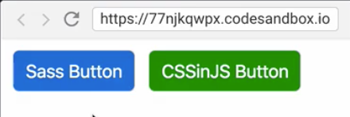

Instructor: 00:00 We have two buttons. 



One is written using `Sass`, and the other one is using `CSSinJS`. Let's have a look at this `button-size` mixin. We have four arguments, `padding-y`,`padding-x`, `font-size`, and `border-radius`. Often, it's hard to remember in which order they have to be used.

00:21 This is where the concept of named arguments is helpful. To name argument in Sass, you need to put a name before the argument. Exact same name can then be used inside of the mixin or function. 

#### button.scss
```scss
@import "./variables";
@import "./mixins";

.sass-btn {
  color: #fff;
  background-color: #0069d9;
  margin: 5px;
  @include button-size(
    $padding-y: $btn-padding-y-lg,
    $padding-x: $btn-padding-x-lg,
    $font-size: $font-size-lg,
    $border-radius: $btn-border-radius-lg
  );
}
```

Now, let's have a look at this mixin in JavaScript. JavaScript as a language has no named arguments concept.

00:42 Instead, it has objects. Objects can be used exactly the same way as named arguments in Sass. Now we are going to convert these arguments to a named arguments object. Now you can see a single object instead of arguments list. Object declaration starts with an `{` and ends with a `}`.

01:09 The body of an object consists of keys and values. In this case, `paddingY` is a key, which is also a name of the argument we want to use later. `paddingYLg` is a value. 

#### button.js
```javascript
import {
  paddingYLg,
  paddingXLg,
  fontSizeLg,
  borderRadiusLg
} from "./variables"
import { buttonSize } from "./mixins"

const css = `
  .cssinjs-btn {
    color: #fff;
    background-color: green;
    margin: 5px;
    ${buttonSize({
      paddingY: paddingYLg,
      paddingX: paddingXLg,
      fontSize: fontSizeLg,
      borderRadius: borderRadiusLg
    })};
  }
`
```

Now it looks like we broke our button. 


The reason is we need to adjust our mixin for named arguments. Here is our mixin in JavaScript, and those are our arguments.

#### mixins.js
```javascript
export const buttonSize = ({paddingY, paddingX, fontSize, borderRadius}) => `
  padding: ${paddingY} ${paddingX};
  font-size: ${fontSize};
  border-radius: ${borderRadius};
`
```

01:35 Now in order to convert our arguments to an object argument, we need to add curly braces. 

In `JavaScript`, this feature is called, "destructuring". Actually, we could do the exact same thing without that destructuring feature. We would name the object argument and then use this name in order to access its properties. I think the destructured version of it is more readable...