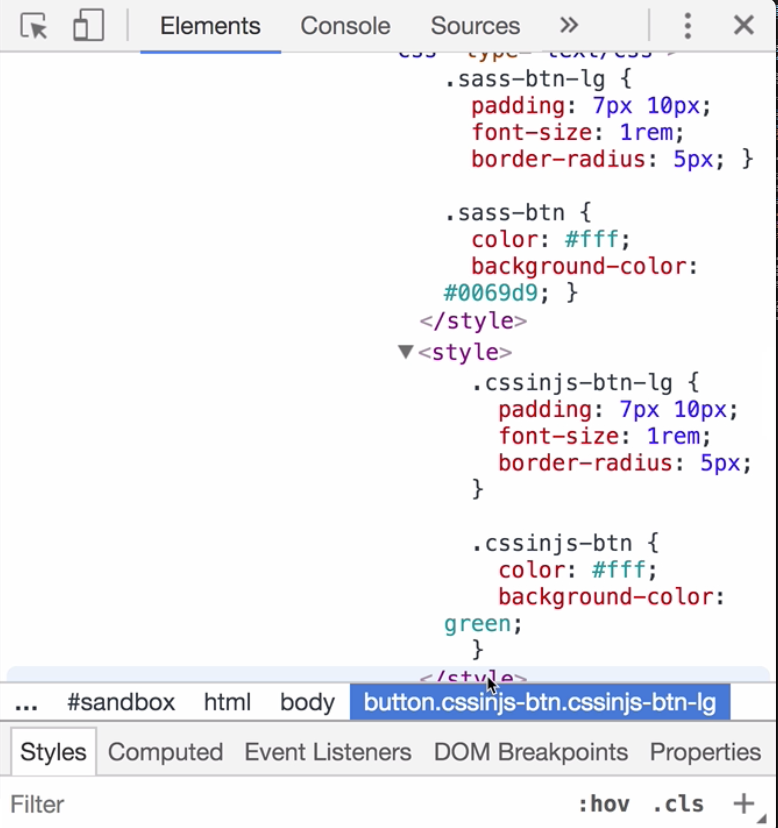

Instructor: 00:00 We have two buttons. One is implemented using `Sass`, it is `blue`. The other one is `green`, and is implemented using `CSSinJS`. Let's have a look a `Sass` button first.

00:11 We have this `.sass-btn` class, we `import variables` and we `import sizes`. Both `variables` and `sizes` are partials. 

#### button.scss
```scss
@import './variables';
@import './sizes';

.sass-btn {
  color: #fff;
  background-color: #0069d9;
}
```

This is how variables partial looks like.

#### _variables.scss
```scss
$btn-padding-y: 7px;
$btn-padding-x: 10px;
$font-size-base: 1rem;
$btn-border-radius: 5px;
```

This is how sizes partial looks like.

#### _sizes.scss
```scss
.sass-btn-lg {
  padding: $btn-padding-y $btn-padding-x;
  font-size: $font-size-base;
  border-radius: $btn-border-radius;
}
```

00:28 `.sass-btn-lg` implements `padding`, `font-size` and `border-radius`, while `.sass-btn` implements `color` and `background-color`. Now, let's have a look at the `cssinjs-btn`. First thing you see is that we `import sizes` from `sizes.js`.

00:46 Next thing is `cssinjs-btn rule`. It contains same declarations as `.sass-btn`. 

#### buttons.js
```javascript
import sizes from './sizes'

const button = `
  .cssinjs-btn {
    color: #fff;
    background-color: green;
  }
`
```

Let's have a look at `sizes.js`. 

#### sizes.js
```javascript
import {
  paddingY, paddingX, baseFontSize, borderRadius
} from './variables'

export default `
  .cssinjs-btn-lg {
    padding: ${paddingY} ${paddingX};
    font-size: ${baseFontSize};
    border-radius: ${borderRadius};
  }
`
```

We have already learned how to import constants. Let's have a look at how we implement our partial.

01:01 First thing is this `export default` statement. `export default` defines the default export for this modal. If you use named exports, you also need to `import` them by name as we did over here.

01:15 If you have a `default export`, you don't need to name it when you `import` it. You can also have both default export, and named export in the same file. 

Let's get back to the `button.js`.

01:28 The name over here can be anything. For instance, we can call it just, "S". We have `imported` our `partial`, and we have declared our `button`. Now, we have to `render` both of them. Here is how we `render` it.

01:41 We create a `style element`. We insert it to the `head` of the `document`, and we use `.textContent` setter. The interesting part is over here, because here, we decide what is going to be rendered. As both `sizes` and the `button` are just strings, we can concatenate them.

#### button.js
```javascript
import sizes from './sizes'

const button = `
  .cssinjs-btn {
    color: #fff;
    background-color: green;
  }
`

// Render styles.
document.head.appendChild(
  document.createElement('style')
).textContent = sizes + button
```

01:58 In our case, sizes will be rendered first and the button second. In the dev tools, we can see what Sass has rendered, and what we rendered using CSSinJS. 


Remember, the order in which we import partials here doesn't matter.

02:13 What matters is the order in which we render them.