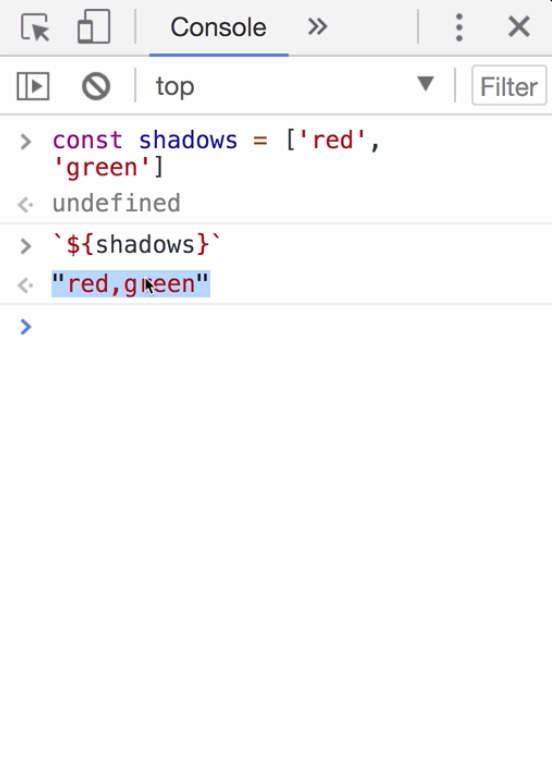

Instructor: 00:00 We have two buttons. One is written using `Sass`, and the other one is `CSSinJS`. Let's have a look at this `box-shadow` mixin.

00:07 This mixin accepts a variable amount of `shadows`. You can pass just one shadow, or you can pass two, same like the native implementation of `box-shadow` in CSS.

#### button.scss
```scss
.sass-btn {
  color: #fff;
  background-color: #0069d9;
  margin: 5px;
  @include button-size();
  @include box-shadow(0px 4px 5px #666, 2px 6px 10px #999);
}
```

00:19 Let's have a look at the mixin itself. Here is the `box-shadow` mixin. We use here a `Sass` feature, which is called `variable arguments`. It allows us to just name one argument without knowing how many of them will be passed.

00:32 To use it like a regular variable, this mixin allows us to generate vendor prefixes. Let's see how we can implement the same thing in JavaScript.

#### _mixins.scss
```scss
@mixin box-shadow($shadows...) {
  -moz-box-shadow: $shadows;
  -webkit-box-shadow: $shadows;
  box-shadow: $shadows;
}
```

00:42 Here we have our `css` rule. Here are the `box-shadow` function/mixin call. Same like in `Sass`, we can pass one argument, two arguments, or basically an unlimited amount of arguments.

#### button.js
```javascript
const css = `
  .cssinjs-btn {
    color: #fff;
    background-color: green;
    margin: 5px;
    ${buttonSize()}
    ${boxShadow('0px 4px 5px #666', '2px 6px 10px #999')}
  }
`
```

00:55 Let's have a look at the mixin implementation itself. Here, we have our mixin function declaration. We assign this function to a `boxShadow` constant. We `export` this constant. Then we declare the function.

01:07 First interesting thing about this function is the arguments. These three dots, `...` before the argument is called rest operator. Rest operator in JavaScript works exactly the same way like variable arguments in Sass.

01:22 The interesting part is how we use the shadows array. 

#### mixins.js
```javascript
export const boxShadow = (...shadows) => `
  -moz-box-shadow: ${shadows};
  -webkit-box-shadow: ${shadows};
  box-shadow: ${shadows};
  ```

JavaScript language has a feature called `Coercion`. We just created the `shadows` array to demonstrate what happens within array inside of our mixin.

01:36 Our mixin is a template string. If we use a variable inside of a template string which is not a string, JavaScript will always try to coerce this variable to a string.

01:48 In our case, the result of a coercion is a string where red and green is comma-separated.

