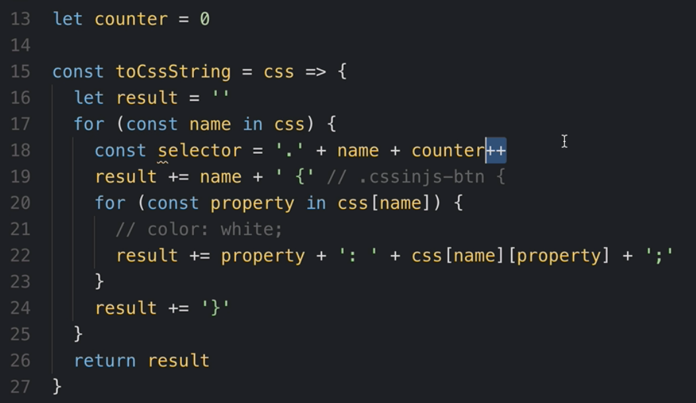
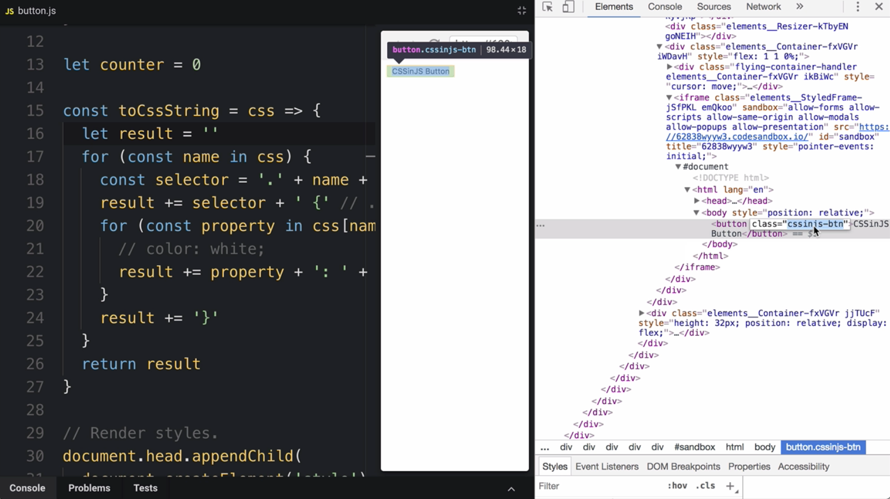
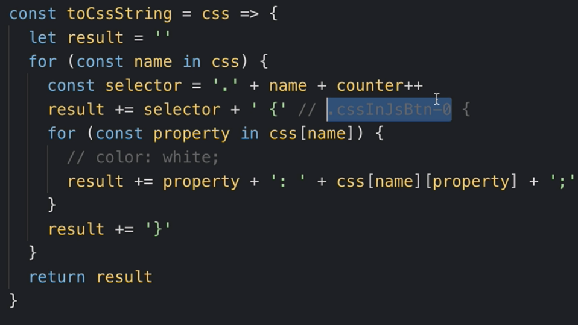
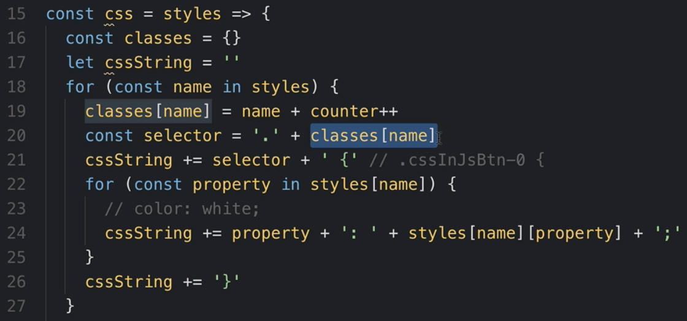
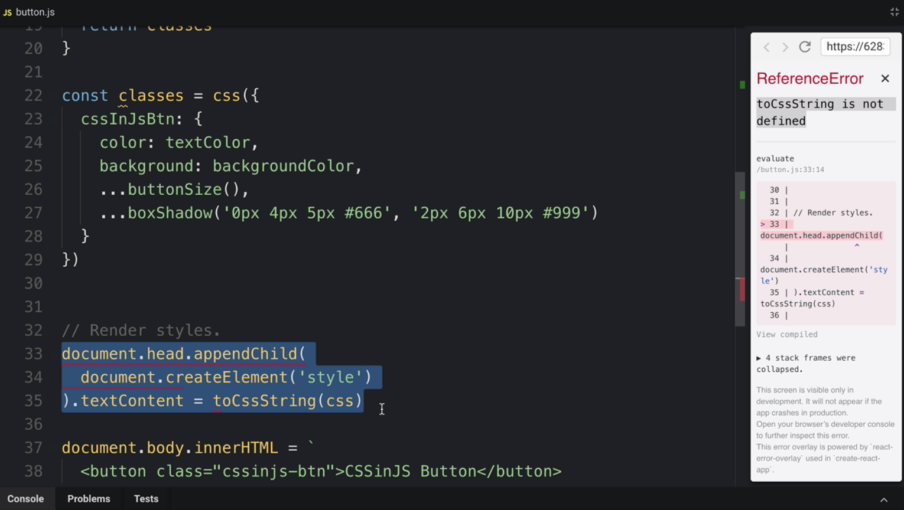
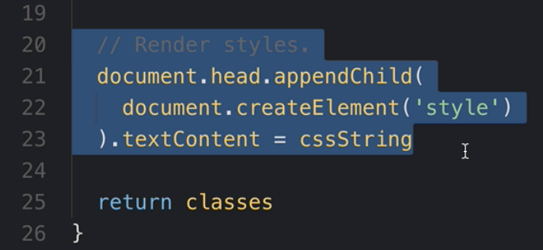
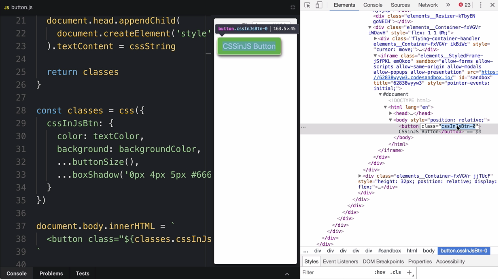
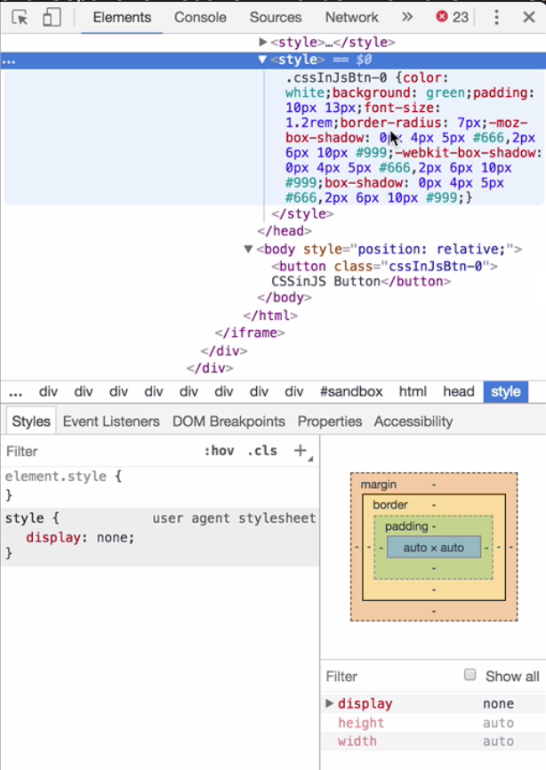
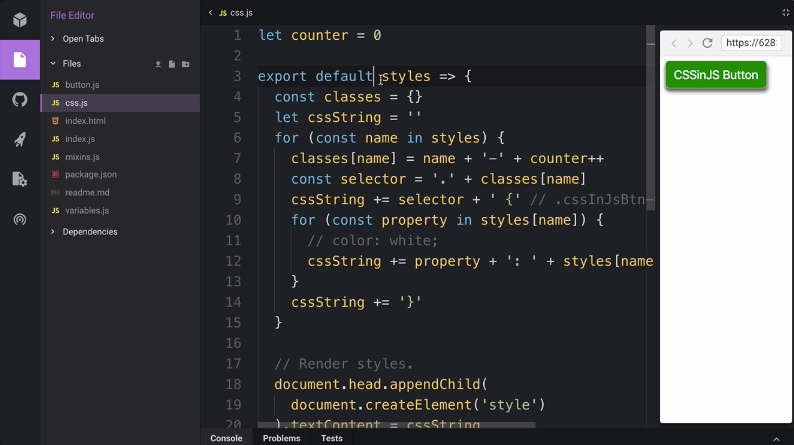

Instructor: 00:00 In order to avoid the class names conflicts, we can generate the class names. This key is not a class name anymore. It's a CSS rule name. In order to make sure our class names never have a collision, we will create a `counter` variable. We are going to increase this counter variable every time we create a class name. We will add this variable to the generated class name.

#### button.js
```javascript
const css = {
  `cssinjs-btn`: {
    color: textColor,
    background: backgroundColor,
    ...buttonSize(),
    ...boxShadow('0px 4px 5px #666', '2px 6px 10px #999')
  }
}

let counter = 0
```

00:23 Now we have to rename this key here as well because it's not a `selector` anymore. It's a rule name. We generate our `selector` using the `name` and the `counter`. We use the `rule name` inside of our `selector` in order to make it human readable. `++` will increment our `counter` so that we never have a collision. At the end, our `selector` will look like this.



00:45 Let's have a look on the HTML of this button. 



The problem right now is that our button expects a class name `cssinjs-btn`, but in reality our class name looks like this. 



We have to make our button use our new generated class name.

01:01 Right now, we have our button rendered from `index.html` file. From now on, we are going to generate HTML from JavaScript. For simplicity reasons, we just use `innerHTML` on the `body` tag, and we use a template string.

01:16 Somehow, we need to reference our generated class name` from here. 

```html
document.body.innerHTML = `
  <button class="cssinjs-btn">CSSinJS Button</button>
`
```

We need to rewrite our function in a way which allows us to access generated class names. Let's rename `toCssString` to `css` and the argument to `styles`.

01:33 Previously, this function was returning a CSS string as a result. Now, we are going to `return` a `classes` object instead. Let's rename `result` to a `cssString`. Let's `return` the `classes` object. Let's add to the `classes object` the `generated class name`. This way, we will be able to access our `generated class name` using our `rule name`.

01:59 Here we just use our `generated class name`. 



Here we have to rename this object because we are using this name already. Let's call this object `classes` because this is what we're going to get there after we have called the `css` function.

02:14 Now we have this error -- `"CSS is not a function."` The reason is we are calling `css` before we have created `css`. 

If we move this piece of code behind the declaration, this will start working.

02:28 The next error is `"To a CSS string is not defined."` The reason is we've got to move this piece of logic to our `css` function. 



Now our CSS function is not only converting the object to a `cssString` and generating the `class name`. It is also rendering the `style`. 



As we now have an access to `classes` object, we can simply access the `generated class name` using the `rule name`.

```html
document.body.innerHTML = `
  <button class="${classes.cssInJsBtn}">CSSinJS Button</button>
`
```

02:55 Let's have a quick look at the `DOM`. What we see is exactly what we have expected. It's using our generated `class name`.



We can also have a look at the `generated style tag`, which looks something like this right now. 



We have basically created our own minimalistic CSS-in-JS library.

03:14 Now I would like to move this `css` function to a separate module in order to make it reusable. Here is our `css` function in a separate `module`. Instead of defining a CSS function, we `export` a `default function` because it's our single export. Now our CSS button looks very tidy because we don't have this boilerplate anymore. We just import our CSS function from this CSS module.

