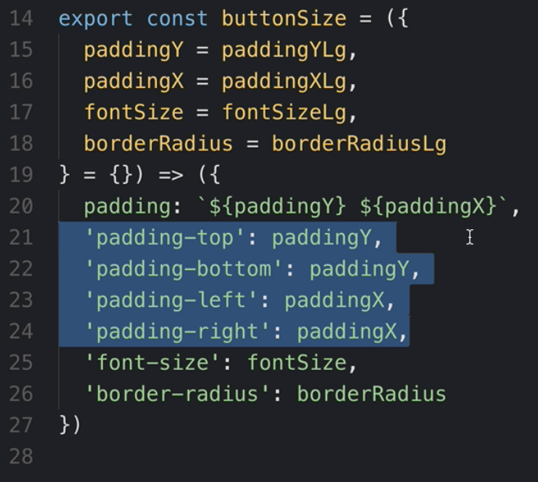
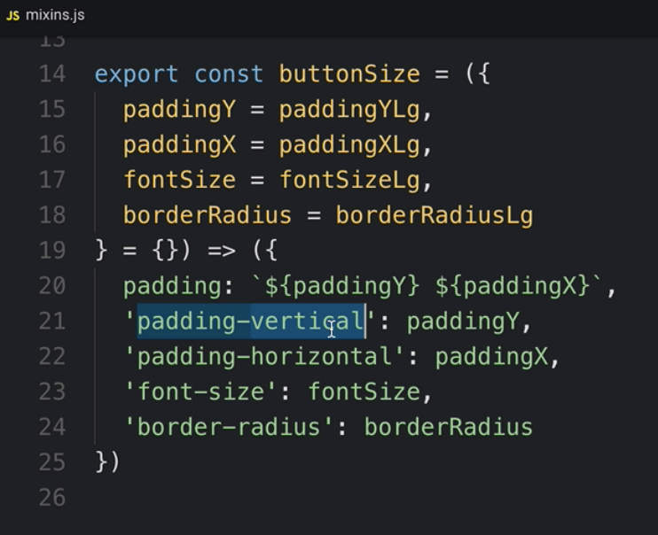
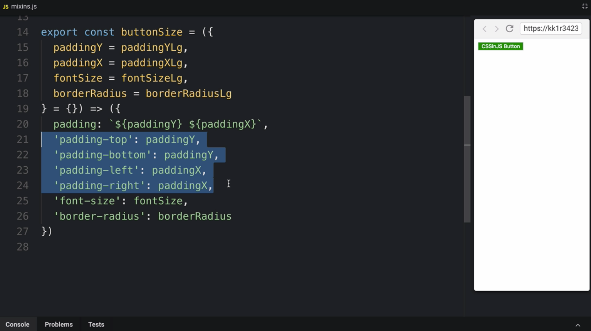
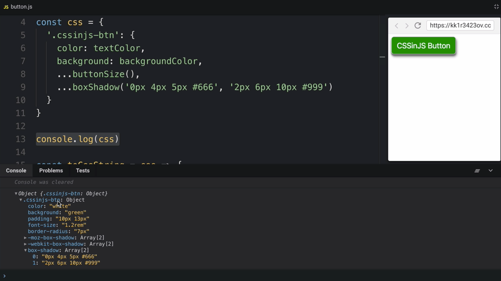

Instructor: 00:00 We have this `.cssinjs-btn`. We style it with using JavaScript object notation. We use a few variables here and there, but one part is missing. We are not using any mixins.

#### button.js
```javascript
import {buttonSize, boxShadow} from './mixins'
import {textColor, backgroundColor} from './variables'

const css = {
  '.cssinjs-btn': {
    color: textColor,
    background: backgroundColor
  }
}
```

00:12 Let's have a look at those mixins. This mixin, `boxShadow`, is still using a template string. In order to use a mixin with object notation, we need to rewrite the mixin. The rewrite is pretty straightforward.

00:24 Instead of `returning` a template string, we return an object now. Keys are CSS properties, and the values are just variables. 

#### mixins.js
```javascript
export const boxShadow = (...shadows) => ({
  '-moz-box-shadow': shadows,
  '-webkit-box-shadow': shadows,
  'box-shadow': shadows
})
```

The same goes for button size mixin. Here is the object notation for button size mixin.

00:38 We're still using a template string as a value here. The reason is this value is a compound value. 

```javascript
export const buttonSize = ({
  paddingY = paddingYLg,
  paddingX = paddingXLg,
  fontSize = fontSizeLg,
  borderRadius = borderRadiusLg
} = {}) => ({
  padding: `${paddingY} ${paddingX}`,
  'font-size': fontSize,
  'border-radius': borderRadius
})
```

In fact, this value represents four values. If I try to avoid a compound value, I will end up with something like this.



00:52 There is a number of ways to optimize this, but most of them will end up with a custom syntax. For instance, we could so something like this. We invented a new padding property, which is called `padding-vertical`, or `padding-horizontal`. Now, we can use just one value.

01:07 This pattern is what React Native is using.



Or we can do something like this. We have just introduced a new syntax for `padding`, which allows us to use object as a value, and `top`, `bottom`, `left`, `right` as a key.

01:18 To me, this reads very explicit, but it's also more code. 



For now, we are going to focus on a string. Our mixins return objects, and we should be able to merge those declarations with this declaration.

01:30 This is where spread operator becomes very handy. Spread operator is expressed by three dots, `...`, same like the Rest operator. Basically, what happens here is we call this `buttonSize` function.

01:42 This function returns an object, and then, we merge this object into this parent object. 

```javascript
import {buttonSize, boxShadow} from './mixins'
import {textColor, backgroundColor} from './variables'

const css = {
  '.cssinjs-btn': {
    color: textColor,
    background: backgroundColor,
    ...buttonSize(),
    ...boxShadow('0px 4px 5px #666', '2px 6px 10px #999')
  }
}
```

We can use `console.log` in order to see the resulting shape of this object, and here is the result.

