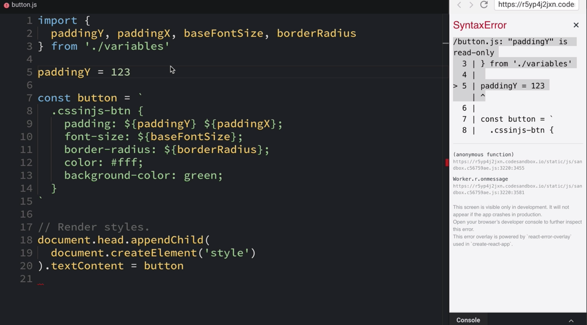

Instructor: 00:00 We have two buttons. One is written using `Sass` or `scss`, and the other one is written using `cssinjs`. As you can see, we have variables and the button itself in the same file.

00:13 As your application grows, you probably want to split those things in separate files. I know at least two reasons for splitting them up. First is you may want to share those variables with a different part of the application. Second, you might want them to be logically separated so that you can find them easier.

#### button.scss
```scss
// _variables.scss
$btn-padding-y: 7px;
$btn-padding-x: 10px;
$font-size-base: 1rem;
$btn-border-radius: 5px;

// buttons.scss
.sass-btn {
  padding: $btn-padding-y $btn-padding-x;
  font-size: $font-size-base;
  border-radius: $btn-border-radius;
  color: #fff;
  background-color: #0069d9;
}
```

00:32 To split them up, you can use an import directive in Sass. The way import directive works is it takes this file and places its contents right here. 

```scss
@import './variables';

.sass-btn {
  padding: $btn-padding-y $btn-padding-x;
  font-size: $font-size-base;
  border-radius: $btn-border-radius;
  color: #fff;
  background-color: #0069d9;
}
```

Now, let's do the same for our `cssinjs-btn`.

00:50 I have just moved the variables to a separate file called `variables.js`. Let's take a look at this file. As you can see, we have the same constants we had before, but now, we also have an `export` statement.

01:04 `export` statement marks the `constants` so they can be imported later. 

#### variables.js
```javascript
export const paddingY = '7px'
export const paddingX = '10px'
export const baseFontSize = '1rem'
export const borderRadius = '5px'
```

This part of the `import` statement, `*as vars` means we want to import all variables, and we want to use them from one `vars` object.

01:20 In order to use them, we need to access this property on the `vars` object. 

We can also `import` each variable explicitly, we can use them without the `vars` object. 

```javascript
import {
  paddingY, paddingX, baseFontSize, borderRadius
} from './variables'
```

There is a very big difference between import directive from `Sass` and import statement from `JavaScript`.

01:40 Imports in JavaScript implement a modal system. When you import something from JavaScript modal, you cannot overwrite it, because it will throw a syntax error. This is good because you cannot accidentally overwrite them.



01:53 Imagine you have a complex system with many files, and you import a lot of Sass files. Any of these files could have overwritten any of these variables, and you wouldn't know where.