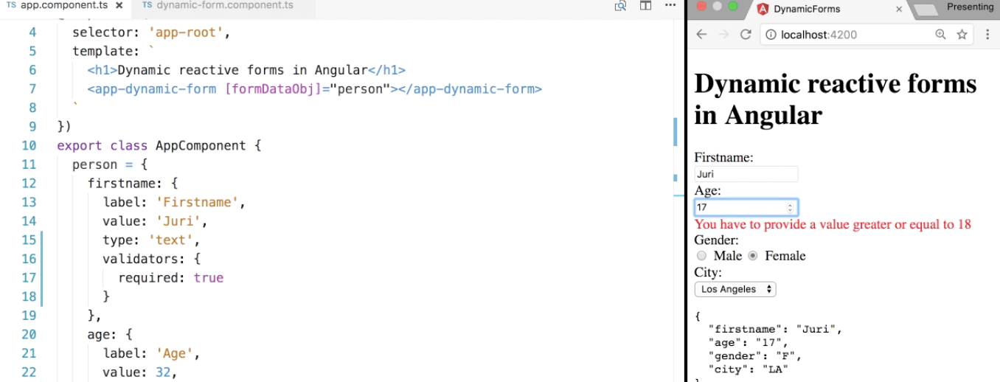

Instructor: [00:00] We came up with this definition of an API object which defines how our form should be created dynamically. What we see here is basically a `person`, where we have the different kind of properties and then we have some metadata, which is the label of the form, actual value of the property, and the kind of field we would like to render in our HTML code.

[00:23] We then pass this into our `dynamic-form` component, and inside there, we dynamically generate a form by using the reactive forms pattern. You can see that for down here, where we basically iterate over that form data object, and then dynamically instantiate some form controls.

[00:40] Our next step, as in every proper form, is to add some validation. Whenever the user doesn't enter some value where it is actually required, we would like to show some notification to the user.

[00:52] Normally, such validators are basically attached here as the second parameter into our form control, so we could do something like `Validators.required` for making our first name required. In our case, we would like, of course, to enter this information dynamically such as we did with all other values, as well.

[01:12] Let's jump back to our `app.component.ts`, and let's define here how our metadata would look like for defining such validators.

[01:21] What we do here is we define a `validators` object such that we can specify then as the key of the objects, or the property name, the name of the `validator` which we would like to attach, and then the actual value of the `validator`, like in the require validator is simply `true`, but it could be also some other value.

```ts
export class AppComponent {
  person = {
    firstname: {
      label: 'Firstname',  
      value: 'Juri',
      type: 'text'
      validators: {
        required: true
```

[01:38] Let's start with this simple example. We would now go back to our dynamic form component, and then inside here, we get a series of validators. Therefore, we would have to create some method. Let's call it `mapValidator`.

```ts
ngOnInit() {
  const formDataobj ={};
  for (const prop of Object.keys(this.formDataObj)) {
    formDataObj[Prop] = new FormControl(this.FormDataObj[prop].value, this.mapValidator();                
```

[01:53] Let's pass in the actual validators, which is under the `prop` property, so the current property we are processing for our data object, `.validators`, which is the property we just defined. 

```ts
ngOnInit() {
  const formDataobj ={};
  for (const prop of Object.keys(this.formDataObj)) {
    formDataObj[Prop] = new FormControl(this.FormDataObj[prop].value, this.mapValidator(this.formDataObj[prop].validators));
```      

Here, we can now start processing it. If the `validators` are actually defined, we do something with it.

```ts
  this.form = new FormGroup(formDataObj);
}
mapValidator(validators) {
  if(validators) {

  }
}
```

[02:15] Otherwise, we simply return an empty array, so nothing will happen. Then inside here we have to do some mapping. This is an object, and it is exactly the object which we defined in out `validators`, so it would be this one. Therefore, we have to iterate over, and let's use the `Object.keys`, as we have already seen, `validators`, and we need to map them to a proper validator, which is built into Angular.

```ts
mapValidator(validators) {
  if(validators) {
    return Object.keys(validators).map()
  } else {  
    return [];
  }
}
```

[02:39] Here, we would get the `validationType`, let's call it. Then we can say if the `validationType` is equals required, then we simply `return Validators.required`. We can also add another one. Let's say if `validationType` equals `min`, then `return Validators.min`.

```ts
mapValidator(validators) {
  if(validators) {
    return Object.keys(validators).map(validationType=> {
      if(validationType === 'required') {
        return Validators.required;
      } else (validationType === 'min') {
        return Validators.min  
      }      
    })
  } else {  
    return [];
  }
}
```

[03:04] The min validator also takes a value, which we can define then later on our API object. That value would then be stored directly in that `validators` array under the property which are currently processing, which is the `validationType`. We also need to adjust here our syntactic error.

```ts
} else if (validationType === 'min') {
  return Validators.min(validators[validationType]); 
}      
```

[03:25] We have the mapping established. Now if we refresh the form and we remove here the name, we actually cannot see any error yet.

[03:35] The problem is not that our validator doesn't work. The problem is that we don't display any kind of error message whenever it fails. Therefore, directly after that `<div>` where we render all our input controls, we add another one, which will be the container for our validation error messages. Let's add here also `class="error"`, and also some very simple styling.

```html
      <div class="error">

      </div>

    </div>
  </form>
  <pre>{{ form.value | json}}</pre>
`,
styles: [
  `

  error{
   color: red;
  }              
```

[03:56] We would like to activate this `<div>` here whenever some validation fails on our current control which we are processing. We can get that form control by using the `form.get(prop.key)`, which will actually represent basically the first name control, the age control, the gender control, and so on. Whenever that is `invalid`, this diff will be shown.

```html
<div class="error" *ngIf="form.get(prop.key).invalid">
```

[04:24] For better user friendliness, we should also add here some more clauses, like to activate this also only when the `form.get(prop.key)`, has been interacted with, or it has been touched by the user. What's missing now is to display the single type of errors for the required validator and the min validator, etc.

```html
<div class="error" *ngIf="form.get(prop.key).invalid && (form.get(prop.key).dirty || form.get(prop.key)">
</div>
```

[04:46] Let's create here a `<div>`, or also a span would be fine perfectly, and we again need to get the actual control which we are processing, which has an `errors` property. Inside there, we say whenever the required validator failed, so that required property would be populated, then you print out the message, `You have to provide a value`.

```html
<div class="error" *ngIf="form.get(prop.key).invalid && (form.get(prop.key).dirty || form.get(prop.key)">
  <div *ngIf="form.get(prop.key).errors.required">
    You have to provide a value.
  </div>  
</div>
```

[05:07] Similarly for the min validators, so let's copy this over here, just that we need to require, obviously, the name of the validator. Here we can say the message, `You have to provide a value greater or equal to`...

```html
<div *ngIf="form.get(prop.key).errors.required">
  You have to provide a value.
</div>
<div *ngIf="form.get(prop.key).errors.min">
  You have to provide a value greater or equal to {{  }}
</div>
```

[05:24] Here we can access a property of that min validator. That one doesn't have only true or false, but it has a value, which indicates the actual specified minimal required value to enter. Now let's try. When we remove now the name, you can see that the validator shows up properly.

```html
<div *ngIf="form.get(prop.key).errors.min">
  You have to provide a value greater or equal to {{ form.get(prop.key).errors.min.min }}
</div>       
```

[05:41] We didn't add a min validator yet, so we can go now and dynamically specify one, like for the age `validators`, and we say `min`. You have to be at least an adult, so older than `18` years old. Now if we go here and we decrease that number input, when we go below `18`, you can see how the error message gets correctly rendered on our form. 



[06:09] Of course, you would have to add further validators, like you have to add further mappings for all the other validators which are present. Also down here, you have to specify those mappings to map them to proper validators accordingly.


