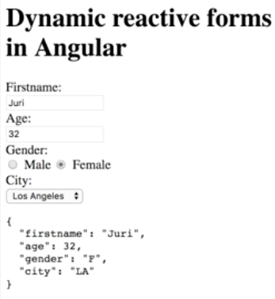
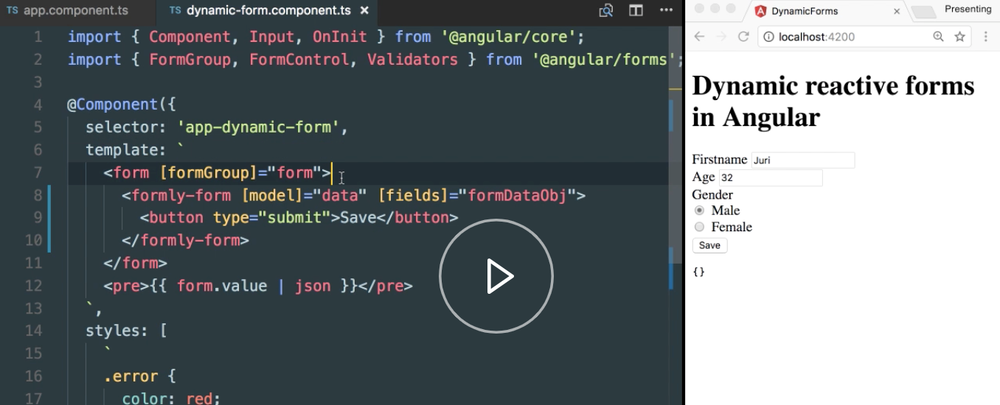

Instructor: [00:00] We have here our `app-dynamic-form` component, which takes here some configuration object, as you can see. This configuration object is described below here in the `class AppComponent`. It describes basically a `person` object with some additional metadata, such as the label or valid errors, which are then interpreted by our `app-dynamic-form`.

[00:20] It then dynamically generates this kind of form here, using the Reactor forms approach in Angular. 



Our example implements a very basic rendering of such a dynamic form. We implemented not all of the available validators and we definitely did not cover all of the different kinds of edge cases you may come across when you are in a real-world application.

[00:40] Therefore, you definitely want to use some library which already implements that. One library which does so is `ng-formly`. Now we are going to take a look on how we could use ng-formly to basically convert our custom dynamic form into one that can be rendered with ng-formly itself.

[00:57] The first step is to install it. It comes with two packages. 

#### Terminal
```bash
$ npm install @ngx-formly/core @ngx-formly/bootstrap
```

This is the core library, basically, and then they have different kind of libraries, depending on the front end framework you're using. Right now, they're supporting Bootstrap and also Angular material. Let's go with Bootstrap for now.

[01:13] The next step is to go into the `app.module.ts` and install here the different kind of models we have just installed. First of all, we need the formly module, which comes from formly/core, and then the formly Bootstrap module, which comes from the Bootstrap library here. Then we need to, obviously, also also register them. We use the `FormlyModule.forRoot`, and the `FormlyBootstrapModule`.

#### app.module.ts
```ts
import { BrowserModule } from '@angular/platform-browser';
import { NgModule } from '@angular/core';
import { ReactiveFormsModule } from '@angular/forms';
import { FormlyModule } from '@ngx-formly/core';
import { Formly BootstrapModule } from '@ngx-formly/bootstrap';

import { AppComponent } from './app.component';
import { DynamicFormComponent } from './dynamic-form.component';

@NgModule({
  declarations: [AppComponent, DynamicFormComponent],
  imports: [
    BrowserModule,
    ReactiveFormsModule,
    FormlyModule.forRoot(),
    FormlyBootstrapModule
  ],
  providers: [],
  bootstrap: [AppComponent]
})
export class Appmodule {}
```

[01:37] Next, let's go into the `app.component.ts`. We obviously need to adjust this API, such that it matches the one formly requires. First of all, formly distinguishes between the data object and the actual configuration of the fields in the form. We have mixed them up. As you can see here, we have the `value`, as well as some metadata on how the form should render.

[01:57] Let's first split that out. Let's call it a `person` object here. We have `firstname`. Let's leave it with these properties. Let's rename this to `personFields`. These person fields in formly are basically a `<FormlyFieldConfig>` object. It takes an array, where, inside, there are the different kind of objects.

#### app.component.ts
```ts
export class AppComponent {
  person = {
    firstname: 'Juri',
    age: 32,
    gender: 'M'
  };

    personFields = <FormlyFiledConfig>[


      firstname: {
        label: 'Firstname',  
        value: 'Juri',
        type: 'text'
        validators: {
          required: true
        }
```

[02:20] Let's first take a look here on how we need to transform here our `firstname`. First of all, we have an object inside that array. Let's remove that property here. Then we need to specify where this configuration belongs. The `key` here indicates that property name on our data object, so that will be the configuration for that first in part here.

```ts
personFields = <FormlyFiledConfig>[
  {
    key:'firstname',
    label: 'Firstname',  
    value: 'Juri',
    type: 'text'
    validators: {
      required: true
    }
```

[02:44] Next, we have here the input `type`, where it defined directly the `input` type of the html control and not the different kind of type text, type radio, and so on. Those kind of things are defined inside the `templateOptions`, so is also the `label`, so let's move it inside here.

```ts
personFields = <FormlyFiledConfig>[
  {
    key:'firstname',
    type: 'input',
    templateOptions: {
      label: 'Firstname'  
```
[03:03] We can remove the `value`, because the value's already specified here on top in our data object. Then we need to specify the validators. Inside here, you have a `validation` property, and you can assign the `Validators` director from the Angular forms module. We can remove this one.

```ts
validators: {
  validation: Validators.required 
}
```

[03:21] What is still missing is the validation messages. The `validation` part here takes a `messages` property, where we can simply put name of our validator and the according message. What's also important here is that you could simply take the validator's compose method to combine multiple validators inside here. But, for our example, we won't need that right now.

```ts
validation: {
  messages: {
    required: 'You need to provide a value'  
  }   
```

[03:46] In order to not bore you too much, let me simply copy in the configuration for the remaining properties here. 

```ts
  validation: {
    messages: {
      min: ' You need to specify a value greater or equal to 18'
    }
  }
},
{
  key: 'gender'
  type: 'radio'
  templateOptions: {
    label: 'Gender',
    options: [{ value: 'Male, key: 'M'}, { value: 'Female', key: 'F'}]  
          }
      }
    ];
}  
```

Let's quickly have a look of what we copied in here. For the `age` property, we have still an `type: 'input'` here on the html part, but the specific type of html tag is then of `type: 'number'`, because we want a number input field.

[04:07] The validators are exactly the same, just that this time we used the `min` validator. What's maybe also interesting here is how the `radio` button list is being done. Here we have a radio button, so a type `radio`, for the HTML part, and then we have the `options` inside here, which specify the different kind of values the user can choose. Great.

[04:29] We need to now adjust here how the data is passed inside our `app-dynamic-form` component. First of all, we will have to add another input property which will pass in the `data` object, which is now `person`. Here, instead, we reference the `personFields`, as that is the one which holds our configuration.

```ts
@Component({
  selector: 'app-root',
  template: `
    <h1>Dynamic reactive forms in Angular</h1>
    <app-dynamic-form [data]="person" [formDataObj]="personFields'></app-dynamic-form>
  `
```

[04:45] Let's jump into the `app-dynamic-form` component. Let's, first of all here, add the new input fields. We have a new `@Input() data;`, which will hold our person object. We can here delete most of these parts, as we won't need them anymore, because formly takes care of them. Similarly, if we scroll up here to our HTML part, we can drop out the whole rendering story.

```ts
@Component({
  selector: 'app-dynamic-form',
  template: `
    <form [formGroups]="form">

    </form>
    <pre>{{ form.value | json }}</pre>
  `,
  styles: [
    `
    .error {
      color: red;
    }
  `
  ]
})
export class DynamicFormComponent implements OnInit {
  form: FormGroup;
  @Input() data;
  @Input()formDataObj;
    
}
```

[05:08] What we need to do here is initialize a `new FormGroup`.

```ts
export class DynamicFormComponent implements OnInit {
  form: FormGroup = new FormGroup({});
  @Input() data;
  @Input()formDataObj;
    
}
```

The binding can still remain the same. The only thing we need to modify is, inside here, we need to specify the `formly-form` component. We need to pass in the `[model]`, which, in our case, is actually the person, the `"data"` property, which we pass from the outside.

```ts
@Component({
  selector: 'app-dynamic-form',
  template: `
    <form [formGroup]="form">
      <formly-form [model]="data" [field]
    </form>
```

[05:28] Then we need to pass in the configuration, which is the `formDataObj`. Finally, we can also here add a `button`, which is of type `submit`, which will then read a response before submitting the entire form. With that, we have concluded the initial configuration of formly. Great.

```ts
@Component({
  selector: 'app-dynamic-form',
  template: `
    <form [formGroup]="form">
      <formly-form [model]="data" [fields]="formDataObj">
        <button type="submit">Save</button>
      </formly-form>
    </form>
```

[05:44] Then let's start up our development server again. Once it is up and running, let's refresh our form. You can now see that the form gets re-rendered. It is not exactly identical as we have designed it before, because we would have to add some styling.




[06:01] Let's also add here `ngSubmit`. We can simply say `submittedData = data`. That is a property which we define quickly inside our `DynamidFormComponent` here. We can then render it here on our form, and that data property is basically just a model that formly gives us. If we save that again, and we save here, we can see how the data basically gets submitted correctly, and it also data-binds.

```ts
@Component({
  selector: 'app-dynamic-form',
  template: `
    <form [formGroup]="form" (ngSubmit)="submittedData =data">
      <formly-form [model]="data" [fields]="formDataObj">
        <button type="submit">Save</button>
      </formly-form>
    </form>
    <pre>{{ submittedData | json}}</pre>
  `,
  styles: [
    `
    .error {
      color: red;  
    }
  `
  ]
})

export class DynamicFormComponent implements OnInit {
  form: FormGroup = new FormGroup({});
  @Input() data;
  @Input()formDataObj;
  submittedData;
}
```

[06:29] Also, the validators work just as expected. If we remove the value, we get the validation error. If we write in again, it disappears. Also the min validator on the number field works just as expect.