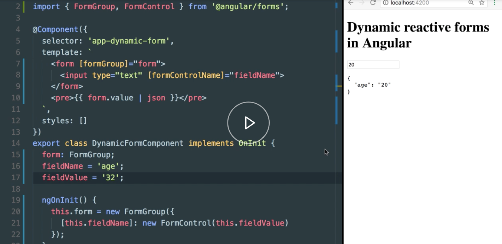

Instructor: [00:00] As you can see, we have here a very simple `form`, which uses the Angular reactive style of binding a `form`. In our code here on the component, we create a new `FormGroup`.

#### dynamic-form.component.ts
```ts
import { Component, OnInit } from '@angular/core';
import { FormGroup, FormControl } from '@angular/forms';

@Component({
   selector: 'app-dynamic-form',
   template: `
     <form [formGroup]="form">
       <input type="text" formControlName="firstname">
     </form>
     <pre>{{ form.value | json}}</pre>
   `,
   styles: []
})
export class DynamicFormComponent implements OnInit {
    form: FormGroup;

    ngOnInit() {
        this.form = new FormGroup({
            firstname: new FormControl('Juri')
        });
    }
}
```

[00:10] We initialize it with some value, which we then expose via this form here, bind it to the HTML tag. Finally, in our `input` field here, we bind to the `firstname` property which we have specified in our `FormGroup`.


[00:22] Now here you can see directed output value, which basically shows us the data mining works properly. As you can see, this is hard-coded.


[00:31] Basically, if we want to have here an `age` property instead of the name property on our form model, we would have to also go to our template and change it there, as well. 

```ts
<form [formGroup]="form>
  <input type="text" formControlName="age">
</form>
...
this.form = new FormGroup({
  age: new FrmControl('32')
}):
```

Let's take a look how we could turn this quite simple `form` into something more dynamic.

[00:48] First of all, we define here a `fieldName`, which will be `'firstname'`, and `fieldValue`, which in this case will be `Juri`. 

```ts
export class DynamicFormComponent implements OnInit {
  form: FormGroup;
  fieldName = 'firstname';
  fieldValue = 'Juri';
```
Then we go down here on our `FormGroup`, and we change it to become more dynamic.

[01:02] Here, we can use some cool ES6 features. Basically, we can define a dynamic property here on our model, which we pass to the `FormGroup`, and specify the `fieldName` which we have defined up here. In the `FormControl`, we can simply then reference the value.

```ts
ngOnInit() {
  this.form = new FormGroup({
    [this.fieldName]: new FormControl(this.fieldValue)
  });
}
```

[01:18] Finally, we also have to go to our `template`, and we have to do some input binding here rather than having it hard-coded. Again, here we reference the `fieldName` which we have defined on our component class.

```ts
<form [formGroup]="form">
  <input type= "text" [formControlName]="fieldName">
</form>
```

[01:30] You can now see that again we have the `firstname` here.


The binding still works, and now if we would like to change that model of our form which gets defined here, we could simply change it here.

```ts
fieldName = 'age';
fieldValue = '32';
```

[01:43] As you can see, it properly reflects on the form here.    



You can imagine now that these kind of fields could be passed in from the outside via some input property of the dynamic form component here, or even as a more complex structure.


