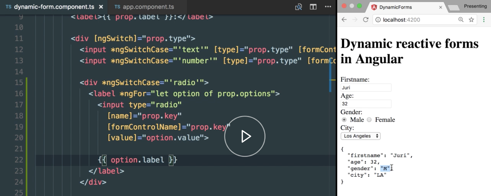

Instructor: [00:00] Now, we have rendered a couple of different input fields. Here you see a text field, a number field, and we also rendered a drop-down list on our dynamic form. Extending this to the radio button list is actually quite straight forward. First of all, we have to know how radio button lists work.

[00:18] Normally, you have a `label` which defines whatever that radio button list specifies. Let's call it `gender`, for instance, and then you have a series of `input` fields. These are of `type` `radio`, and you specify different values, for instance, male. Let's create another one for female.

#### dynamic-form.components.ts
```html
<label>
  <input type="radio" value="M">
  <input type="radio" value="F">
  Gender
</label>
...
<div [ngSwitch]="prop.type">
  <input *ngSwitchCase="'text'" [type]= "prop.type"[formControlName]="prop.key">
  <input *ngSwitchCase="'number'" [type]= "prop.type"[formControlName]="prop.key">           
```

[00:36] As you can see, we get here our input field rendered, but the problem is they don't exclude each other. What you have to do in order to make that happen is to specify here a `name` property which is identical. In this case, it displays our `gender`, and whenever we do that, you basically see how each of these excludes each other. Great. Now, let's make this dynamic.

```ts   
<label>
  <input type="radio" name="gender" value="M">
  <input type="radio" name="gender" value="F">
  Gender
</label>
...
<div [ngSwitch]="prop.type">
  <input *ngSwitchCase="'text'" [type]= "prop.type"[formControlName]="prop.key">
  <input *ngSwitchCase="'number'" [type]= "prop.type"[formControlName]="prop.key">
```

[00:57] Let's jump back where we defined our API for our form. Let's create here a `gender` property. Let's copy over here the values. These will be of `type: 'radio'`, and similar as in the drop-down field below here, we need to specify different `options`. Let's copy over such an object here.

#### app.component.ts
```ts
gender: {
  label: 'Age',
  value: 32,
  type: 'radio'
  options: [
    { label: '(choose one)', value: ''},            
```

[01:17] We have a `label`, which will tell something like `Male`, and the `value` will be `M`. Then we have `Female`, and an `F` as the `value`. Obviously, here we need to specify `Gender`.

```ts
gender: {
  label: 'Gender',
  value: 32,
  type: 'radio'
  options: [
    { label: 'Male', value: 'M'},{ label: 'Female', value: 'F']},            
```

[01:27] We can also here define a predefined value again. That will be pre-selected whenever our form gets rendered.

```ts
gender: {
  label: 'Gender',
  value: 'F',
  type: 'radio'
  options: [
    { label: 'Male', value: 'M'},{ label: 'Female', value: 'F']},
```

[01:33] Now, let's jump back to our HTML part here. Let's move that a bit further down, and let's add here a switch statement for our radio button list.

[01:42] We call here a `<div>` such that our radio buttons are nicely grouped, and our `*ngSwitchCase` statement will be on top of that. Whenever a `"'radio'"` button comes in, it should enter this part here, and then we create our `<label>`.

#### dynamic-form.component.ts
```html
<div *ngSwitchCase="'radio'">
      
</div>
...
<select *ngSwitchCase="'select'" [formControlName]="proper.key">
  <option *ngFor="let option of prop.options" [value]="option.value">
```

[01:55] For each option, we want to have a dedicated `label` that comes in over that options. As you remember, that part will basically be rendered inside there, and for each of these options, we also need to create a `radio` button `input` `type`.

```html
<div *ngSwitchCase="'radio'">
  <label *ngFor="let option of prop.options">
    <input type="radio"
  </label>
</div>
```

[02:09] We have to specify the `name` such that they exclude each other, so they are exclusive, and here we will use the `prop.key`. We also, obviously have to bind it via the normal reactive forms approach. Again, `prop.key` will specify on which model property this will be bound.

```html
<div *ngSwitchCase="'radio'">
  <label *ngFor="let option of prop.options">
    <input type="radio"
      [name]="prop.key"
      [formControlName]="prop.key"
  </label>
</div>
```

[02:28] Finally, we also need to make sure that the predefined `value`, in this case female, will get properly data-bound when the form is initialized, and we use `option.value` here. The final step is then to render the value of our label, which will be `option.label`.

```html
<div *ngSwitchCase="'radio'">
  <label *ngFor="let option of prop.options">
    <input type="radio"
      [name]="prop.key"
      [formControlName]="prop.key"
      [value]="option.value">

    {{ option.label}}
```

[02:44] Once we have refreshed our application here, you can see that the gender properly renders. You can also see that female is pre-selected and it is bound below here. If we change it, it gets correctly reflected on the form values.

