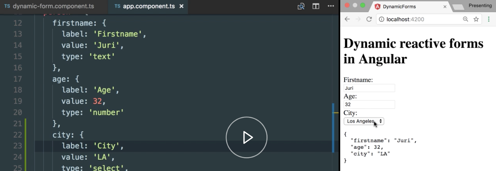

Instructor: [00:00] So far, we have dynamically rendered different input fields. As you can see here, a number input type, and a normal text input type, but what about drop-down lists?

[00:10] Let's jump to our `app.component.ts` where we have basically defined our API object that renders our form, and let's add another one. Let's call it `city`. Again, here we have to label `city`. Then, we have some `value`, which could be some predefined one. Let's say New York, so the short code for `NY`, and here let's define this as a `select` box.

#### app.component.ts
```ts
age: {
  label: 'Age',
  value: 32,
  type: 'number'
},
city: {
  label: 'City',
  value: 'NY',
  type: 'select'
}  
```

[00:33] A `select` box basically consists of one value that finally gets stored in the final output or in the data model, but it usually has a series of fields where a user can choose from. We also have to account for that one, so we will add here an `options` property, which is an array, which in turn has different select possibilities for a user.

```ts
city: {
  label: 'City',
  value: 'NY',
  type: 'select',
  options: [
    {}
  ]
```

[00:54] Again, here we will have a `label`. Let's define here an empty one which will initially be displayed, if no `value` is actually chosen, and now, let's copy it for some `value`s here. Great.

```ts
city: {
  label: 'City',
  value: 'NY',
  type: 'select'
  options: [
    { label: '(choose one)', value: '' }
    { label: 'New York', value: 'NY' },
    { label: 'Los Angeles', value: 'LA' },
    { label: 'Salt Lake City', value: 'SLC' },
  ]
```

[01:07] We now have everything we need for rendering our select box. Let's jump into our `dynamic-form.component.ts` here in our dynamic form. Let's scroll down where we basically push the properties onto our template. Here we will need to pass along as well the options part, so let's call this `options`, and we read the `options` here.

```ts
this.personProps.push({
  key: prop,
  label: this.formDataObj[prop].label,
  type: this.formDataObj[prop].type
  options: this,formDataObj[prop].options
});
```

[01:27] Let's scroll now up to our `template`, because here we have to do some more work. While the input type text and the input type number are only different by their `type` attribute here, the select box is quite different.

[01:40] It is rendered as a `select`, and inside there, we have a series of `options`. Let's have a look. For this purpose, we can use here an `ngSwitch` statement, and we will use the `prop.type` to distinguish between the different types.

```html
template: `
  <form [formGroup]="form">
    <div *ngFor="let prop of personProps">
      <label>{{ prop.label }}:</label>

      <div [ngSwitch]="prop.type">
        <input [type]= "prop.type" [formControlName]="prop.key">

        <select>
          <options>
        </select> 
      </div>
    </div>
  </form>
  <pre>{{ form.value | json}}</pre>
  `,
```

[01:55] For each `input` field, we now define an `ngSwitchCase` statement, and we distinguish by the type that enters here. For the `text` type as well as for the `number` type, we can simply copy the control, as the rendering is totally identical.

```html
<div [ngSwitch]="prop.type">
  <input *ngSwitchCase="'text'" [type]= "prop.type"[formControlName]="prop.key">
  <input *ngSwitchCase="'number'" [type]= "prop.type"[formControlName]="prop.key">

  <select>
    <options>
  </select>     
</div>
```

[02:09] Now, comes the interesting part where we basically use our `select` box here and we bind it to `select`. We also have to use the `formControlName` and bind it to `property.key`.

```html
<select *ngSwitchCase="'select'" [formControlName]="proper.key">
  <options>
</select> 
```

[02:21] Now, we have to render our `options` field here. We use the `ngFor` and iterate over the option properties which you have just bound before, so `prop.options`. We can use the `[value]` binding here to automatically select a current value that might have been chosen already by the user on our data model. Finally, we need to render that proper label of our `option.label`.

```ts
<select *ngSwitchCase="'select'" [formControlName]="proper.key">
  <option *ngFor="let option of prop.options" [value]="option.value">
    {{ option.label}}
  </option>
</select> 
```

[02:45] As you can see now, the select box, the drop-down list gets rendered directly. It also binds already the pre-selected value which we had in our data model, as you can see here.



[02:56] If I change this to LA, it will automatically bind to Los Angeles. Also, if I change inside here to Salt Lake City, it will correctly update the form value.