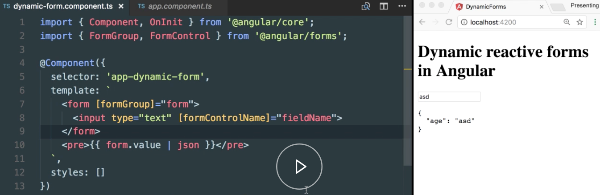
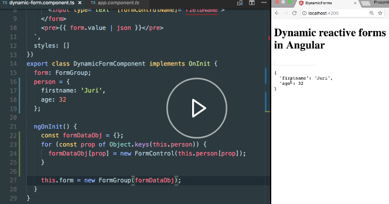
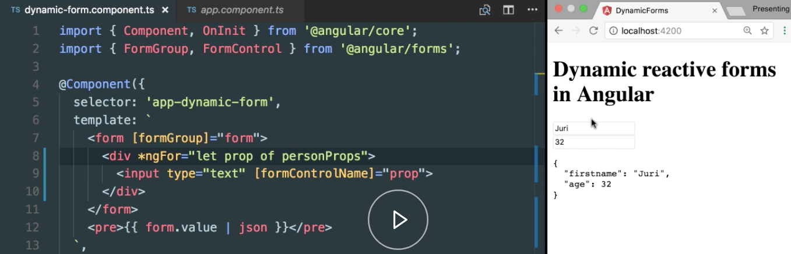
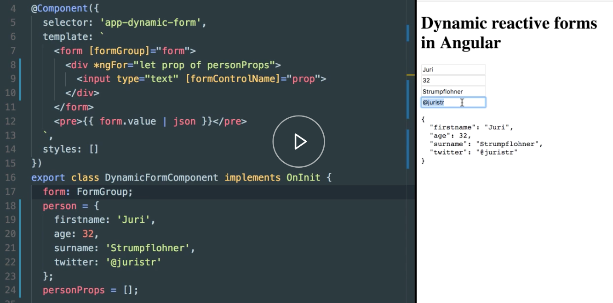

Instructor: [00:00] Our simple dynamic `form` here works, as you can see here from the binding,



but it is quite limited because normally, you don't have just two fields, but you have a couple fields. Let's see how we could render even a more complex object.

[00:14] Let's create here a `person`, and directly initialize it with a `firstname` property and some `age`. We can now do the same thing which we did before, but now by iterating over those person objects' properties.

#### dynamic-form.component.ts
```ts
export class DynamicFormComponent implements OnInit {
  form: FormGroup;
  person = {
      firstname: 'Juri',
      age = 32
  };
```

[00:27] Let's take here out our `formDataObj` and initialize it to an empty one, and now we basically iterate over our `person` object above. We can do that by using the `Object.keys`, and now we simply say the `formDataObj`, and we set a new property, `prop`, which will be the property of our `person` here, and we initialize it to the according value.

```ts
ngOnInit() {
  const formDataobj ={};
  for(const prop of Object.keys(this.person)[prop]);
  }
```

[00:52] As you can see, we create here a `FormControl`. We associate it to our form data model, and then we store everything inside here. Next, we need here below to remove that inline `form` definition, and basically assign our `formDataObj`.

```ts

ngOnInit() {
  const formDataobj ={};
  for(const prop of Object.keys(this.person)[prop]);
  }

  this.form = new FormGroup(formDataObj);
```

[01:09] You can now see that our form value array reflects our updated form, 



so you can see the `firstname` and `age` property. Now we also need to render basically `input` fields for each of our properties which we have.

[01:20] First of all, let's store the `personProps` names here, and here while we iterate over these properties, we also update here our array and push in the property name. This is quite handy, because now we can use this structure here to iterate over in our template.

```ts
export class DynamicFormComponent implements OnInit {
  form: FormGroup;
  person = {
    firstname: 'Juri',
    age = 32
  };
  personProps = [];
    
    ngOnInit() {
      const formDataobj ={};
      for (const prop of Object.keys(this.person)) {
        formDataObj [Prop] =new FormControl(this.person[prop]);
        this.personProps.push(prop);
      }
      ...   
      this.form = new FormGroup(formDataObj);
    }
}
```

[01:40] We create here a `<div>`, such that each `input` field gets its new line, and we use a simple `*ngFor`, and we iterate over those `personProps`. You can imagine that the next step here is to simply change this from the `fieldName` to the `prop`, which will be the `personProps`, and if we save here, you can see how the values get reflected. 



```html
<form [formGroup]="form">
  <div *ngFor="let prop of personProps">
    <input type= "text" [formControlName]="prop">
  </div>
</form>
```

[02:02] Also, if we now have a person object, then we want also `surname` property, and maybe even a `twitter` handle. We can simply save here, and you see that without any change in our template, it gets reflected on the UI, 



and it also data mines properly.

```ts 
person = {
  firstname: 'Juri',
  age = 32,
  surname: 'Strumpflohner',
  twitter: '@juristr'
};
```
