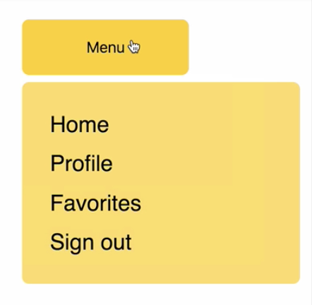

00:00 In this example we have a menu button which, when clicked toggles the appearance of a menu, using a transistion, with `CSSTransition` from `react-transition-group`. 



This example uses vanilla-CSS to acheive the transition. Let's say instead we want to use styled components to acheive the same thing.

00:23 We'll refactor our `index.js` and our `index.css` to use styled components. First we'll create a new file called `components.js`. We'll grab all our CSS and we'll place it inside `components.js`. Now let's import `styled` from `'styled-components'`. 

```js
import styled from 'styled-components';
```

00:47 What we need to do is turn these CSS blocks into styled components. So here's an example wih a `.toggler`, which is a button. It becomes a `Toggler` component, which is a `styled.button`. And we pass it a template string. Let's apply the same principle to the rest of the CSS in this file.

```js
export const Toggler = styled.button`
  position: relative;
  z-index: 2;
  width: var(--toggler-width);
  height: var(--toggler-height);
  background-color: ${props =>
    props.active
      ? 'var(--toggler-active-bg-color)'
      : 'var(--toggler-bg-color)'};
  border: none;
  border-radius: 5px;
  outline: none;
  cursor: pointer;
  transition: background-color 350ms;
`;
```

01:09 So now we have a `Container` component that contains our variables, a `Toggler` component which accounts for the active state using props instead of a modified class name, which is what we had before, and the `List`, `ListItem` components. In order to refactor our transition CSS, i.e. these four blocks, we need to make use of a seperate package, `styled-transition-group`. So let's import that now.

01:43 We'll `import transition from 'styled-transition-group'`. And this is going to allow us to use styled components alongside `react-transition-group`. So now we can refactor our transition CSS.

```js
import transition from 'styled-transition-group';
```

01:56 Now we have a `Menu` component with the styles as before, and we're using a `transition.div`. And the selectors here are slightly different to account for the library. Our styled components are set up now. Let's head over back to our `index.js`, where we'll need to do some refactoring, to account for styled components. 

02:19 We're no longer going to need the imports to `CSSTransition`, `cx`,or `./index.css`. Instead we're going to import the styled components we just wrote.

```js
import {
  Container,
  Toggler,
  List,
  ListItem,
  Menu,
} from './components';
```

02:35 And down in our `render`, we're going to replace `className` and elements with their corresponding style component names. So, `<div className="container">` becomes `<Container>`. Let's apply that to the rest of the `render` method now. Now let's save and refresh. Now our example is working with styled components.