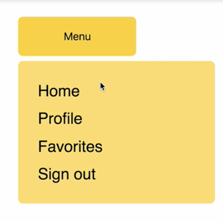
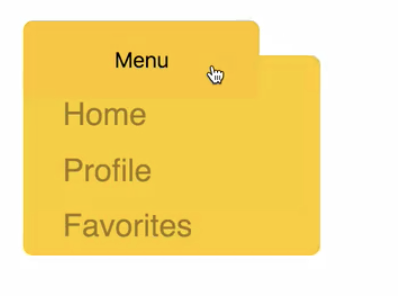

00:00 In this example, we have a menu button which toggles the appearance of a menu when clicked. 



The menu is transitioned in and out of the DOM using `CSSTransition` from `react-transition-group`. This example is using vanilla-css. Let's say we need to use JSS instead.

00:22 We can use JSS with `react-transition-group`. What we're going to do is refactor this example to be using React's JSS instead of standard CSS. We're going to start by making a new file inside the directory. This is going to be our `styles.js`. We're going to turn all of our CSS into JavaScript objects.

00:47 Now, we have a populated `styles.js` with all of the styles in JavaScript which we can use for JSS. Let's head back over to our component. We can remove the CSS import. We'll replace it with `styles.js`. We're going to need to `import injectSheet from 'react-jss'`.

```js
import styles from './styles';
import injectSheet from 'react-jss';
```

01:08 Let's head towards the bottom of our app where we'll need to slightly change our export to account for using `injectSheet` with our styles. We're going to make a `StyledApp` which uses `injectSheet` to join `styles` and `App`. That's what's going to get exported.

```js
const StyledApp = injectSheet(styles)(App);

export default StyledApp;
```

01:31 Now, we need to turn our `className` references into JSS friendly references. Using `injectSheet` gives us a `classes` prop. I'm going to use this to refer to the styles in `styles.js`. 

```js
const { classes } = this.props;
  return (
    <div className={classes.container}>
```

After refactoring all of our `className` references to link to our `styles.js`, we can now see that we have the same styles. However, there's no transition added yet.

02:02 This is because we need to change how this `CSSTransition` component is set up. What we need to do is change this `classNames` prop.

02:11 If we're using standard CSS, it is fine to pass a string as this prop. The `react-transition-group` class names such as `enter` and `enter-active` will always stem from this string. However, in JSS, it's a bit different, because our `classNames` need to refer to `classes`.

02:30 This `classNames` prop in `CSSTransition` is ideal for using with JSS, because we can also pass an object as the prop. Instead of passing a string of `"balloon"`, we're going to pass an object with `enter`, `enter-active`, `exit`, and `exit-active` keys. And they're going to refer to JSS class names.

```html
<CSSTransition
  in={this.state.showBalloon}
  timeout={350}
  unmountOnExit
  classNames={{
    enter: classes.balloonEnter,
    enterActive: classes.balloonEnterActive,
    exit: classes.balloonExit,
    exitActive: classes.balloonExitActive,
  }}
>
```

02:56 The difference here is that we need to be explicit about the `classNames` that we need. This `classNames` prop can either be a string or an object. The reason is classNames as supposed to className is that we can supply multiple class names.

03:12 If you only pass a string, it will generate multiple class names. If we look in our `styles.js`, we can see that we have these transition selectors set up. Now, let's save and refresh. There's our transition working with JSS.



