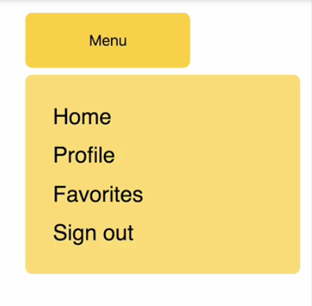
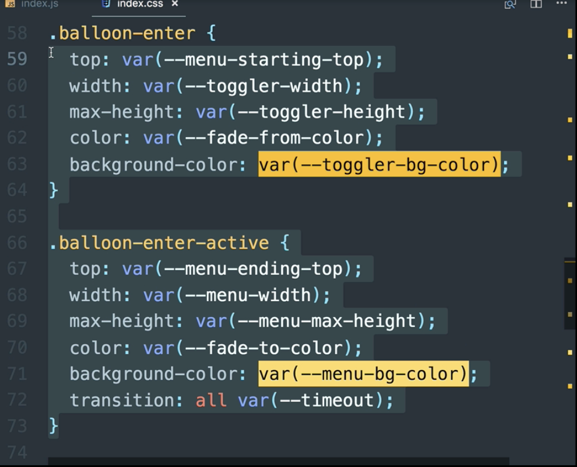
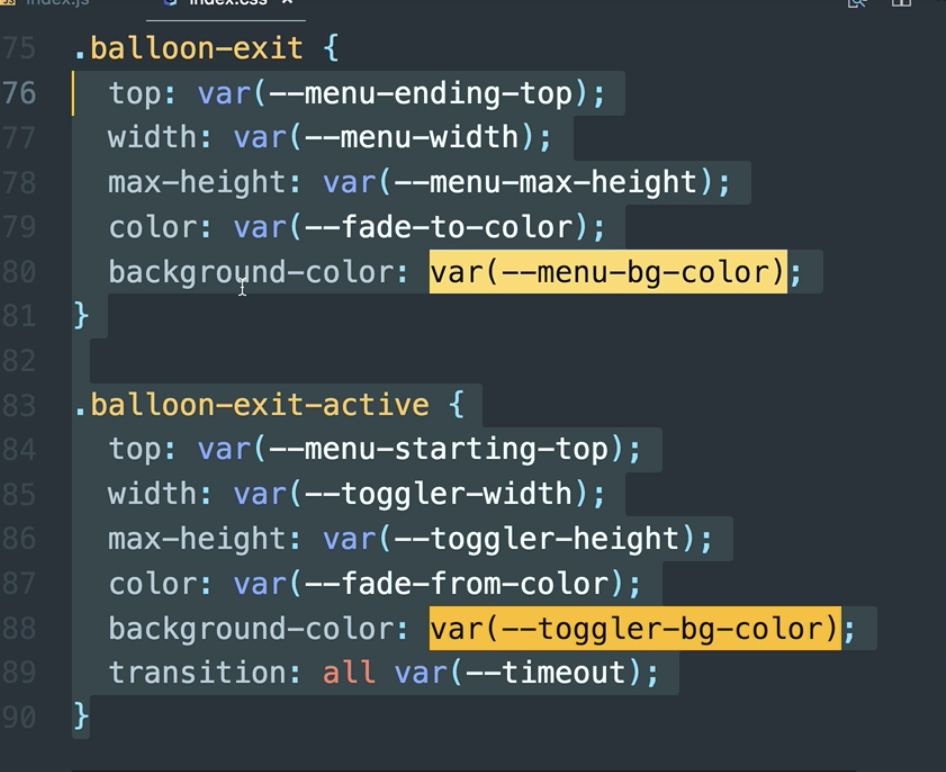

00:00 Here, we have a button which toggles the appearance of a menu using `<CSSTransition>` from React Transition Group. 



As well as the props that we're passing so far into our `<CSSTransition>`, we can also make use of the `enter` and `exit` props. These are true by default.

00:22 If we set `enter` to `false`, then these styles that we're using for our enter transition will not apply. 



The same can be said for when `exit` is `false`, these styles won't apply. 



Let's see that in action now. Let's pass `enter={false}` and refresh.

```html
<CSSTransition
  in={this.state.showBalloon}
  timeout={350}
  classNames="balloon"
  unmountOnExit
  enter={false}
>
```

00:47 Now, we get the exit transition, but not the enter transition. If we do `exit={false}`, we get no transition. This could be useful for when we want to keep hold of the CSS for our transitions, but we may want to dynamically disable the transitions, should our app require it.