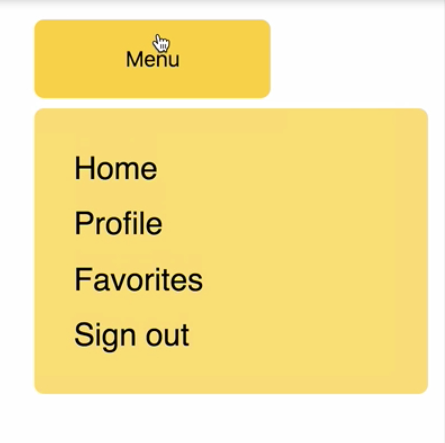
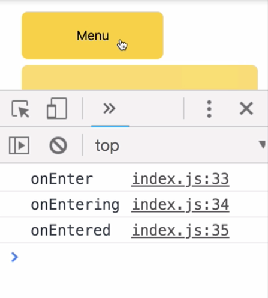
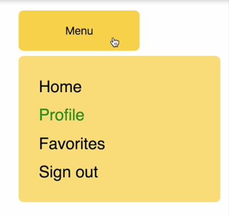

00:00 In front of us, we have a menu button which opens a menu using a transition with the `<CSSTransition>` component from React Transition Group. 



Using `<CSSTransition>`, we have access to a series of lifecycle props. These props can be used to target particular times during the transition phases. Let's demonstrate this.

00:25 Let's write out all of the lifecycle props that we have available to us. We have `onEnter`, `onEntering`, `onEntered`, `onExit`, `onExiting`, and `onExited`. We're just going to fire a `console.log` for each of these lifecycle props, so that we can see when they fire.

```js
<CSSTransition
  in={this.state.showBalloon}
  timeout={350}
  classNames="balloon"
  unmountOnExit
  onEnter={() => console.log('onEnter')}
  onEntering={() => console.log('onEntering')}
  onEntered={() => console.log('onEntered')}
  onExit={() => console.log('onExit')}
  onExiting={() => console.log('onExiting')}
  onExited={() => console.log('onExited')}
>
```

00:49 Let's save, refresh, and open the console. When the menu opens, we get logs for the phase of entering and the same for leaving. 



Let's use these lifecycle props for something practical in our app.

01:10 Let's say that when the menu opens, our Profile link is going to turn green to grab the user's attention. We'll add `onEntered` and we fire a method which we haven't written yet called `toggleHighlightedMenuItem`, which will also fire `onExit`.

```html
<CSSTransition
  in={this.state.showBalloon}
  timeout={350}
  classNames="balloon"
  unmountOnExit
  onEntered={this.toggleHighlightedMenuItem}
  onExit={this.toggleHighlightedMenuItem}
>
```

01:35 Above our render method, we'll write the method which is going to set some state, and it's just going to toggle a Boolean value called `highlightedMenuItem`, which we're going to initialize to `false`.

```js
toggleHighlightedMenuItem = () => {
  this.setState(state => ({
      highlightedMenuItem: !state.highlightedMenuItem,
  }));
};
```

```js
class App extends Component {
  state = {
    showBalloon: false,
    highlightedMenuItem: false,
  };
```

01:57 Now we need to apply a `className` tied to this state for value. Let's head back down to our render. We can make use of the `className` package to conditionally apply an active class name depending on the state. When `highlightedMenuItem` is `true`, we're going to get this `active` variant of list item.

```html
<li
  className={cx('list-item', {
    'list-item--active': this.state
      .highlightedMenuItem,
  })}
>
  Profile
</li>
```

02:23 We just need to write some styles for the `active` list item. Let's say when it's `active`, the `color` is going to turn `green`, and it's going to take `250ms` to do so. 

```css
.list-item--active {
  color: green;
  transition: color 250ms;
}
```

Let's save now and see how that affects our menu. When it opens, we see the profile link turn green and it goes back `onExit`.

