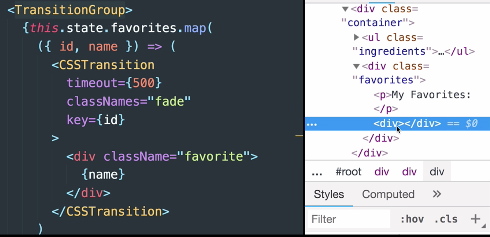
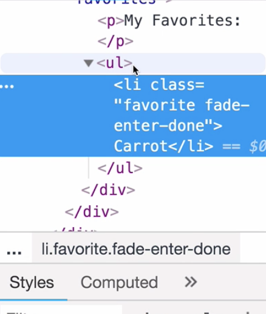
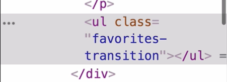
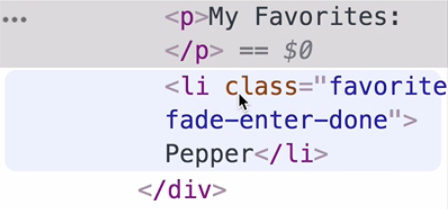

00:00 In front of us, we have a `TransitionGroup` component, which is mapping over our stateful `favorites` array and rendering a `CSSTransition` for each one.

00:11 It's worth noting that the `TransitionGroup` component renders a `<div>`. If we inspect the DOM, then we can see that this is the `TransitionGroup` component.



 However, if we don't want it to be a `<div>`, we can change which type of element gets rendered as the `TransitionGroup` element.

00:34 Let's supply a practical example. Let's say these `"favorite"` `<div>`s could be list items. We'd want to put these inside an unordered list, so we could pass `component="ul"`. Now, let's save and refresh.

```js
<TransitionGroup component="ul">
  {this.state.favorites.map(
    ({ id, name }) => (
      <CSSTransition
        timeout={500}
        classNames="fade"
        key={id}
      >
        <li className="favorite">{name}</li>
      </CSSTransition>
    )
  )}
</TransitionGroup>
```

00:50 Now, we can see that our `TransitionGroup` component is a `<ul>`. 



If we want to target this element with CSS, we can also supply a `className` prop. Here, we see it in the DOM.

```html
<TransitionGroup 
  component="ul"
  className="favorites-transition"
>
```



01:08 If we don't want an element to render at all for the `TransitionGroup` component, we can also pass `null` as the component. 

```html
<TransitionGroup component={null}>
```

Now, we see no transition group component. 



This could be useful for certain situations, involving styling or DOM structuring.

