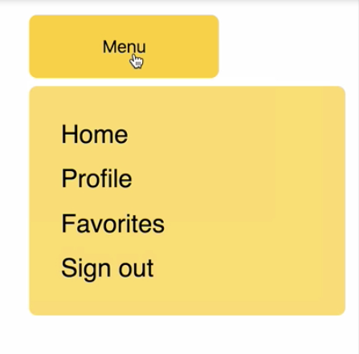

Instructor: 00:00 Here, we have a button which toggles a `Menu` component, and this is controlled with a CSS transition which is using a balloon transition, controlled by the `enter`, `enter-active`, `exit`, and `exit-active` selectors in the CSS.



00:21 Let's say we wanted this menu to show initially when the page loads, so before the user clicks the button. We can just change the stateful `showBalloon` value to `true`. Then when we refresh the page, the menu shows instantly, but there's no transition on it.

```js
state = {
  showBallon: true,
}
```

00:45 We can achieve a transition initially with the appear prop. In the `<CSSTransition>` component, we can pass `appear` as true. What that's going to do is add an extra pair of class names onto this menu on the initial load.

```html
<CSSTransition
  in={this.state.showBalloon}
  timeout={350}
  classNames="balloon"
  unmountOnExit
  appear
>
```

01:04 Then we can head over to our CSS, and include `balloon-appear` and `balloon-appear-active`, which will share the same styles as `enter` and `enter-active`. 

```css
.balloon-enter,
.balloon-appear {
  top: var(--menu-starting-top);
  width: var(--toggler-width);
  max-height: var(--toggler-height);
  color: var(--fade-from-color);
  background-color: var(--toggler-bg-color);
}

.balloon-enter-active,
.balloon-appear-active {
  top: var(--menu-ending-top);
  width: var(--menu-width);
  max-height: var(--menu-max-height);
  color: var(--fade-to-color);
  background-color: var(--menu-bg-color);
  transition: all var(--timeout);
}
```

Now, when the page loads, we get the initial transition.

