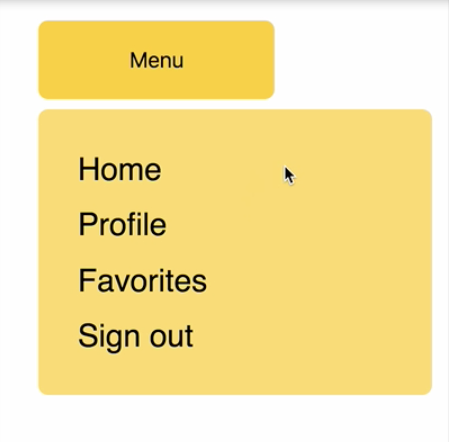
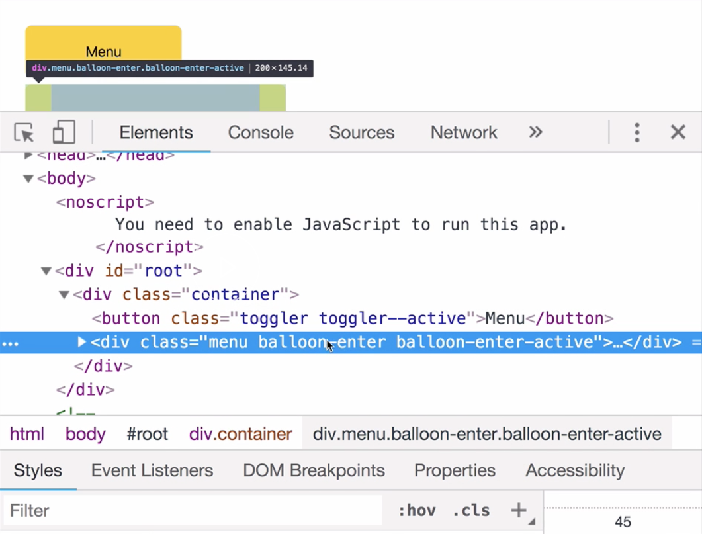

 00:00 In this example, we have a menu button which, when clicked on, toggles a menu which appears underneath. 
 
 
 
 The way this works is as simply as possible, using React state. The `onClick` fires this `toggle` method, which updates some state. The stateful value then controls the appearance of the menu.

00:24 Let's say we want to transition this balloon menu over time, so that it doesn't appear and leave straight away. Instead, it smoothly transitions in and out. To do this, we're going to make use of React Transition Group.

00:41 As a dependency, let's install React Transition Group. 

```
yarn add react-transition-group
```

Then we're going to import `CSSTransition` from React Transition Group. 

```js
import { CSSTransition } from 'react-transition-group'
```

The `CSSTransition` component is going to allow us to apply CSS transitions to elements entering and leaving the DOM.

01:03 Let's head back down to the render method. We're going to replace this line that refers to `this.state.showBalloon`. We'll replace it with a `<CSSTransition>`. It's still going to be controlled by that stateful value, but we're going to pass it to the `in` prop.

01:25 The `in` is a Boolean value, which is going to control the appearance of the menu. We'll also supply a `timeout` value, which is going to be the amount of milliseconds it will take to enter or leave. We'll pass it a `classNames` prop, which is going to be a string. It's going to be called `"balloon"`.

01:47 We're going to need this when we apply our CSS for the transition. Lastly, we're going to pass the `unmountOnExit` prop. This will mean that when this menu disappears, it's actually going to leave the DOM completely. This is an extremely useful feature of CSS transition.

```html
<CSSTransition
  in={this.state.showBalloon}
  timeout={350}
  classNames="balloon"
  unmountOnExit
>
```

02:10 Let's see how this affects what we have so far. Now, when the menu leaves, there's 350 millisecond delay, which will allow us to apply a transition. Our render method looks good. Let's head over to our CSS.

02:25 In our CSS, we have a list of variables at the top which control the colors and the measurements of the button and the menu. We also have a `timeout` value down here, which is the same as the `timeout` value that we used in the render method.

02:44 Below these variables are styles for the `button`, the `menu`, and the `list` inside the menu. Underneath this, we're going to write some styles for a transition. We passed the class name of `"balloon"`, so we're going to write transitions pertaining to the balloon class name.

03:06 CSSTransition gives us four key class names to use for elements entering and leaving. We have `balloon-enter`, `balloon-enter-active`, `balloon-exit`, and `balloon-exit-active`. `balloon-enter` will fire immediately when the element enters the DOM.

03:34 `balloon-enter-active` will apply on the next tick after `balloon-enter`. This is where we can add a transition. `balloon-exit` will fire immediately when the stateful value turns false, and `balloon-exit-active` will fire on the next tick after that. Then the element will leave the DOM.

03:57 Let's say we want to just do a simple fade as the transition. It's going to fade into the DOM and fade back out. We'll use `opacity` for that. In `balloon-enter`, we're going to say `opacity: 0;`. `balloon-enter-active` will have `opacity: 1;`.

04:14 It's going to have a transition on it. We're going to `transition: opacity`, and we can use the `timeout` that we declared at the top of this file. `balloon-exit` will start with `opacity: 1;`. It will transition to `opacity: 0;`. We need to add the `transition` in order to do this.

```css
.balloon-enter {
  opacity: 0;
}

.balloon-enter-active {
  opacity: 1;
  transition: opacity var(--timeout);
}

.balloon-exit {
  opacity: 1;
}

.balloon-exit-active {
  opacity: 0;
  transition: opacity var(--timeout);
}
```

04:45 Let's save and refresh. Now, when we open our menu, we get a fade in effect. Let's slow this down, so that we can see exactly what's going on. I'm going to change the `timeout` to 3.5 seconds, up from 350 milliseconds.

05:08 Let's inspect inside the DOM. When this button is pressed, we're going to see the menu appear into the DOM with `balloon-enter` and `balloon-enter-active` on it. When it's completed, we get `balloon-enter-done`, which is also a targetable class name.



05:29 When the stateful value turns false, we get `balloon-exit balloon-exit-active`, and then it leaves the DOM entirely. Of course, if we want to, we can be is elaborate as we want with our transition. Let's switch the `timeout`s back.

05:52 Let's say we want our balloon to grow out from this menu. We'll apply a `top` value, a `width`, a `max-height`, a `color`, and a `background-color`. All these values are going to transition to their finishing values. `menu-starting-top` becomes `menu-ending-top`, etc.

06:24 For the `transition`, we're going to transition everything. For the exit class names, we apply the same principle as before. `balloon-enter` and `balloon-exit-active` actually have the same values, because they're the starting and ending states of our transition.

06:49 Similarly, `balloon-enter-active` and `balloon-exit` have the same values, but the `transitions` are on the `active` class names. Let's save and refresh. Now, we have a menu which grows out from the button.

```css
.balloon-enter {
  top: var(--menu-starting-top);
  width: var(--toggler-width);
  max-height: var(--toggler-height);
  color: var(--fade-from-color);
  background-color: var(--toggler-bg-color);
}

.balloon-enter-active {
  top: var(--menu-ending-top);
  width: var(--menu-width);
  max-height: var(--menu-max-height);
  color: var(--fade-to-color);
  background-color: var(--menu-bg-color);
  transition: all var(--timeout);
}

.balloon-exit {
  top: var(--menu-ending-top);
  width: var(--menu-width);
  max-height: var(--menu-max-height);
  color: var(--fade-to-color);
  background-color: var(--menu-bg-color);
}

.balloon-exit-active {
  top: var(--menu-starting-top);
  width: var(--toggler-width);
  max-height: var(--toggler-height);
  color: var(--fade-from-color);
  background-color: var(--toggler-bg-color);
  transition: all var(--timeout);
}
```

