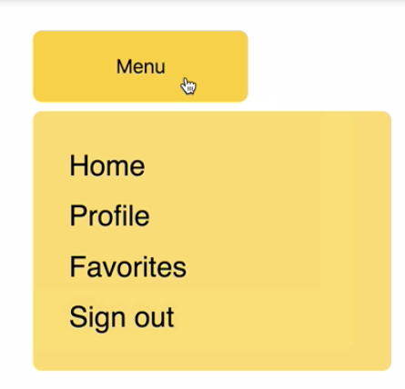
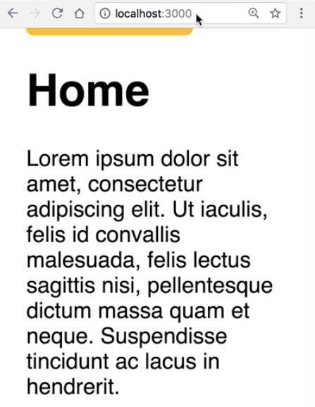
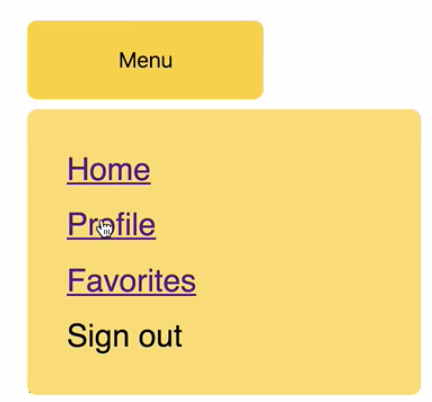
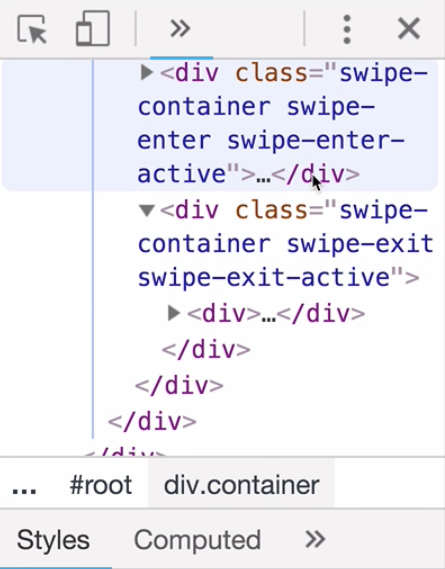

00:00 In this example, we have a button which when clicked, toggles the appearance of this menu. 



This menu is transitioned in and out of the DOM using `CSSTransition` from `react-transition-group`.

00:16 Currently, these list items don't lead anywhere, so what we're going to do is add routing using React `Router`, and we're going to transition the pages when they change using `react-transition-group`. Each page will gradually transition into the next one.

00:34 Let's get started by adding routing. Let's head to the top of the file. We're going to add `BrowserRouter as Router`, `Route`, `Switch`, and `Link` `from 'react-router-dom'`.

```js
import {
  BrowserRouter as Router,
  Route,
  Switch,
  Link,
} from 'react-router-dom';
```

00:49 Now, let's write a `Router` component which is going to link to our `App` component. Let's call it `Base`. It's going to return a `Router` component which contains a `Route` component which links to the `App` component. 

```js
class Base extends Component {
  render() {
    return (
      <Router>
        <Route component={App} />
      </Router>
    );
  }
}
```

Of course, we'll need to export that component instead of the `App` component.

```js
export default Base;
```

01:13 Underneath our button, we're going to write the main content to the page. We're going to write a `<div>` with the `className="swipe-container"`. It's going to contain a `<Switch>` component from React Router, and the `<Switch>` component is going to contain three `Route`s, one leading to `Home`, one leading to `Profile`, and one leading to `Favorites`, and they each have appropriate `path`s.

```html
<div className="swipe-container">
  <Switch location={location}>
      <Route
        exact path="/" component={Home} />
      <Route
        exact
        path="/profile"
        component={Profile}
      />
      <Route
        exact
        path="/favorites"
        component={Favorites}
      />
    </Switch>
</div>
```

01:39 We haven't imported these components yet. Let's head back to the top and import those now. 

```js
import Home from './components/Home';
import Profile from './components/Profile';
import Favorites from './components/Favorites';
```

Each of those components is a stateless component which is going to render some paragraphs of text. Let's save now and refresh. Now, we get the home component, because we're on the home route.



02:03 Now, let's replace these list items with some links from React `Router`. These will correspond to the routes that we just set up. 

```html
<div className="menu">
  <ul className="list">
    <li className="list-item">
      <Link to="/">Home</Link>
    </li>
    <li className="list-item">
      <Link to="/profile">Profile</Link>
    </li>
    <li className="list-item">
      <Link to="/favorites">Favorites</Link>
    </li>
    <li className="list-item">Sign out</li>
  </ul>
</div>
```

When we save and refresh, we'll have some links inside our menu. When we navigate to them, we get the appropriate component and the appropriate route.



02:33 The menu doesn't close when we change the route. Let's fix that now. We're going to write a class method: `componentWillReceiveProps` which takes `nextProps`, and it's going to hide the menu on any route change. We're going to check `nextProps.location` against the current `props.location`, and if they are different, we're going to set some state to hide the balloon menu.

```js
componentWillReceiveProps(nextProps) {
  // Hide menu on route change.
  if (nextProps.location !== this.props.location) {
    this.setState({ showBalloon: false });
  }
}
```

02:57 Let's check that now. Now, the menu closes whenever the route changes. Now that we've added routing to our small app, let's transition between pages. To do this, we need to make use of `CSSTransition` from `react-transition-group`, but also the `TransitionGroup` component.

03:17 The `TransitionGroup` component takes multiple CSS transitions as its children, which is the situation that we have in this case, because there are actually going to be two routes on the same page at once, when they transition. As one leaves gradually, the next one will enter gradually. Let's head back down to our `"swipe-container"` that we just wrote.

03:41 I'm going to wrap it in a `TransitionGroup` component. As the first child of the `TransitionGroup`, we're going to write a `CSSTransition` component. The `key` is going to be React Routers `location.key`, and that comes from `this.props`. 

Let's destructure that at the top of the `render` method.

```js
const { location } = this.props;
```

04:03 We're going to pass `classNames="swipe"` which will generate the class names that we need for the transition. We'll need this for our CSS, and we'll add a `timeout` of 500 milliseconds. It's going to take half a second to leave and half a second to enter. This is going to wrap the entire `"swipe-container"` `<div>`.

```html
</CSSTransition>
  <TransitionGroup>
    <CSSTransition
      key={location.key}
      classNames="swipe"
      timeout={500}
    >
      <div className="swipe-container">
        <Switch location={location}>
          <Route
            exact
            path="/"
            component={Home}
          />
          <Route
            exact
            path="/profile"
            component={Profile}
          />
          <Route
            exact
            path="/favorites"
            component={Favorites}
          />
        </Switch>
          </div>
</CSSTransition>
```

04:28 Let's see how that affects our app. Now when we change pages, we can see the previous one stays there for short time. Let's slow this right down and inspect the DOM. If you increase the `timeout` to five seconds, now when we change route, we can actually see two components both with the `class="swipe-container"`.



05:03 One is taking five seconds to leave, and one is taking five seconds to enter. Let's take the `timeout` back to half a second. What we're going to do is transition the leaving component to slideDown and fadeOut and the entering component is going to slideIn and fadeIn. Let's head over to our CSS to rights and transitions. We'll head towards the bottom of the file.

05:31 The first thing we're going to do is make the `swipe-container` `position: absolute`, so that the components leaving and entering are not statically positioned. Next, we can write some transitions for the swipe class name. We'll have `swipe-enter`, `swipe-enter-active`, `swipe-exit`, and `swipe-exit-active`.

05:58 We're going to fade and slide the component in, and fade and slide it out. We're going to start and end with an `opacity: 0`. I'm going to transition to `opacity: 1`. We're going to start with `transform: translateY(-100%)` and it's going to go to `0%` on `enter-active`.

06:24 When we begin to leave, we're also going to begin from `0%`. I'm going to `transform: translateY(100%)` as opposed to `(-100%)`. On the `active` class names, we can apply a `transition`, and we're going to apply all 500 milliseconds, which is the time out that we supplied in the JavaScript.

```css
.swipe-container {
  position: absolute;
}

.swipe-enter {
  transform: translateY(-100%);
  opacity: 0;
}

.swipe-enter-active {
  transform: translateY(0%);
  opacity: 1;
  transition: all 500ms;
}

.swipe-exit {
  transform: translateY(0%);
  opacity: 1;
}

.swipe-exit-active {
  transform: translateY(100%);
  opacity: 0;
  transition: all 500ms;

}
```

06:50 Now, let's save and refresh. When we switch between routes, the leaving components slides and fades out, and the arriving components slides and fades in.


