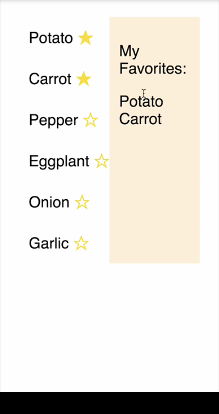
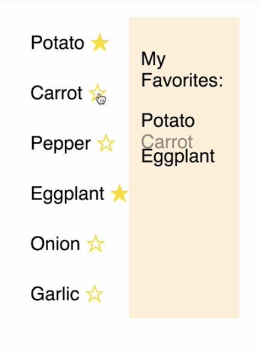

00:00 In this example, we have a list of ingredients. When an ingredient is pressed, it's toggled from the list of favorites. 



The way this is put together is that we have a list of items at the top of our component. These are the ingredients. `favorites` is initialized to an empty array and it's stateful.

00:24 We have a `toggleInFavorites` method, which will remove or add depending on its presence in the `favorites` array and then set the state accordingly. Down here, we have the `render` method in which we `map` over the initial items, and display list element for each one, and lastly the `"favorites"` section which appears on the right.

00:56 In its current state, the favorites are added and removed immediately. Let's add a transition for each of the favorites, so that they appear and leave smoothly. To do this, we're going to need two components from `react-transition-group`: `CSSTransition` and `TransitionGroup`.

```js
import {
  CSSTransition,
  TransitionGroup,
} from 'react-transition-group';
```

01:17 `CSSTransition` will be applied to each of the favorites, and `TransitionGroup` will be used as the container for individual CSS transitions. Let's use these components inside our render method now. Inside our `.map` of our favorites, we're going to add the `CSSTransition` components.

01:41 It's going to have a `timeout` of 500 milliseconds. It's going to have `"fade"` class name. This will be useful when we add a transition in the CSS. It's going to have the `key` as currently on our `<div>`. 

```js
{this.state.favorites.map(
  ({ id, name }) => (
    <CSSTransition
      timeout={500}
      classNames="fade"
      key={id}
    >
```

Now, we can apply the `TransitionGroup` component which is going to go in place of the container `<div>`.

```js
<TransitionGroup>
  {this.state.favorites.map(
    ({ id, name }) => (
      <CSSTransition
        timeout={500}
        classNames="fade"
        key={id}
      >
        <div className="favorite">{name}</div>
          </CSSTransition>
    )
  )}
</TransitionGroup>
```

02:09 This acts as a wrapper for using multiple CSS transitions inside this `.map` method. Let's save now and see how that affects what we have so far. Now, when a favorite leaves the list, there's a 500 millisecond delay. Now we're ready to write some transitions.

02:30 Let's head into our `index.css`, and there were already some style set up for the positioning and the colors of what we have here. Let's add some variables to the top of our file. We're going to add a time out value which is the same as what we have in our `index.js`.

```css
:root {
  --timeout: 500ms;
  --list-item-max-height: 30px;
}
```

02:49 We're going to add `list-item-max-height`, because we're going to be transitioning the max-height of each of the favorites, and it's just convenient to be able to have it as a variable should we want to change it.

03:02 Now at the bottom, we're going to start writing some styles for a fade transition, as `"fade"` is the class name that we supplied to `CSSTransition`. We can use `fade-enter`, `fade-enter-active`, `fade-exit`, and `fade-exit-active`.

03:27 We're going to start and finish with a `max-height` and `opacity` of `0`. We're going to transition to a `max-height` of the variable that we set at top and an `opacity` of `1`. The favorite is going to transition its `max-height` and its `opacity`. `fade-enter-active` and `fade-exit-active`, a class name's applied on the next tick after `fade-enter` and `fade-exit`.

04:03 That means we can target these with the transition. We're going to say `transition: all var(--timeout):` by the time out on `fade-enter-active` and `fade-exit-active`. Our CSS is looking good now. Let's save and refresh, and see what we end up with.

```css
.fade-enter {
  max-height: 0;
  opacity: 0;
}

.fade-enter-active {
  max-height: var(--list-item-max-height);
  opacity: 1;
  transition: all var(--timeout);
}

.fade-exit {
  max-height: var(--list-item-max-height);
  opacity: 1;
}

.fade-exit-active {
  max-height: 0;
  opacity: 0;
  transition: all var(--timeout);
}
```

04:25 Now, when items are added, they are faded in. When an item is removed, the item underneath slides up which gives a good indication of which item is leaving and where.

