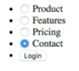

Let's look at the sibling selector, which is a less common CSS selector combinator. For this example, we're going to style a navigation. This is an unordered list of radio buttons. 



The benefit here is that even without CSS or JavaScript, this nav is pretty functional. It easily shows which item is selected. This could be a good strategy for a single-page app navigation.

Looking at the markup, we have list items with a class of `nav-item`. They contain a checkbox input. This one has a property of checked, so the page loads with this as the default selection. Then they have a corresponding label. On the end of the list, we have a login button.

Let's go ahead and start styling this. If we look at the CSS, I have commented out some styles here. It adds a background with a linear gradient, styling the nav just basically and then styling the nav items. 

#### CSS
```css
body {
  min-height: 100vh;
  background: linear-gradient( to right top, #360033, #0b8793);
  font-family: sans-serif;
}
.site-nav {
  padding: 0 20px;
}
.site-nav ul, .login-button button {
  list-style: none;
  padding: 0;
  font-size: 12px;
  text-transform: uppercase;
  letter-spacing: 2px;
}
.site-nav li {
  display: inline-block;
}
.nav-item {
  margin-right: 30px;
  color: #FFF;
}
```


Also, I have commented out the styling for the login button.

```css
.login-button button {
  background: transparent;
  color: white;
  border: 1px solid;
  padding: 6px 10px;
  border-radius: 12px;
  cursor: pointer;
}

.login-button button:hover {
  background: white;
  color: #0b8793;
  border-color: white;
}
```


Let's go ahead and style these `nav-items` with these radio buttons. We'll start by styling the `label`. I want to make these look like they're clickable, so I'm going to change the `cursor` to `pointer`. Let's add a `padding-bottom: 3px`, which we'll use for an underline in the selected state.

```css
.nav-item__label {
  cursor: pointer;
  padding-bottom: 3px;
}
```

These radio buttons are in the way. They're nice for functionality, but not for design. On the `radio` button, I'm going to start by setting the `pointer-events` to none. That'll make it so that if you click on it, nothing happens because we're actually then going to set the `position` to `absolute` to get it out of the layout and not mess up the layout further. Then we're going to set the `opacity` to `0`. 

```css
.nav-item__radio {
  pointer-events: none;
  position: absolute;
  opacity: 0;
}
```

Then we're going to go ahead and set `nav-item__radio:checked`. We want to change the state of what happens when they're checked. I want to put a `border-bottom`, which will act like an underline.

```css
.nav-item__radio:checked ~ .nav-item__label {
  border-bottom: 1px solid;
}
```

If you can see here, this didn't do anything. That's because the radio button's hidden. I'm going to use this `+` symbol, which is the sibling selector, so that when it's checked, the label should have an underline.


```css
.nav-item__radio:checked + .nav-item__label {
  border-bottom: 1px solid;
}
```

That's useful when the sibling is right after the initial selector, but if you have, like in this instance, where I've got a span in between, you can see that the pricing doesn't get its underline.

If I change this from a `+` symbol to a `~`, what that'll give me is a general sibling selector.

```css
.nav-item__radio:checked ~ .nav-item__label {
  border-bottom: 1px solid;
}
```


It doesn't have to be right after. There's a word of caution here, is that order is important.

I cannot select a sibling that comes before the first half of the selector. Doesn't work that way. Cascading styles only work in one direction. It has to be a sibling that follows after the initial element.

That's the sibling selector. If you use it correctly, there's not a ton of use cases for it, but when you really need it, it comes in very handy.