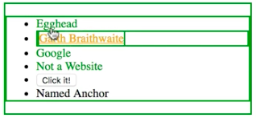

The majority of the time, all you need are basic selectors like the class and element selectors, but there are times when more advanced selectors will save you from adding unnecessary `HTML` or `JavaScript` to accomplish the styling and interaction you need.

The most basic or common example of interactive styling are state pseudo classes... in the DOM to make them work. Here in the `HTML`, 

#### HTML
```HTML
<ul>
  <li><a href="http://egghead.io">Egghead</a></li>
  <li><a href="http://garthdb.com">Garth Braithwaite</a></li>
  <li><a href="https://google.com">Google</a></li>
  <li><a href="http://fakewebsite.notreal">Not a Website</a></li>
  <li><button>Click it!</button></li>
  <li><a id="named-anchor">Named Anchor</a></li>
</ul>
```

we have an unordered list with some links, a button, and the last one looks like a link, because it's also an a tag, but it's actually a named anchor, because it doesn't have an `href` or a url` that it's going to.

Let's go ahead and style some of these links. If I want to remove the underlines from all of the links, I can do that by targeting the `a` and changing the `text-decoration` to `none`. 

#### CSS
```css
a {
  text-decoration: none;
}
```

If I want to change just the links -- notice that they're blue, but the last one isn't -- I can do that using the `link` pseudo class. I can target the links and then change the `color` of the text to be `green`.


```css
a:link {
  color: green;
}
```

One of these is purple because it is a link that I visited. If I want to change the `visited` state, I can go ahead and use the `visited` pseudo class, and then I can change the `color` to something like `orange`.

```css
a:visited {
    color: orange;
}
```

I can add a `hover` state to the links by using the hover pseudo class. Here, I'll add the `underline` back when we hover over the links using `text-decoration`. Notice the last a tag also gets this hover state even though it isn't a link. 

```css
a:hover {
    text-decoration: underline;
}
```

To be more specific, we can stack the link and hover pseudo classes, or even use the `[href]` attribute selector to just target tags with an href property.

```css
a[href]:hover {
    text-decoration: underline;
}
```

Links also have an `active` state, which is triggered when the link is being activated, or in this example, when the mouse is being held down while hovering over the link. Here, I'm going to go ahead and change the `border`, give it `1px` and make it `solid`. When I hover over it and I click the button, you can see that border shows up.

```css
a:active {
    border: 1px solid;
}
```

It's important to know that order matters here. CSS is designed to have a hierarchy, and you can override these states or pseudo classes if things get out of order and they'll do things that you may not expect. It's recommended, if you're going to use any of these pseudo classes, to use `link`, `visited`, `hover`, `active` in that order.

Links aren't the only elements with the pseudo classes. If I make a generic hover pseudo class and add a green border to it, it'll trigger on all the elements on the page. 

```css
:hover {
    border: 2px solid green;
}
```



I can be more specific by adding the `a` tag to the front of it, but that also triggers that named anchor. I can add the `href` attribute selector, or in this case, I'll stack it with the `link` selector.

```css
a:link:hover {
    border: 2px solid green;
}
```

If I want to also include the button in the same hover state, I can use a comma to combine selectors in the same rule set.

```css
a:link:hover, button:hover {
    border: 2px solid green;
}
```

None of these pseudo classes were defined by us by changing the DOM, but they come from the browser and the user's interactions. There are also some form pseudo classes, but these links pseudo classes are the ones that are most commonly used when you're styling a website.