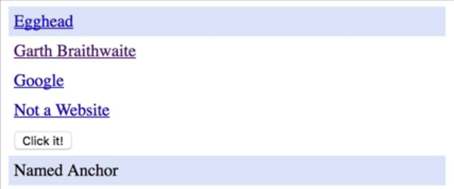
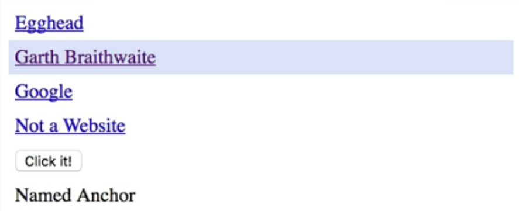
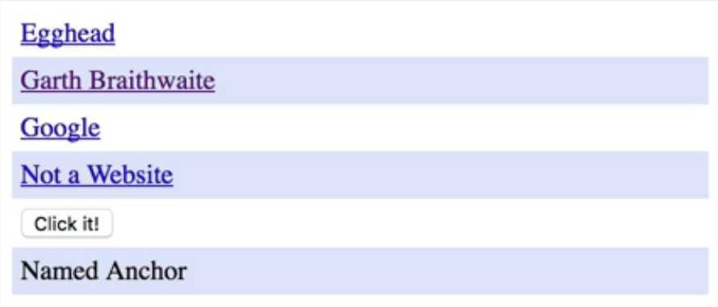
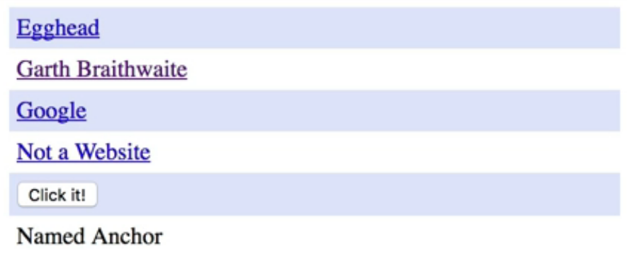
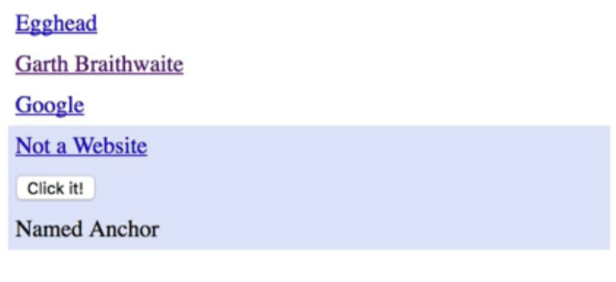

These last pseudo-classes have to deal with the location of the element in the DOM hierarchy. Here we're back to an unordered list of most siblings. As we scroll down, you can see...I just took of some of the styling of the list.

#### CSS
```css
ul{
  list-style: none;
  margin: 0;
  padding: 0;
}
li {
  padding: 5px;
}
```

Here is our first pseudo-class. This is the `first-child`. I'm changing the background to this blue color. You can see the `first-child`. It's kind of a purplish color. The `first-child` in the list element is going to be this purple and this last one as well.

```css
li:first-child {
  background-color: rgb(225, 231, 252);
}

li:last-child {
  background-color: rgb(225, 231, 252);
}
```



If I go ahead and comment these out and save it, then we can look at this next one. We got `first-child`, then `last-child`, and this is the `nth-child`. Here, I passed in the parameter of `2`, which just means the second child. If I want to head and put this back to 1, this would be the same thing as same `first-child`. I'm going to go ahead and put it back to 2, because that makes more sense. 

```css
li:nth-child(2) {
  background-color: rgb(225, 231, 252);
}
```


We can pass through more complex patterns to this `nth-child`. Here is an example of `2n`. You can see that it's going to be all of the even indexes. Indexes start with 1, 'Egghead' would be index 1, but the `n` counting actually starts with 0. We'd first pick the 0th element, but there isn't one in this list, so it'll apply to not 1 but 2, not 3 but 4 etc. 

```css
li:nth-child(2n) {
  background-color: rgb(225, 231, 252);
}
```



If we want to get the odd elements, then we can say `2n+1`. That way it'll choose the first element, the third, and so forth.

```css
li:nth-child(2n+1) {
  background-color: rgb(225, 231, 252);
}
```


You can get more complex with this. This pattern will actually pick the first four elements and apply the style to it. The reason again why it does that is, if we pass in 0 for n, it would be -04, which is the fourth element, and it's -1+4 which is the third element, and so on.

```css
li:nth-child(-n+4) {
  background-color: rgb(225, 231, 252);
}
```


You can also do something like this which would be everything except for the first three elements. You can do some interesting stuff with the nth child. You can make some complex patterns.

```css
li:nth-child(n+4) {
  background-color: rgb(225, 231, 252);
}
```



There are some other pseudo-classes that you might find helpful. There is the `nth-last-child` pseudo-class which is the same thing as `nth-child` that just counts from the bottom going up. This only child applies to every element that is an orphan.

```css
li:nth-last-child()
li:onlychild()
```

Then, there is `only-of-type` which will allow you to target a specific element type. If you want to get a paragraph that was all alone regardless of other sibling, nodes were around it, you could use this.

```css
li:only-of-type()
```

If you want to get `last-of-type` again if you want to get the last paragraph in a section, you could use this one.

```css
li:last-of-type
```

Then, you've got `nth-of-type` that it has the same pattern that you can use for the `nth-child`, and same thing with `nth-last-of-type` it does the same thing, but it's coming backwards up.

```css
li:nth-of-type(an+b)
li:last-of-type(an+b)
```

You can get really complex for some of the pseudo-classes. In fact, some of them make it little bit hard to read and maintain the codes. You're going to want to be careful with these. Just use them where they make sense.