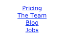
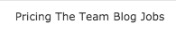
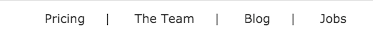
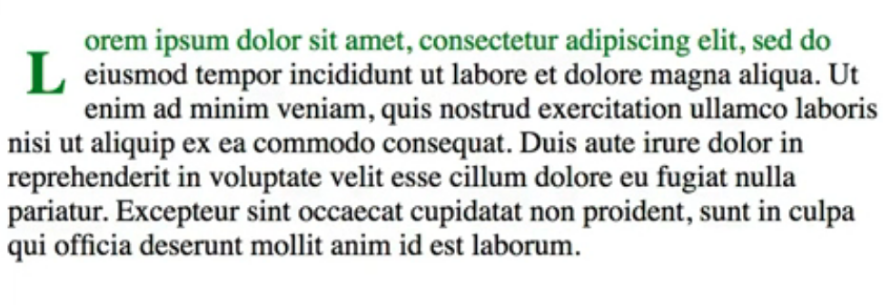
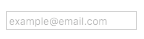

Pseudo-element selectors are used for styling elements that are inexplicitly set in the DOM. Like pseudo-classes, we use a colon to declare a pseudo-element, but we use two colons to differentiate pseudo-element selectors from pseudo-class selectors.

Probably, the most useful are the `::before` and `::after` pseudo-elements. I've got a blockquote here in the HTML. 

#### HTML
```html
<blockquote cite="http://garthdb.com/writings/i-am-a-jekyll-god/">Although your newfound power is real, and potentially useful, it’s not exactly super. Don’t let its intoxicating influence blind you to social contexts; these optimizations are not interesting enough to mention at dinner parties, and you should probably avoid referring to yourself as a god in any context.</blockquote>
```

If I wanted to put some quotes, double quotes, before and after, I could use the `before` pseudo-class or pseudo-element. To go ahead and change the content to be set to double quotes which will make it double quote character appear before the rest of the content. I can duplicate this and change it to an `after`, and that will give me double quotes afterwards.

#### CSS
```css
blockquote::before {
  content: '"';
}
blockquote::after {
  content: '"';
}
```

We can also have some better formatting on our quotes with the help of a property called `quotes`. If we use the `blockquote` selector and set the quotes property to be a series of quotes here, I'm going to go ahead and just paste it in. These are just strings that represent, the curled double quotes. Here, in the content, and the before I can change it to be `open-quote` and change it to be `closed-quote`, and that will actually replace those quotes with these curled ones.

```css
blockquote {
  quotes: "“" "”" "‘" "’";
}

blockquote::before {
  content: open-quote;
}
blockquote::after {
  content: close-quote;
}
```

#### Output
```
"Although your newfound power is real, and potentially useful, it’s not exactly super. Don’t let its intoxicating influence blind you to social contexts; these optimizations are not interesting enough to mention at dinner parties, and you should probably avoid referring to yourself as a god in any context."
```

The second pair of quotes actually applies to cases where you have nested quotes. Let's look at another useful example. Here, I've got a `nav` with a unordered list of links, similar to what you might see in a footer of a website. 

#### HTML
```html
<nav class="footernav">
  <ul>
    <li><a href="#">Pricing</a></li>
    <li><a href="#">The Team</a></li>
    <li><a href="#">Blog</a></li>
    <li><a href="#">Jobs</a></li>
  </ul>
</nav>
```

I'm going to go ahead and change some of the formatting of the list itself. Go ahead and start by getting rid of the bullets by changing the `list-style: none;` Getting rid of that indent by changing the `padding: 0;`. Then, we can change the `font-family`. I'm going to use `Verdana`. That thing is huge, so let's change the font size to something a little bit smaller.I'm going to align this to the center which doesn't make too much sense right now.

#### CSS
```css
.footernav ul {
  list-style: none;
  padding: 0;
  font-family: verdana;
  font-size: 12px;
  text-align: center;
}
```



Once we go ahead and change the `li` item `display`, we're going to set that to `inline-block`, those will allow those things to all be on one line.

```css
.footernav li {
  display: inline-block;
}
```

I'm going to style the link a little bit and start by a changing the `color` to something a little bit more subdued than that blue. I'm going to change the `text-decoration` on the text to be `none`, so it gets rid of that underlying.

```css
.footernav a {
  color: #333;
  text-decoration: none;
}
```

Right now, it's hard to actually tell where one link starts and the other one ends. Let's have a `hover`state to that, which will also make it seem a little bit more like a link. That will help with the look by putting that `underline` back on the `text-decoration` there.

```css
footernav a:hover {
  text-decoration: underline;
}
```



If I hover over them, at least I can tell which is which. To make it a little bit better, let's go ahead and put a separator in there. This is where we'll use the pseudo-element. We'll put an `::after`. Got to use the double colon. We'll put it after on the list items, `li`,  and we'll change the content to be just this vertical pipe, `|`. I've got to change that to a class. Now, you can see we've got a nice separator line, but let's change the margin a little bit to spread that a little more evenly. If you notice, how that last one's got a line on it as well which it doesn't need. We'll use the nth child or the `:nth-last-child`. Just started after that first element, so we'll do `n+2`. That will get rid of that last one. 

```css
.footernav li:nth-last-child(n+2)::after {
  content: '|';
  margin: 0 20px;
}
```



Let's go ahead and uncomment out the next example. It's just an article with the paragraph of text inside. We're going to use it to show off another pseudo-element called `first-line`. 

#### HTML
```html
<hr>
<article>
  <p>Lorem ipsum dolor sit amet, consectetur adipiscing elit, sed do eiusmod tempor incididunt ut labore et dolore magna aliqua. Ut enim ad minim veniam, quis nostrud exercitation ullamco laboris nisi ut aliquip ex ea commodo consequat. Duis aute irure dolor in reprehenderit in voluptate velit esse cillum dolore eu fugiat nulla pariatur. Excepteur sint occaecat cupidatat non proident, sunt in culpa qui officia deserunt mollit anim id est laborum.</p>
</article>
```

If we use the `p` tag and do `::first-line`, you can actually change the color, just the first line of text, without defining it in its own element. We can change that to something...instead of FireBrick we can change it to `green`. 

#### CSS
```css
p::first-line {
  color: green;
}
```

There is another pseudo-element that we can use called `::first-letter`. That would allow us to do something like a drop cap. I'm going to go ahead and change the `font-size` to be something bigger. I'm going to set the `float` to `left` to get the text to go around it. Let's put the line height and some `padding`. It probably also could use some `font-weight` increase there. Make it something a little bolder.

```css
p::first-letter {
  font-size: 2em;
  float: left;
  line-height: 1.7em;
  padding: 0 .3em;
  font-weight: bold;
}
```



The last pseudo-element example that we'll look at actually deals with form elements. If we uncomment this, you've got an input that's of type email and it has a `placeholder`, which is just a little bit of text that shows up, and there is no text in there put in by the user.

#### HTML
```html
<input type="email" 
placeholder="example@email.com"/>
```

We can style this `placeholder` using the `::placeholder` pseudo element. We'll change the `font-size` to be a little smaller, and we can change the `color`. This will just make it the little bit lighter.

#### CSS
```css
input::placeholder {
  font-size: 10px;
  color: rgba(0,0,0,.3);
}
```



At some point, you might be tempted to use some of these elements incorrectly, especially like before and after, because they allow you to insert content into the page from CSS.

That's almost always a bad idea to do this, because the whole purposes of CSS is to separate out styling from the content, and we'd be using it to potentially put content from a styling back into the mark up.

Where it can be useful is in throwing in some non-essential content into the page or really some decoration. The same thing with the placeholder, the first line, and even on the first button. These are all things that should be used for adding some styling, but not necessarily for changing the content or the nature of the content.