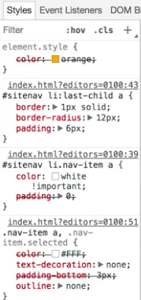

Selector specificity is one of the most useful and potentially the most complicated parts of CSS Selectors. CSS is designed to have a cascading hierarchy of styles, so you can overwrite styles as needed. Most of the time, the last style declared will overwrite conflicting styles that have been declared before, but specificity can counteract that.

If two selectors have conflicting rules, the selector with the higher specificity will win, but if they both have the same specificity, the last declared rule will win. It's important to understand how specificity is calculated, so that you'll be able to figure out which style will actually end being applied in the browser.

These are two examples of selectors with different specificities. The way that you calculate it is you figure out the parts that apply to different categories. You've got the number of inline styles. In this case, these are selectors that are part of external style sheets or embedded style sheets. That doesn't really apply. There will be zero in both these cases.


We can count the number of IDs. In this case, there is just site nav, so there's one ID and the number of classes, attributes, and pseudo-classes. If we look here, `.navitem`, that's one class. Then, we can count the number of elements and pseudo-elements.

We've got 1, 2, 3, 4. This is a bit more specific than it needs to be. We really don't need `nav`, we don't need `list-item`, and we probably don't even need unordered list. This one has a lower specificity. Here, we've just got one class, and one pseudo-class, and then we've got two elements.

If these two were competing for the same styles, obviously the one with the higher specificity would outrank the lower one, even if this one, 

#### CSS
```css
nav#sitenav ul li.nav-item a {}
```

appeared before this one. 

```css
.sitenav li:last-child a {}
```

If you're looking at the CSS here, we actually have it written out as an example, where here we have the `color` of white and a `padding` of zero. 

```css
nav#sitenav ul li.nav-item a {
    color: white;
    padding: 0;
}
```
With the same one, we have a padding of `6px`.

```css
li:lost-child a {
    border: 1px solid;
    border-radius: 12px;
    padding: 6px
}
```

We ideally want this `padding` of `6` to overwrite the `padding` of `0`, so that this 'BLOG' will look more like a button with its separated out. That's not happening here, because the specificity is higher above.

If we took off some of these things, if we actually took off `nav` and we took off unordered list, `ul`, then we put `#sitenav` in front of `li:last-child`, then we'll find that the specificity is the same. We're actually a little bit higher here, so we'll end up with the style applied correctly.

```css
#sitenav li.nav-item a {
    color: white;
    padding: 0;
}

#sitenav li:last-child a {
    border: 1px solid;
    border-radius: 12px;
    padding: 6px
}
```

Now, we have a `color` of `white` here. The reason that that's not being applied is, because in the HTML, we're actually using an inline style which is just the `style` attribute on this `Blog` element, and you write your styles in there. There's no selector. It's just the rule-set. We're applying the `color` of `orange` to that.

#### HTML
```html
<li class="nav-item"><a href="#" style="color: orange;">Blog</a></li>
```

Even though this might have a higher specificity, though things that are currently being applied in inline style, so they trump everything. Now, there's one way for a rule overwrite all the other rules regardless of specificity, and that's to use the keyword `important` at the end of the declaration before the semicolon. You prefix it with an exclamation mark, `!`.

#### CSS
```css
sitenav li.nav-item a {
    color: white !important;
    padding: 0;
}
```

What this is saying is, "I don't care about specificity. I just want this rule to be applied this way." It's a useful tool when you really need to use it, but it's highly recommended to avoid it at all costs if at all possible.

The reason being is, it really throws a wrench in to the cascading aspect of CSS, and makes it very difficult to trying and figure out what's being applied and how it's being applied, and it makes it difficult for you to overwrite that again in the future or further down in different external style sheet if you need to.

Yes, you can use important, but you probably shouldn't ever use it if you can avoid it. If you want to see what is being overwritten, you can always go ahead and inspect an element using the dev tools. You can do this in Chrome or in Firefox, and you can see what the declarations are on a specific element and what's being overwritten, and it'll have a line crossed through it here.



You can see that the orange is trumping the white, or the white is trumping the orange in this case, because it has the important keyword. Like I said, it's probably best to avoid using the important keyword and also to avoid using inline styles as possible.

#### HTML
```html
<li class="nav-item"><a href="#">Blog</a></li>
```

Again, it's one of those things that make it hard to overwrite things in the future or further down in the cascading chain. Ideally, you'll also try and keep the specificity low, so it's easy to overwrite if you ever need to. Often times that means avoiding using `id`, if you can, stick to classes, and sometimes, even avoiding using elements.

That's more of a maintenance thing to try and make it easier to maintain code if you need to change what element you're using. If you stick to just flat classes, then it makes it a lot easier to maintain the code.

There are number of CSS ideologies that are associated with this idea of sticking with just flat classes for everything. Specificity is one of those things that if something is not working out right, if you're expecting something to be styled and it doesn't appear to be that way, often times your specificity is mixed up and it's overwriting in a way that you don't expect.

If you're not getting things to appear the way you want, go ahead and double check. Figure out all the things that are being applied to it, and figure out if you got things that are crossed out in your dev tools. Often times that means that it's being overwritten in a different place that you might not expect.