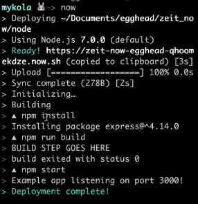
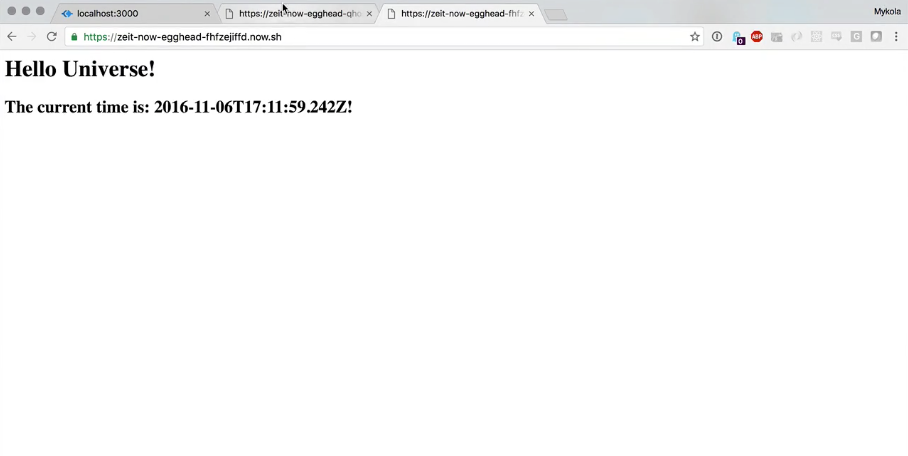
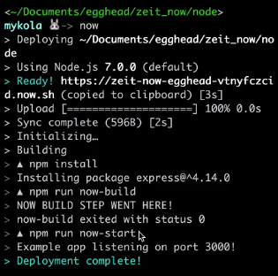

We've got a very simple **Node** `express` application here. `package.json` says on `start`, run `node index.js`. `index.js` just says, any incoming requests you get to the root path, just respond with `'<h1>Hello World!</h1>'` and the current time. I'm going to go ahead and listen on `port 3000`.

####index.js
```javascript
var express = require('express');
var app = express();

app.get('/', (req, res) => {
    res.send('<h1>Hello World!</h1>
        <h2>The current time is: ${new Date().toISOString()}!</h2>');
});

app.listen(3000, function () {
    console.log('Example app listening on port 3000!');
});
```

If we run `npm start` and we go to `localhost:3000` here, we see `"Hello World!, the current time is this."`


The problem is we don't want to run this locally, we want to deploy this so anyone in the world can visit that endpoint and find out what time it is.

To do that, we're going to type `$ npm install -g now`, which is going to install the **Now** package from a company called **ZEIT** globally. When you install something globally on npm, that means you can just type, if there's a binary exposed like there is for now, you can just type that command in any folder and it'll attempt to run.

What happens if I type `$ now` in a folder that has a `package.json` file? Something pretty simple and amazing. It's going to generate a URL for me, which you can see here, and it's going to copy it to the clipboard for me. It's going to upload my entire project to a remote Web server.



Then it's going to run `$ npm install`, so it's going to pull down whatever specification I had, in this case, it was just `express`. Then it's going to run `$ npm run build`, just in case you have a `"build"` step. I don't, but I wanted to stick that in there so you could see that it runs. Then it'll run `npm start`. That'll run your `"start"` script.

Then if you go to the URL that it generates for you, you can hit Enter in your browser, there's your application and it's currently running and it's live. I can refresh it and watch the time refresh. This is live in production right now.


Now, something cool about this URL. This is the name of my project, and this is a unique key that it generated based on, like, the state of my application right now. It looks at my `package.json`, and it looks at my code.

It says, OK, awesome. If you deploy this package against this code, using `now`, that's the URL that you get. I can show you that that's true by running ZEIT `now` again. Pay attention, it's Q-H-O-O-M something.

```
https://zeit-now-egghead-qhoomekdze.now.sh
```

If I run `now` again, we're not going to see it do `npm install` and `npm run build` and `npm start`, it's actually just going to give us the same URL again. This is using a certain property of immutable data structures.

```
https://zeit-now-egghead-qhoomekdze.now.sh
```

It's actually saying that this deployed instance is like a pure function of this particular named project with the current state of this code. No matter how many times I deploy the current state, it's always going to return the same deployment instance that I can get to via that URL.

It's going to be up forever unless I choose to take it down, so if you're watching this in three years, if you type in this URL, then, in theory, this should just work. How do I change stuff, then? What does that mean in the world of immutability?

The first thing you want to ask is, "OK, well, how is change handled?" Let's try to change. Let's say, instead of `"Hello World!"` our marketing department's come back and said, "It turns out `'Hello World!` is overdone. The new thing is `'Hello Universe!'`"

####index.js
```javascript
app.get('/', (req , res) => {
    res.send('<h1>Hello Universe!</h1>
        <h2>The current time is: ${new Date().toISOString()}!</h2>'); 
});
```

OK, great, so we make that change. We've run `now`. You can see it's actually giving us a new URL, because the `package.json` file with this code, which is different from the previous code, means that our input has changed, which means that our output has changed.

```
https://zeit-now-egghead-fhfzejiffd.now.sh
```

Now, if we go to this endpoint, we see `Hello Universe!` Note that this endpoint is still here. I can still hit switch tabs, hit Refresh, and get `Hello World!` Isn't that like super inefficient? Isn't this using up a ton of system resources?



No, with modern containerization and stuff, it's easy for them to, this URL doesn't get any requests for a while, because this is now, like, the new canonical endpoint for this project, they can just put this one to sleep.

It's still available, it just means that the next time somebody does submit a request to it, it is going to just take a few extra seconds to warm up. Let's look at one other feature here. Sometimes, if we're running things locally, we want to have a different sort of setup than we do if we're running them remotely.

Now offers a nice little escape hatch here. If we define a script called `start`, and a script called `now-start`, then when we've run it on `now`, it'll ignore start and it'll run `now-start`. The same for `build`, if we define a `now-build`, echo `now-build` step went here.

####package.json
```json
"scripts": {
    "start": "node index.js",
    "now-start": "node index.js",
    "build": "echo 'BUILD STEP GOES HERE'",
    "now-build": "echo 'NOW BUILD STEP WENT HERE!",
    "test": "echo \"Error: no test specified\" && exit 1"
},
```

If I then run `now`, we're going to see, now that our dependencies have been installed, run `now-build` and then run `now-start`. That's just useful, like, we're not doing anything special with it here.



If you want your dev to run with certain environment variables, for instance, and your prod to run with other ones or something like that, we can dig a little bit more deeper into that in future lessons. There is an escape hatch, and there is a way for you to have `now` specific `start` and `build` scripts.
