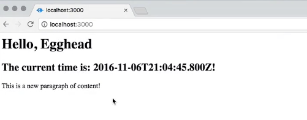
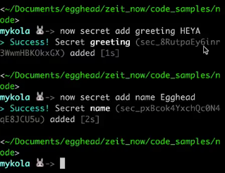
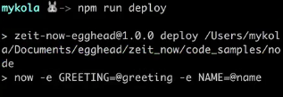

A lot of times as our applications grow in complexity, it becomes necessary for us to store certain parts of information in a way that's accessible to the application without actually being in the code. One way that we do that is using **environment variables**.

####getGreeting.js
```javascript 
module.exports = function() {
    return 'Hello, world!';
}
```

The kinds of stuff I'm talking about, let's say for instance we're really tired of having to bump the version and redeploy every time we change the greeting. Instead, we're going to say, `var greeting = process.env.GREETING;` That says find the environment variable named `GREETING`, and whatever its value is, set this variable equal to that value.

####getGreeting.js
```javascript 
var greeting = process.env.GREETING;

module.exports = function() {
    return 'Hello, world!';
}
```

Then down here, instead of returning `Hello, world!`, we're going to go ahead and `return` a template string that says, `'Hello, ${greeting}'` Now if I run this, if I type `export GREETING=Egghead && npm start`, you'll see that I can access that. I can control that.



If I change that to say, `GREETING=ZEIT`, then it says `Hello, ZEIT`. I can control parts of my application without having to change my code. That's pretty cool.

In order to take these environment variables and make them true on the now deployment, you have to use a special flag. If I say `now -e`, I can now give it a key value pair. I can say, `GREETING=Egghead` and hit enter.

```bash
$ now -e GREETING=Egghead
```

Let's deploy. We'll come over here, wait for that to finish up. Cool. "Hello, egghead." That worked. 

You can actually do this with multiple things. Let's change this a little bit. Let's say this becomes `${greeting}` and this becomes `${name}`. That's a little bit more appropriate. We say, `var name = process.env.NAME;`

####getGreeting.js
```javascript 
var greeting = process.env.GREETING;
var name = process.env.NAME;

module.exports = function() {
    return '${greeting}, ${name}!!';
}
```

I can say, `now -e GREETING=Hi -e`, there can be any number of these, `NAME=Egghead`. Now I'm redeploying this. We've got our URL on the clipboard. Let's go ahead and navigate there. Now it says, `Hi, Egghead!!` That's cool.

Now you might be saying to yourself, "I really don't want to have to type out all of this stuff every time I deploy. I really liked my three letter deploy." One thing you can to make that a bit easier is to create a `"deploy"` script.

####package.json
```json
"scripts": {
    "start": "node index.js",
    "now-start": "node index.js",
    "build": "echo 'BUILD STEP GOES HERE'",
    "now-build": "echo 'NOW BUILD STEP WENT HERE!",
    "deploy": "now -e GREETING=Hi -e NAME=Egghead"
    "test": "echo \"Error: no test specified\" && exit 1"
},
```

Now when you do `npm run deploy`, it'll do that for you. It's not three letters, but that's something. That still works.

A problem you'll run into sometimes...This is fine for simple strings. There's not necessarily going to be any kind of a problem saving all of this to Git and publishing it. This is not a secret. This is just a config variable that we have set for this version.

But what if instead of the name egghead, it's something like `-e TWITTER_API_KEY=`? You don't actually want to paste something in there because then if you commit, package that JSON to Git, now you've got your secret key...It's a bad practice.

How can we protect ourselves? How can we stick secret information into our `now` deploys without committing that information anywhere visible? Now has a feature called **secrets** that makes this super easy.

Let's make our `GREETING` and our `NAME` secret for the purposes of this demo. That works like this. We say, `now secret add greeting HEYA`. `now secret add name Egghead` I've added those on my command prompt right here.



That is the last time I ever need to see them because now I have a name for this secret. I can reference the secret by name and refer to it by name. The actual value isn't going to be stored anywhere in my code. It stays just a reference until it gets up to the now server. Then the environment gets built and the secret gets swapped in.

The way I do that is I prefix with an `@` sign here. The value of `greeting` going to be my secret greeting and the value of `name` is going to be my secret name.

####package.json
```json
"scripts": {
    "start": "node index.js",
    "now-start": "node index.js",
    "build": "echo 'BUILD STEP GOES HERE'",
    "now-build": "echo 'NOW BUILD STEP WENT HERE!",
    "deploy": "now -e GREETING=@greeting -e NAME=@name"
    "test": "echo \"Error: no test specified\" && exit 1"
},
```

Now if I run `npm run deploy`, you see it's not even spitting out the actual things.



Now we can go to the url it gave us. As you can see, it found our secret and it substituted in in the environment variable that we told it to. This is really cool.


If you type, `now secrets ls` it'll list all the secrets on your account. I've got a bunch of them here. You can delete them, `now secret remove name`

But the important thing is that these secrets are secure. You reference them purely by name and the actual value of it is just stored over on the Now server. Once you've got that secret in the system, you can reference it by name all you want everywhere in your code, and it's safe and it's secure.