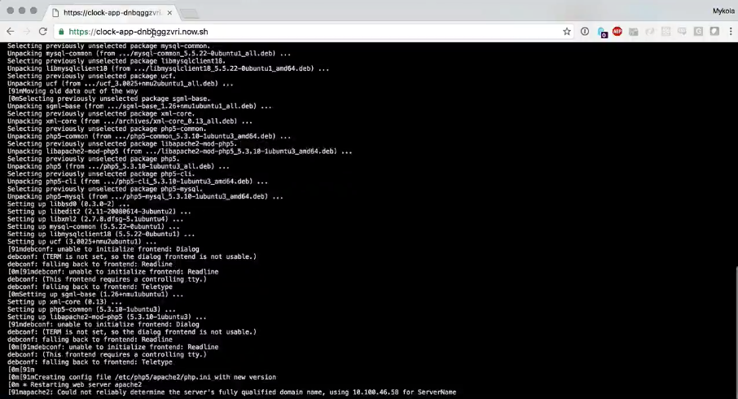
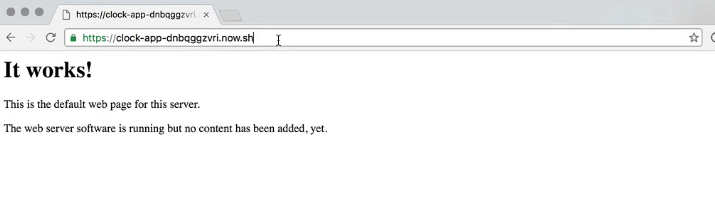
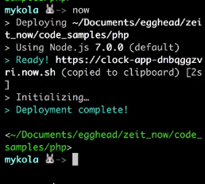

In addition to natively parsing `package.json` files and making **node** applications super easy to deploy, **Now** from **Zeit** is also capable of parsing Dockerfiles.

####Dockerfile
```php
FROM kstaken/apache2
LABEL name "clock-app"
RUN apt-get update && apt-get install -y php5 libapache2-mod php5 php5-mysql
COPY clock.php /var/www
EXPOSE 80
CMD ["/usr/sbin/apache2", "-D", "FOREGROUND"]
```

What this means is that, in addition to **JavaScript** projects, you can also deploy projects written in the custom language that you wrote in grad school and have never used for anything but want to deploy a service in or whatever, anything. Anything can be run inside of Docker because it's just a virtual Linux container.

To prove this point, we're going to run some PHP code here and show you that PHP is as easy to deploy with **Now** as JavaScript. Here's our `Dockerfile` and don't worry if you don't know what this is. We're going to have some Egghead Lessons on this soon.

####Dockerfile
```php
FROM kstaken/apache2
LABEL name "clock-app"
RUN apt-get update && apt-get install -y php5 libapache2-mod-php5 php5-mysql
COPY clock.php /var/www
EXPOSE 80
CMD ["/usr/sbin/apache2", "-D", "FOREGROUND"]
```

If you look at it, what we're basically saying is go grab a template. In this case, an `apache2` Docker container. Give it a name. Run a little bit of code. In this case, we're just updating our dependencies. Copy this file from the local computer into this location on the Docker's container. `EXPOSE` port `80` and then start `apache2`.

What is our file? It's just like our node example file. It's a clock. It's spitting out the current time, but this time, it's using PHP codes. It's going to render that on the server and spit it out. How do we deploy this with Now? We just type `now`.

####clock.php
```php
<html>
    <head>
        <title>Universe Clock</title>
    </head>
    <body>
        <h1>Hello, Universe!</h1>
        <h2>
            <?php echo 'Current Time: '. date('m-d-Y H:m:s'); ?></h2>   
    </body>
</html>
```

Dockerfiles in my experience take a little bit longer than node projects, but it gives us a URL. `https://clock-app-dnbqggzvri-now.sh` That gives me a good opportunity here to show you something cool. As your application is deployed in Now, it logs all this stuff out to the terminal, but it's also logging this out to the URL.



You'll notice the URL is something that it gives you right away. It doesn't wait until the whole thing's deployed before giving the URL. Instead it gives you this, and then you can put this up there and already share it around.

Even if your Docker install takes a minute or two, because it's going to pump all of these logs out to the browser via, I assume, Web sockets or something. Then as soon as this whole thing is done, it's going to redirect and show you the `index.php` page. If we watch this for a second, we see it storing. There we go. Now, we're all set.



Now, all we have to do is go to `clock.php`. We can see that our clock is running and hasn't been deployed via Docker. Now, all the same rules hold true. If we run `now` again without making any changes, you can see that it's giving us the same URL. It's not jumping through any of those hoops.



This is still an immutable deployment, but now, instead of a Node application, we're running something in any language, in this case PHP, and sticking it out there. That's really awesome because that means that we can now officially use Now to deploy any of our code anywhere with three letters on the command line.