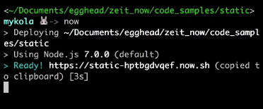
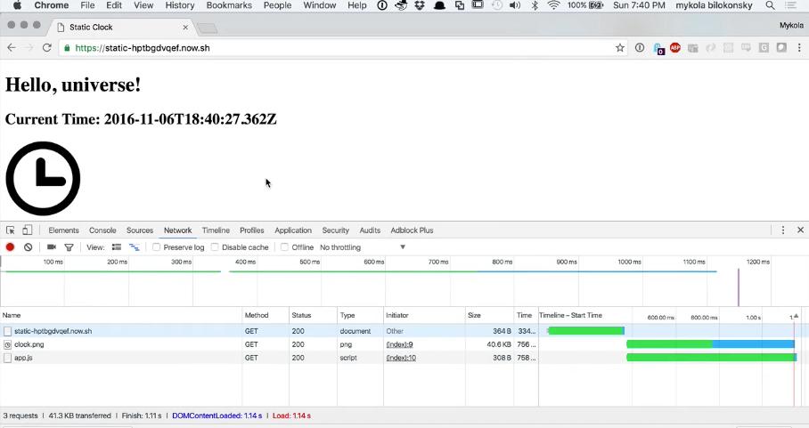
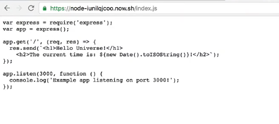

We know we can use `now` to deploy behavior to the cloud stuff that runs on the server either by deploying a **Node** application, in which case you have a valid `package.json` file, or anything else, in which case it has to be in a **Docker** container, but `now` can also allow us to serve static content with no additional difficulties.

This makes it a direct competitor to something like **Serge**, for instance. That works as easily as anything else. If you're in a directory with a bunch of static content, let's say it does not have a `package.json` file, it does not have a `Docker` file, and you type `now`, it's going to go ahead and serve that directory.



Here, we've got `index.html`, `app.js`, and `clock.png`. All we're doing, it's the same example we've been doing elsewhere. We have `Hello Universe!`, `Current Time:`, and then we've got a `span` with an `id`. Here we added an image of a clock.

####index.html
```html
<!DOCTYPE html>
<html>
<head>
    <title>Static Clock</title>
</head>
<body>
    <h1>Hello, universe!</h1>
    <h2>Current Time: <span id='time'></span></h2>
    
    <script type="text/javascript" src='app.js'></script>
</body>
</html>
```

Then we go to our JavaScript `app.js`. All this is doing is getting our reference to that `span` with the ID `time`, and then it's setting the inner text to be a new date.

####app.js
```javascript
var timespan = document.getElementById('time');
timespan.innerText = new Date().toISOString();
```

Here's our `clock.png`, which I just downloaded for free from [The Noun Project](https://thenounproject.com/) which is a great place to go for images of stuff.

We deployed that. We typed `now`. It gives us our URL. Let's go over to **Chrome**. Let's paste that URL. We see `Hello, universe!` Here's the current time. Here's our clock image. If we go over here and do our dev tools, refresh this, we see that this is all getting loaded in. It's loading. It's pulling down `app.js`, pulling down `clock.png`.



That's a static site hosted via `now`. All the same rules apply. If we type `now` again, it's going to give us the same URL because it's an immutable deployment. If we change something, if we decide, "Oh, universe should be capitalized," we'll type `now`. It's going to give us a different URL.

```
https://static-hptbgdvqef.now.sh
```

All of these URLs are just going to be up all the time. Here, if we go to the new one that we just spun up, you can see we now have the U in universe capitalized. Again, these are immutable deployments. We refresh this old one. This one's also still live. It's just a different URL.


Now, we can also force `now` to deploy something statically. If we go over here back to our node example and we type `now --static`, let's see what it does. We've got our URL. `https://node-iunilqjcoo.now.sh` It's pushing all the stuff up. Let's go ahead and paste that in there. You can see it just gave us our `index.js`.



You can force `now` to deploy things statically. It looks like it stripped out the `package.json`. It just didn't actually send it up, but the only other thing in there was `index.js`. If you have a folder that has a `package.json` in it, but you want to for whatever reason share the contents of that folder via `now`, but I'm not saying it's a good idea.

I'm just saying that you can do it. You do that by typing `now --static`. `now`
can be used to serve node projects. It can be used to serve `Docker` containers. It can be used to serve directories containing static data.