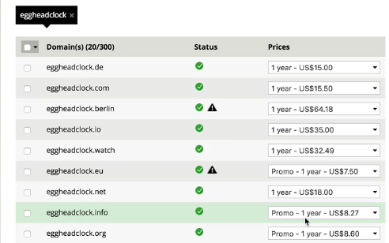
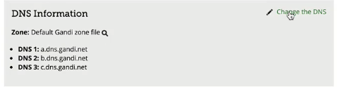
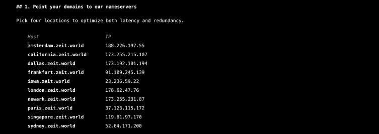
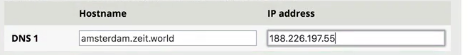
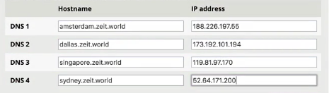
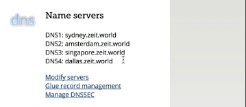
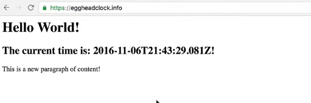

We've seen how **Now** from **ZEIT** can be used to deploy **Node** projects, `docker` containers, even folders of static content. We've seen how to use `now alias` in order to point a user readable sub-domain to whichever deployment we want users to see.

But at some point, you want to make a little bit more personal. You want to add your own domain name. With the free account, you can't do this, but if you subscribe to Now, there's reasonably straightforward way to map your own domain name and treat it as though it were just another alias. Let's take a look at how that works.

I'm going to go over here to [gandi.net](https://www.gandi.net/domain/register), which is what I use to register domain names. I'm just going to get something like `Eggheadclock`. I'm going to get this for really cheap.


What do they have, a dot com or something for not a lot of money? Can't imagine there's too many egghead clocks out there. What's even cheaper? There's an EU. `Eggheadclock.info` for 8.27, that fits the bill perfectly.



I'm going to go ahead and order that domain name. When I order it, I want to change the DNS.



I don't want to use Gandi's domain name servers. Instead, I want to provide zeit world's domain name servers. You get those from here. `https://zeit.co/world` If you have a paid account, this is all going to be available to you. `https://zeit.co/world` has the description of how to set this up.



But basically, we're going to pick four domain name servers from this list. There's the host. There's the IP.



Let's try to get them from different parts of the planet so they're nicely distributed. I've got one from Amsterdam, got one in Dallas. Let's do Singapore. Let's do Sydney, Australia. Why not?



We accept the terms. I now own the domain that I just bought, `eggheadclock.info`. Over here under DNS, every register is going to do this differently. If you can buy a domain name somewhere, one of the things that you can control is the DNS servers.



My DNS servers that I put in when I was setting this up are now here which means that this is now ready for use with Zeit world. That means that I can now alias to this domain instead of just to a string to use as a sub-domain like we did with `eggheadcourse.now.sh`. We can alias directly to this URL. `eggheadclock.info` We do that like this.

Let's just go ahead and run `now` back in our terminal to get our URL, make sure we have our most recent deploy ready to go. Then, all we want to do is we want to say `now alias`, copy and paste that new URL, then it's `eggheadclock.info`. Then, that worked.

```bash
$ now alias https://zeit-now-egghead-kpylifpmbg.now.sh egghead.clock.info
```

Now, if we go to `https://eggheadclock.info`, we should see our site. There it is. Adding your own domain name is really pretty simple.



I should point out that about two and a half hours elapsed from the time I started recording this video until now. The DNS stuff does take a little bit of time to propagate. You might get some weird behavior in that first hour or two. just give it a couple of hours. They say up to 48 hours, usually I find it doesn't take that long. 

Now, as you make edits to your application, you can just update this pointer to always be pointing at the most recent version. All you have to do is give out your custom domain name to your customers.