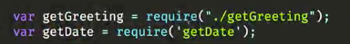
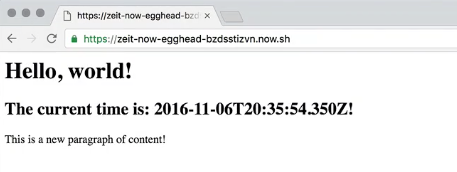

**Now** comes with a pretty awesome little debugging tool called **Cloudview Source** which allows you to look at the source of your service side application right there on the server, if it's set up to be exposed. Let's take a look at what that looks like.

First, let's refactor our application a little bit, so that we have a little bit of room to introduce the sneaky bug. Let's create a couple of modules here. Let's go create one called `getGreeting.js` and one called `getDate.js`

Let's open `getGreeting` and write.

####getGreeting.js
```javascript
module.exports = function() {
    return 'Hello, world!';
}
```

Let's open `"e getDate"` and grab this code from our `index.js` and return it.

####getDate
```javascript
module.exports = function() {
    return new Date().toISOString();
}
```

We're going to import these. So we write in our index.js.

####index.js
```javascript
var getGreeting = require("./getGreeting");
var getDate = require("getDate");
```

Here, replace this with it called `getGreeting`. Here, we're going to have it called `getDate` So far so good.

####index.js
```javascript
app.get('/', (req, res) => {
    res.send('<h1>${getGreeting()}</h1>
        <h2>The current time is: ${getDate()}!</h2>
        <p>This is a new paragraph of content!</p>');
});
```

I just want to publish this. Let's show that everything works as expected. That our refactor is functional. 



Yeah, that one gets me every time. Quick bug. `${./getDate}` There we go. Everything is working as we expect.



Let's go ahead and introduce a bug. Let's go into "getdate" and just call this "getISO" string with a lowercase as right. Something that's pretty easy to do. Let's deploy this. In order to use Cloud View Source, your deploying needs to be public.

If you're running a free instance as of Now, then all your deployments are always going to be public automatically. If you're running a paid instance, like I am, you just have to pass in the "-P flag." We're going to deploy this in a public way. We're going to go over here, navigate to this end point.

Oh, no. ".2 iso string" is not a function. It looks like that's in "getdate.js" line two. What we can do is append "/_src" to our URL. Look at that. This is the actual code that's been deployed. There's no ambiguity. This is definitely the code that has the error in it.

This is not some past version, or future version. We know that the error was in "getdate" line two. That allows us to highlight that. Now, here's a cool thing that you can do. Anything that you highlight in this remote view source tool actually generates a new URL.

If you're running debug or something, if you're doing QA for your team -- you can highlight that. Say, "Hey, I found the error. I'm going to give you this URL." Somebody can take this, open this URL in another window, open it.

See, the highlight is still there. OK, I see what the problem is. I can fix that and redeploy. All your code is here. You can look at this including your start scripts and all of that. This is just a cool extra feature. Again, this is only available on public projects.

Generally speaking, you don't want this to be available once you've deployed to productions. Make sure that you're not accessing and redeploying code that anybody can introspect and view the source on because that could be catastrophic. It's a great tool for debugging, and it's a lot of fun.