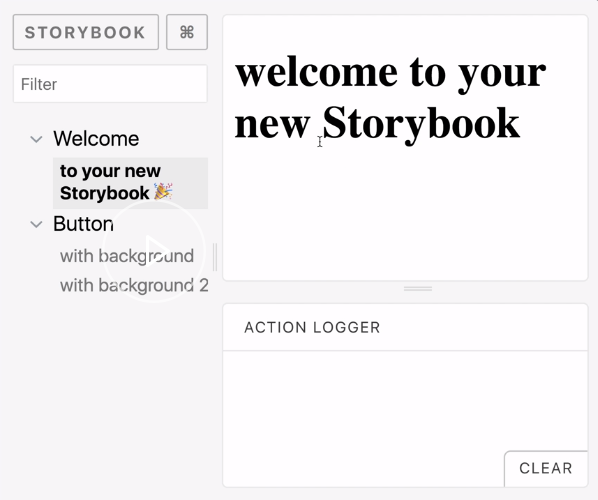

We are going to add a welcome page of our storybook, almost like any other page, except we are going to add it in the `.storybook` folder.

In here, we are going to import the usual `React` and `@storybook/react`, imports. 

#### welcomeStory.js
```javascript
import { storiesOf } from '@storybook/react';
import React from 'react';
```

We are going to define the story, much like we do everywhere else. We add the module, then we say, "To your new storybook," with a ta-da emoji -- that's very important -- and then a little welcome message, "Welcome to your new storybook."

```javascript
import React from 'react';
import { storiesOf } from '@storybook/react';

storiesOf('Welcome', module).add('to your new Storybook 🎉', () => (
  <h1> welcome to your new Storybook</h1>
));
```

Now, all you do to set it up is head to the `config.js`, and notice how we didn't name it `.stories.js`. We just named it `welcomeStory.js`. That's enough because we can just add it here. Because it's sequentially above the rest of the stories, it's always going to show up first.

#### config.js
```javascript
function loadStories() {
  require('./welcomeStory');
  req.keys().forEach(file => req(file));
}
```

When I run the storybook, and I refresh it on the screen, it's going to show the welcome page. It's going to be the first thing that any user sees when they see the storybook.

