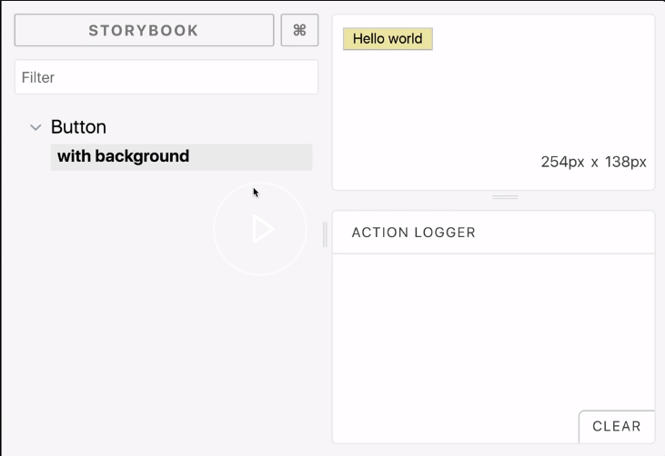
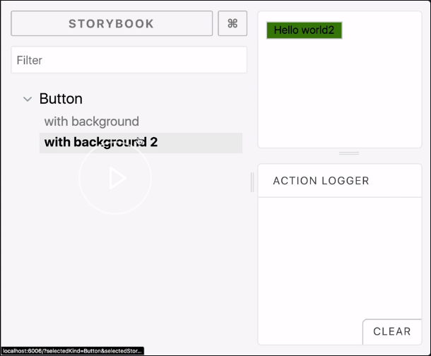

I am going to start by configuring our storybook. First, we import the `configure` method from `@storybook/react`. 

#### config.js
```javascript
import { configure } from '@storybook/react';
```

Then we define a small utility function from `require.context`. What this does is it looks through everything in the `src` folder, and it uses a regex to look for files that end in `stories.js`.

```javascript
const req = require.context('../src', true, /.stories.js$/);
```

We are going to use this in a function called `loadStories`. For every file that matches, we're going to require it, like so. 

```javascript
function loadStories() {
  req.keys().forEach(file => req(file));
}
```

Finally, we are going to pass that function to the `configure` method along with the current module.

```javascript
configure(loadStories, module);
```

Next, we are going to go over to our empty `src` folder and set up our first React component. We are going to `import React from 'react'`.

Then we'll define a small functional component. It's going to take props `bg` and `children`, and render them. That's a simple React component.

```javascript
import React from 'react';

export const Button = ({ bg, children }) => (
  <button style={{ backgroundColor: bg }}> {children}</button>
);
```

Now, we are going to set up the stories for this React component. Make a new file called `Button.stories.js`. Whatever it is, the file name just has to end in `.stories.js` to match up with the regex.

We are going to import `React`, import the `storiesOf` function from `@storybook/react`. We are going to import the component that we just made.

```javascript
import React from 'react';

import { storiesOf } from '@storybook/react';
import { Button } from './Button';
```

Now, to actually define the story, we declaratively say `storiesOf`, and then the category, which is `Button`, the current `module`. Then we'll say `add`.

```javascript
storiesOf('Button', module)
  .add
```

Some description goes here, of the particular story that we want. I am just going to say `with background`, for example.

We'll pass a simple function that is essentially a React's element that implements an instance of whatever we are trying to demonstrate with our story.

I am going to say, "Hello World," over here, and save it. 

```javascript
storiesOf('Button', module)
  .add('with background', () => <Button bg="palegoldenrod">Hello world</Button>)
```

Now when I run storybook, it's going to show the button that we just implement. When I refresh, you can see over here that we have the new button with the background.




If I want to demonstrate other capabilities of the component that I'm demonstrating, I can just make another story and, say, change some of the props, save it, refresh it, and then we'll add a new story here which we can navigate to. 

```javascript
storiesOf('Button', module)
  .add('with background', () => <Button bg="palegoldenrod">Hello world</Button>)
  .add('with background 2', () => <Button bg="green">Hello world2</Button>);
```



That's storybook.