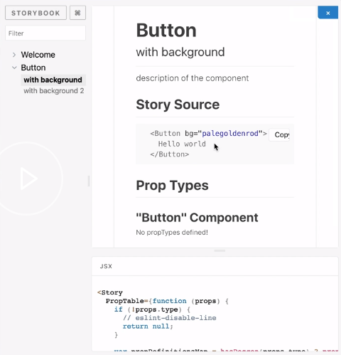
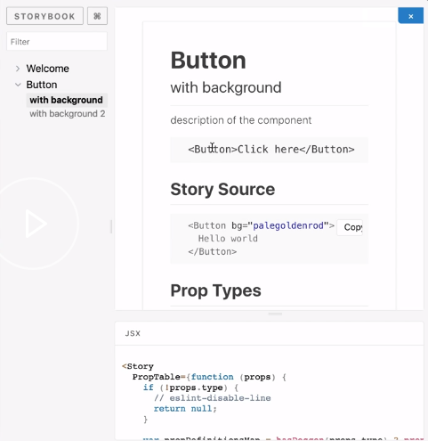
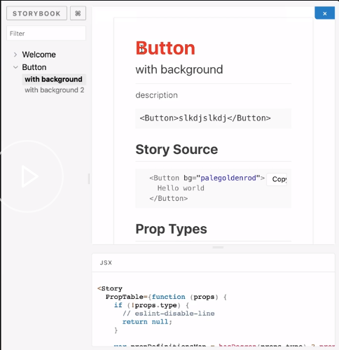
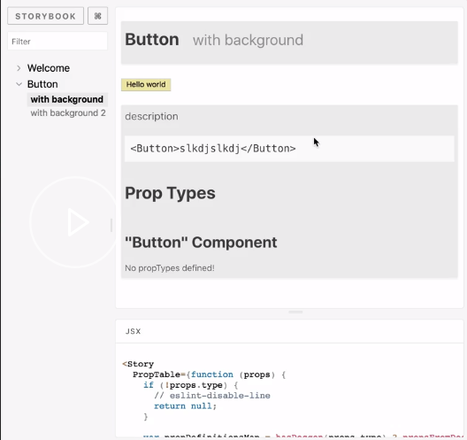

Start by adding the `addon-info` to your storybook project. 

#### console.js
```javascript
yarn add -D @storybook/addon-info
```

The `addon-info` doesn't require additional configuration on top of what you already have. You just have a function called `withInfo`, which you can wrap around your existing elements.

Inside `withInfo`, you can type in some descriptive texts. 

#### Button.stories.js
```javascript
import { withInfo } from '@storybook/addon-info';

storiesOf('Button', module)
    .addWithJSX('with background', withInfo(`description of the component`)
    (() => <Button bg="palegoldenrod">Hello world</Button>))
```

Now, when you run storybook, it will show the text. 

If you click show info on the top right, you will see a description of the component, as also `source` and `types` if you use prop types.



`withInfo` does this markdown, so you can do things like escaping and putting code blocks within your markdown for further descriptive ability. 

```javascript
storiesOf('Button', module)
  .addWithJSX(
    'with background',
    wInfo(`
      description
      
      ~~~js
      <Button>slkdjslkdj</Button>
      ~~~
      `)(() => <Button bg="palegoldenrod">Hello world</Button>),
  )
```

If you save it over here, you should be able to see that additional markdown up in your info box.



You can optionally style your info box by passing in an object, and declaring the component styles, like so. Here, I am putting a red color on the `h1`s, and passing in the same text that I used to have -- description, button.

```javascript
storiesOf('Button', module)
  .addWithJSX(
    'with background',
    withInfo({
        styles: {
            header:{
                h1: {
                    color: 'red',
                },
            },
        },
    },
    text: `
      description
      
      ~~~js
      <Button>slkdjslkdj</Button>
      ~~~
      `)(() => <Button bg="palegoldenrod">Hello world</Button>),
  )
```

If I reload over here, I can see that the `h1` has been styled. 



I don't necessarily recommend defining your own styles inline every single time. I do like setting up utilities folder, `utils.js`, and then defining the styles that I like, particularly the inline display, and then using this as a high-order component from my other stories.

#### utils.js
```javascript
import { withInfo } from '@storybook/addon-info';
const wInfoStyle = {
  header: {
    h1: {
      marginRight: '20px',
      fontSize: '25px',
      display: 'inline',
    },
    body: {
      paddingTop: 0,
      paddingBottom: 0,
    },
    h2: {
      display: 'inline',
      color: '#999',
    },
  },
  infoBody: {
    backgroundColor: '#eee',
    padding: '0px 5px',
    lineHeight: '2',
  },
};
export const wInfo = text =>
  withInfo({ inline: true, source: false, styles: wInfoStyle, text: text });

```

Over in my stories, I can just replace `withInfo` with my new utility, `wInfo from './utils'`. Wherever I used to say `withInfo`, I can just say `wInfo` and skip the styling. That seems a lot more reasonable to use.

#### Button.stories.js

```javascript
storiesOf('Button', module)
  .addWithJSX(
    'with background',
    wInfo(`
      description
      
      ~~~js
      <Button>slkdjslkdj</Button>
      ~~~`)(() => <Button bg="palegoldenrod">Hello world</Button>),
  )
```

Now, when I refresh, this is how it looks by default, with everything inline and no additional click needed on the top right.

