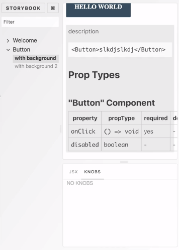
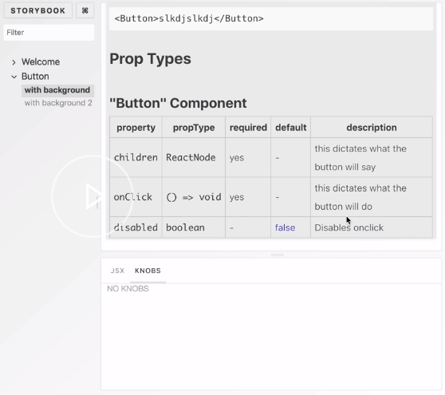

We're going to add `react-docgen-typescript-webpack-plugin`. 

#### console
```javascript
yarn add -D react-docgen-typescript-webpack-plugin
```
To configure the plugin, we're going to go to the `webpack.config.js` and import it. All we need to use it is to just push it into the plugins list of the `defaultConfig`.

#### webpack.config.js
```javascript
const path = require('path');
const TSDocgenPlugin = require('react-docgen-typescript-webpack-plugin');
module.exports = (baseConfig, env, defaultConfig) => {
  // config
  defaultConfig.module.rules.push({
    test: /\.(ts|tsx)$/,
    loader: require.resolve('awesome-typescript-loader'),
  });
  defaultConfig.plugins.push(new TSDocgenPlugin());
  defaultConfig.resolve.extensions.push('.ts', '.tsx');
  return defaultConfig;
};
```

Now, when you run Storybook, this is what you see. 



You should see the `Prop Types` section populated with extra fields. Sometimes, you find you want annotate individual props to tell your users what each of them might do.

Head over to `Button.tsx`, and add extra comments on top of your interface. 

#### Button.tsx
```javascript
export interface Props {
  /** this dictates what the button will say  */
  children: React.ReactNode;
  /** this dictates what the button will do  */
  onClick: () => void;
  /**
   * Disables onclick
   *
   * @default false
   **/
  disabled?: boolean;
}
```
When you reload, you should get full indications of descriptions of each prop, as well as whether something is required, and whether there is a default value.

