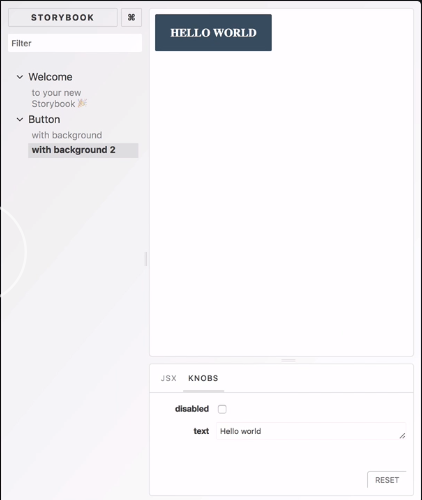
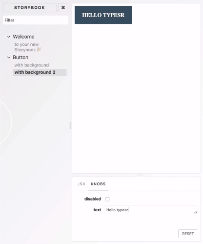

We are going to add two new files, `webpack.config.js` in the special `.storybook` folder, and `tsconfig.json`. We're also going to add a couple of new dependencies, the types definition for `react`, `typescript`, and the `awesome-typescript-loader`. 

#### console
```javascript
yarn add -D @types/react typescript awesome-typescript-loader
```
We're going to head to `tsconfig.json` and set up the typical tsconfig. The main thing to take note of is to have the `jsx` field set to `react`.

#### tsconfig.json
```javascript
{
  "compilerOptions": {
    "outDir": "build/lib",
    "module": "commonjs",
    "target": "es5",
    "lib": ["es5", "es6", "es7", "es2017", "dom"],
    "sourceMap": true,
    "allowJs": false,
    "jsx": "react",
    "moduleResolution": "node",
    "rootDir": "src",
    "baseUrl": "src",
    "forceConsistentCasingInFileNames": true,
    "noImplicitReturns": true,
    "noImplicitThis": true,
    "noImplicitAny": true,
    "strictNullChecks": true,
    "suppressImplicitAnyIndexErrors": true,
    "noUnusedLocals": true,
    "declaration": true,
    "allowSyntheticDefaultImports": true,
    "experimentalDecorators": true
  },
  "include": ["src/**/*"],
  "exclude": ["node_modules", "build", "scripts"]
}
```

Now, we're going to head to set up the `webpack.config.js` inside Storybook. The `webpack.config.js` requires a special format where they pass you the Storybook's internal `webpack.config.js` We're going to use the full config mode to customize it.

We take Storybook's `defaultConfig` and we modify it by pushing on extra rules on top of the rules it already has. For `ts` and `tsx` files, we're going to require that it use TypeScript loader and also make it recognize `ts` and `tsx` files. Make sure to also return `defaultConfig` at the end.

#### weback.config.js
```javascript
const path = require('path');
module.exports = (baseConfig, env, defaultConfig) => {
  // config
  defaultConfig.module.rules.push({
    test: /\.(ts|tsx)$/,
    loader: require.resolve('awesome-typescript-loader'),
  });
  defaultConfig.resolve.extensions.push('.ts', '.tsx');
  return defaultConfig;
};
```

Now that our Storybook can speak TypeScript, it's time to upgrade our `Button.js` file into a `.tsx` file. I've rewritten our button component into a TypeScript React component with extra props with types. 

#### Button.tsx
```javascript
import * as React from 'react';
export interface Props {
  children: React.ReactNode;
  onClick: () => void;
  disabled?: boolean;
}
const noop = () => {};
export const Button = (props: Props) => {
  const { children, onClick, disabled = false } = props;
  const disabledclass = disabled ? 'Button_disabled' : '';
  return (
    <div
      className={`Button ${disabledclass}`}
      onClick={!disabled ? onClick : noop}
    >
      <span>{children}</span>
    </div>
  );
};
```

You can also add some custom CSS just to make styling look better. 

```javascript
import './Button.css';
```

#### Button.css
```css
.Button span {
  margin: auto;
  font-size: 16px;
  font-weight: bold;
  text-align: center;
  color: #fff;
  text-transform: uppercase;
}
.Button {
  padding: 0px 20px;
  height: 49px;
  border-radius: 2px;
  border: 2px solid var(--ui-bkgd, #3d5567);
  display: inline-flex;
  background-color: var(--ui-bkgd, #3d5567);
}

.Button:hover:not(.Button_disabled) {
  cursor: pointer;
}

.Button_disabled {
  --ui-bkgd: rgba(61, 85, 103, 0.3);
}
```

Now, when you run Storybook, this is what you should see.



Now, if you set up your knobs for your story -- for example, here in the second story I have set up the `boolean` knob for the `disabled` prop which just takes true or false, as well as the `text` knob for the child `text` property

#### Button.stories.js
```javascript
import { text, boolean } from '@storybook/addon-knobs/react';

storiesOf('Button', module)
  .addWithJSX(
    'with background',
    wInfo(`
      description
      
      ~~~js
      <Button>slkdjslkdj</Button>
      ~~~
      `)(() => <Button bg="palegoldenrod">Hello world</Button>),
  )
  .addWithJSX('with background 2', () => (
    <Button disabled={boolean('disabled', false)}>
      {text('text', 'Hello world')}
    </Button>
  ));
```

-- I can also play with them here. For example, here I'm toggling on and off the disabled field, as well as editing the text field.

