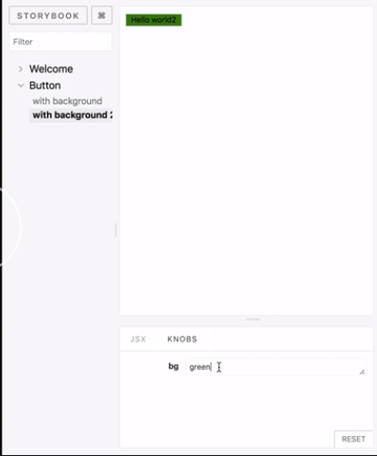
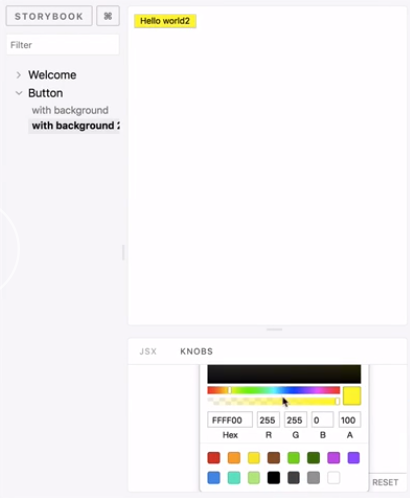

First, we're going to add the Knobs addon to our project. 

#### console
```javascript
yarn add -D @storybook/addon-knobs
```

Then we register it in `addons.js`.

#### addons.js
```javascript
import '@storybook/addon-knobs/register';
```

Next, over in `config.js` we're going to import a new method called decorators, so `addDecorator`. 

We're going to configure that with the `withKnobs` decorator from `addon-knobs`.

#### config.js
```javascript
import { configure, setAddon, addDecorator } from '@storybook/react';
import { withKnobs } from '@storybook/addon-knobs/react';
addDecorator(withKnobs);
```

Now we're all set to use the knobs decorator. Just head over to the stories, import the appropriate knob. For example, I'm importing the `text` knob over here. 

#### Button.stories.js
```javascript
import { text } from '@storybook/addon-knobs/react';
```

Wherever I have text, I can now use the `text` knob to make it dynamic.

```javascript
.addWithJSX('with background 2', () => (
    <Button bg={text('bg', `green`)}>Hello world2</Button>
  ));
```
`bg`, so you just have a label here and then whatever text you want it to submit as your ordinary text. Now when I refresh my storybooks, you can see a new area called `knobs`.



Here I can change it to whatever I want. Let's just say, `purple` It just changes to purple. It's reactive to whatever I do. This is very handy for testing any props that your components may have.

There are a whole range of other knobs, and I encourage you to read the docs to explore them. For example, since we're really using colors here, I can say for the color knob I can have a default value of `green`. I can also have a color-picker over here and pick a different color based on whatever I want.

```javascript
import { color } from '@storybook/addon-knobs/react';
storiesOf('Button', module)
  .addWithJSX(
    'with background',
    wInfo(`
      description
      
      ~~~js
      <Button>slkdjslkdj</Button>
      ~~~
      `)(() => <Button bg="palegoldenrod">Hello world</Button>),
  )
  .addWithJSX('with background 2', () => (
    <Button bg={color('bg', 'green', 'group1')}>Hello world2</Button>
  ));
```

