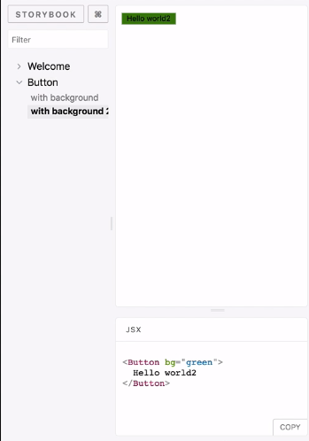

First, we're going to install some dev dependencies for `@storybook/addons`. In particular, we're going to use the `storybook-addon-jsx`.

#### console.js
```javascript
yarn add -D @storybook/addons storybook-addon-jsx
```

To configure the Addons, we're going to create a new file in the `.storybook` folder called `addons.js`, then just declare our dependency `storybook-addon-js/register`, and that calls it within. Internally, this executes a registration function.

#### addons.js
```javascript
import 'storybook-addon-jsx/register';
```

Now over in `config.js`, we're going to import an additional function called `setAddon` from `@storybook/react`, and we're going to import `JSXAddon` from `storybook-addon-jsx`. Then we're just going to pair them together with `setAddon`, `JSXAddon`.

#### config.js
```javascript
import { configure, setAddon } from '@storybook/react';
import JSXAddon from 'storybook-addon-jsx';

setAddon(JSXAddon);
```

That's all the setup we need to do. Now we can use this globally in any of those stories by just saying `addWithJSX` for any JSX component. Since we're using a React code base, this is basically all the components.

### Button.stories.js
```javascript
storiesOf('Button', module)
  .addWithJSX('with background', () => (
    <Button bg="palegoldenrod">Hello world</Button>
  ))
  .addWithJSX('with background 2', () => (
    <Button bg="green">Hello world2</Button>
  ));
```

Now when I `run storybook`, and then I refresh on the right, I can see the JSX of whatever the component I'm demonstrating on the top.

