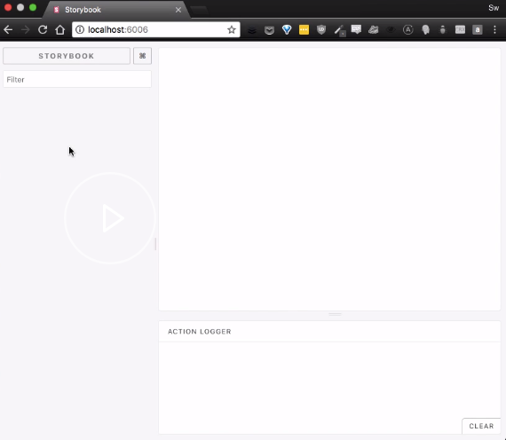

Start from an empty folder. You know this, when you type `ls`, there is nothing in this folder. I'm going to start the project with `yarn init -y`, which answers yes for all the initializing questions and gives me a package.json

#### package.json
```javascript
{
  "name": "egghead-storybook1",
  "version": "1.0.0",
  "main": "index.js",
  "license": "MIT",
}
```

Now, I'm going to add my dependencies, so I type `yarn add -D` for devDependencies. I'm going to add `@storybook/react` for the React version as well as `babel-core` for Babel.

#### console
```javascript
yarn add -D @storybook/react babel-core
```

When you are done installing, you should see `@storybook/react` and `babel-core` in your `devDependencies` section of your `package.json`. 

#### package.json
```javascript
{
  "name": "egghead-storybook1",
  "version": "1.0.0",
  "main": "index.js",
  "license": "MIT",
  "devDependencies": {
    "@storybook/react": "^3.4.3",
    "babel-core": "^6.26.3"
  },
}
```

We're also going to add `react` and `react-dom` as real dependencies.

When the installation is finished, you should have `react` and `react-dom` in your `dependencies` section of your `package.json` file. 

```javascript
{
  "name": "egghead-storybook1",
  "version": "1.0.0",
  "main": "index.js",
  "license": "MIT",
  "devDependencies": {
    "@storybook/react": "^3.4.3",
    "babel-core": "^6.26.3"
  },
    "dependencies": {
    "react": "^16.3.2",
    "react-dom": "^16.3.2"
  }
}
```

Now, I'm using the `mkdir` command to set up two folders, `.storybook` -- which is the special folder for storybook -- and `src`.

We're going to leave the `src` folder empty, but I'm going to set up a empty config file in `.storybook`. This is required for storybook to run. 

#### console
```javascript
touch .storybook/config.js
```

Finally, head too `package.json` and add an npm scripts.

This is not required, but it makes it much more convenient to run your storybook in future. Just type `storybook: "start-storybook -p 6006` which is standard port `-c.storybook` for the folder and that's it.

#### package.json
```javascript
{
  "name": "storybook1-rough",
  "version": "1.0.0",
  "main": "index.js",
  "license": "MIT",
  "devDependencies": {
    "@storybook/react": "^3.4.3",
    "babel-core": "^6.26.3"
  },
  "dependencies": {
    "react": "^16.3.2",
    "react-dom": "^16.3.2"
  },
  "scripts": { "storybook": "start-storybook -p 6006 -c .storybook" }
}
```

When you run `npm run storybook`, it's going to start up a server on [http://localhost:6006](http://localhost:6006), which you can navigate to and see the result. That's your storybook.

