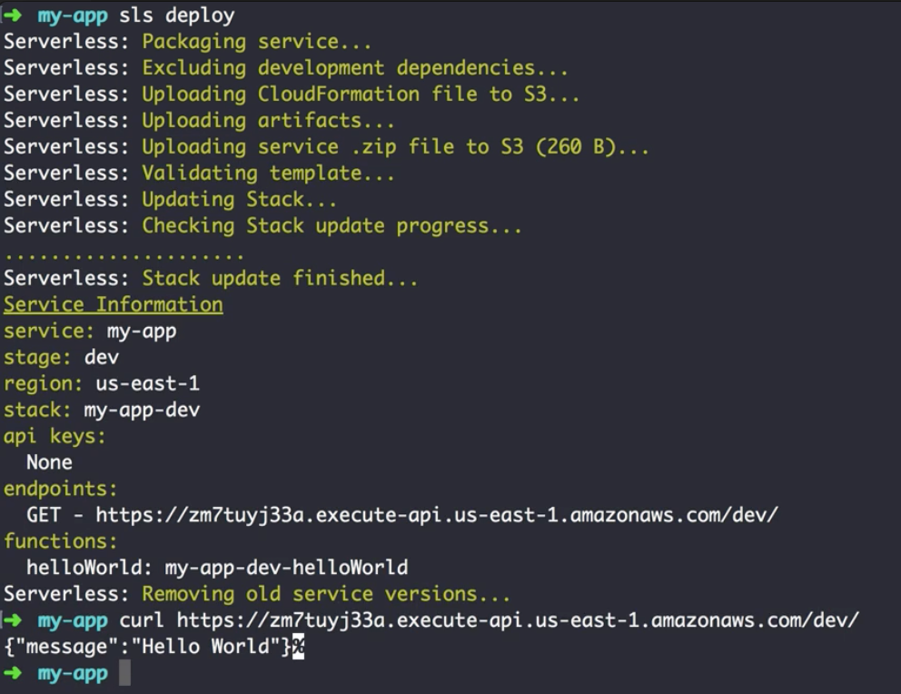

00:02 The Serverless Framework allows us to attach an HTTP endpoint to our lambda function for an `event concept`. In its simplest version, we `define the path and the method`. By the way, by default lambdas can only be invoked using the SDK.

00:15 There are other AWS services like API Gateway that can invoke lambda and under the hood the framework actually is setting up an API Gateway for you, but abstracting away all the overhand. 

#### serverless.yml
```yml
service: my-app

provider:
  name: aws
  runtime: nodejs8.10

functions:
  helloWorld:
    handler: handler.run
    events: 
      - http: 
          path:
          method: get
```
Once you start using the HTTP event, though, the expected response must be an object containing at least a `statusCode` as well as the `body`. In our case, we return a `JSON.stringify()` response.

#### handler.js
```javascript
module.exports.run = async (event) => {
  return{
    statusCode: 200,
    body: JSON.stringify({
      message: "Hello World"
    })
  }
}
```

00:41 Now that everything is set up, we run `sls deploy` in the terminal. Note that in this case, we can't run `sls deploy function` since we changed some configuration. In this case, the API Gateway service needs to be set up. After the deploy succeeded, we can use `curl` to invoke the published endpoint.



01:03 Voila! Works as expected.