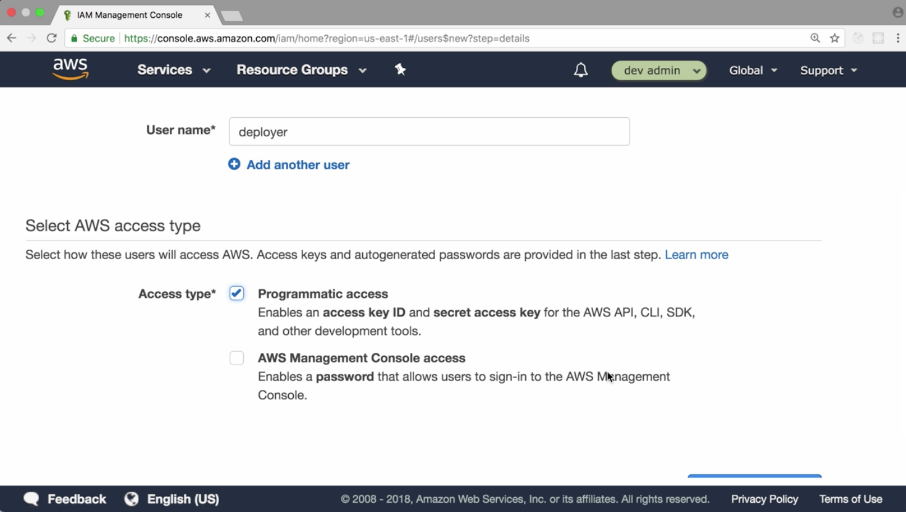
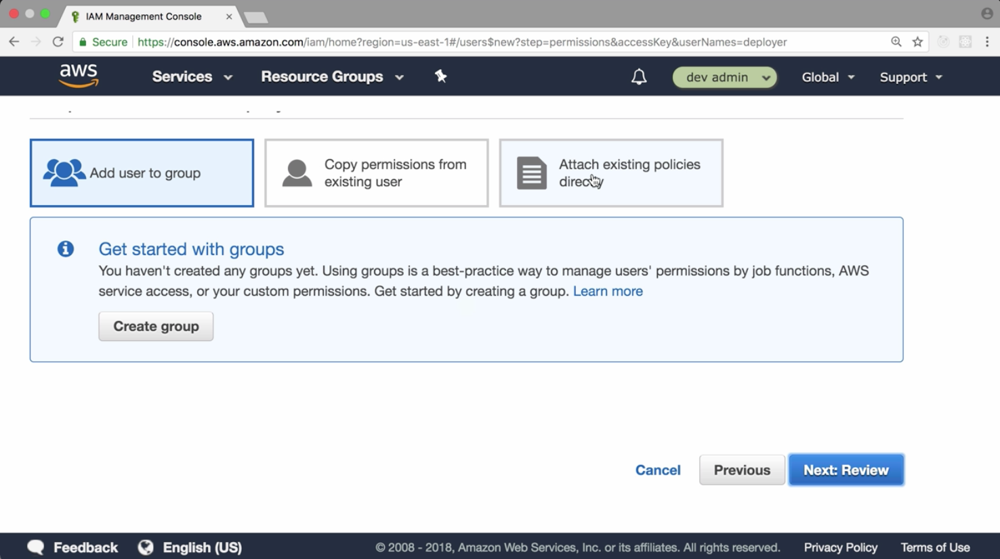
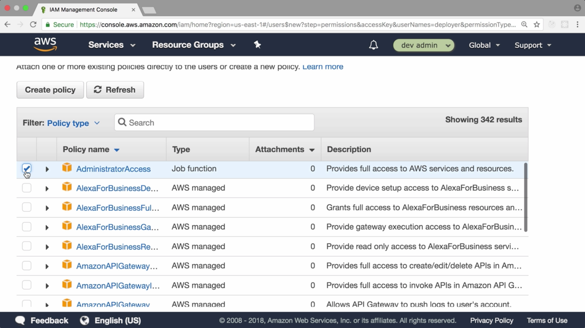
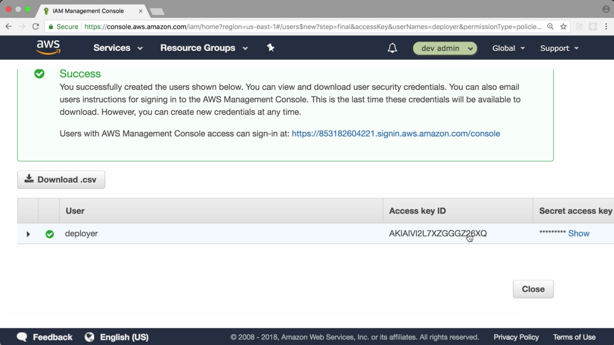
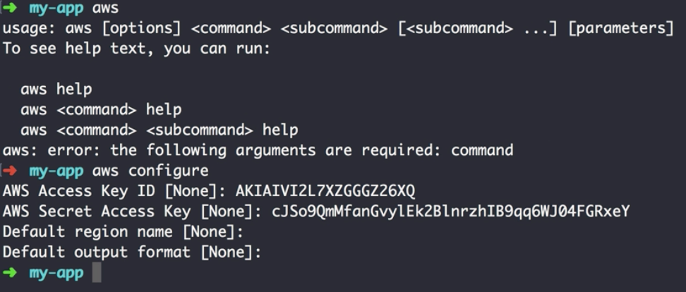

00:00 In order to interact with AWS from a computer, we need to get an access and a secret key with the necessary permissions to deploy an application. To get these keys, we visit the AWS console and switch to the [identity and access management](https://console.aws.amazon.com/iam/home?region=us-east-1#/home).

00:15 Here, we create the new user which we're going to call `deployer`. Feel free to choose any name that you prefer. Make sure to enable programmatic access at the bottom of the page and then move on to the next step.



00:27 Depending on which service you want to use, you can attach only the needed policies. 



For my demo account, I want to be able to experiment a lot and therefore give the user administrator access.



00:42 We confirm. Now we see the keys. 



In order to store them on our system, we `brew install awscli` in the terminal. 

```bash
$ my-app brew install awscli
```

Once finished, we have AWS available. We can run `aws configure`.

```bash
$ my-app aws configure
```

It asks us for our keys. Once we've pasted them into our terminal, we're good to go.

