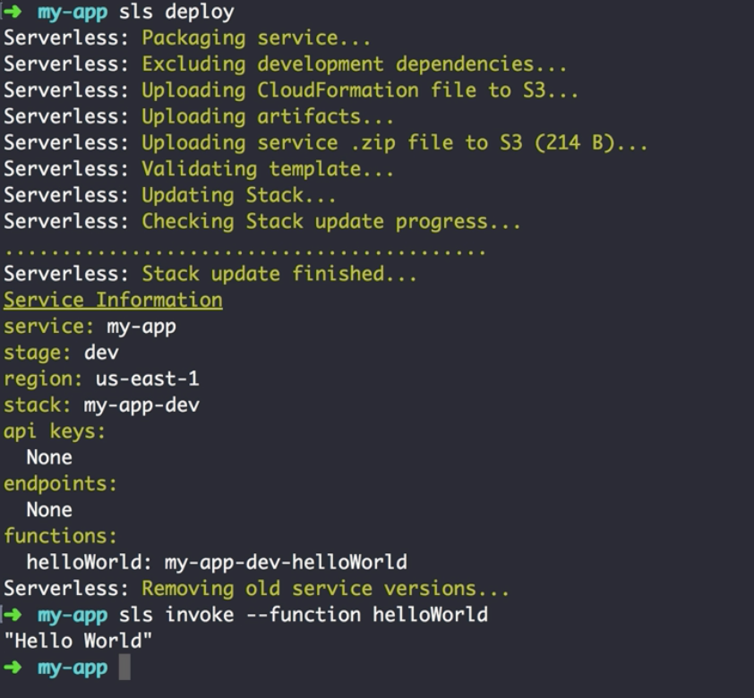
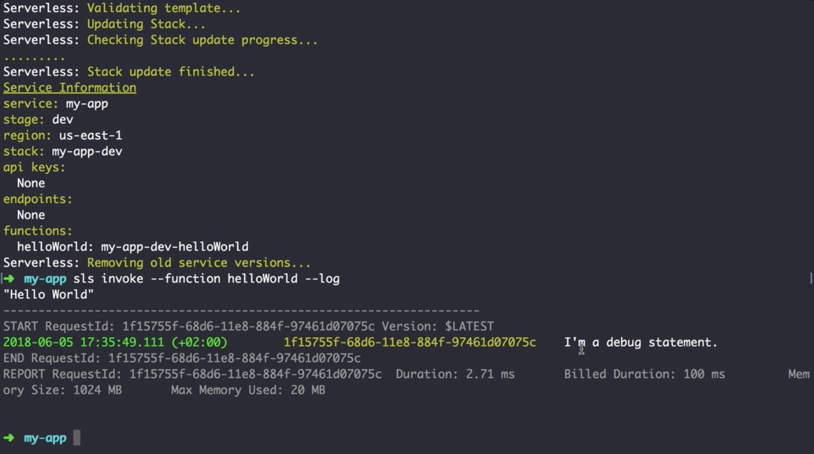
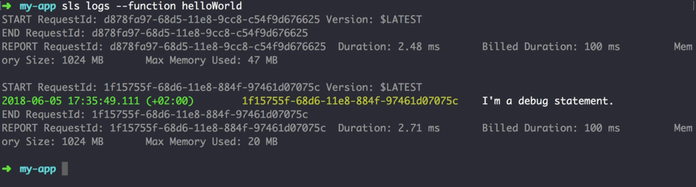
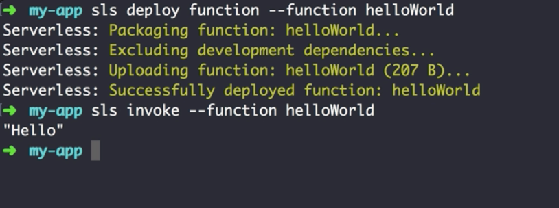
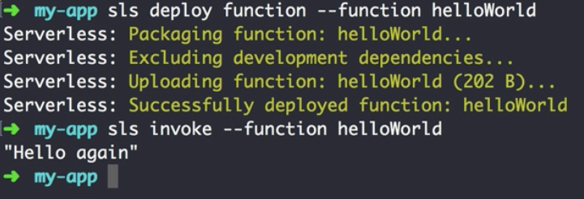

00:00 In order to configure a lambda function, we need to create a `serverless.yml` file. 

```bash
$ my-app touch serverless.yml
```

In here, we define multiple fields. First, we define a `service` name, `my-app`, then set the `provider` and the `runtime: nodejs8.10`. Next up, we allow a `functions` section, and add a `helloWorld` function.

00:22 The `handler` is referring to the file `handler`, which should export a function, `run`. 

#### serverless.yml
```yml
service: my-app

provider:
  name: aws
  runtime: nodejs8.10

functions:
  helloWorld:
    handler: handler.run
```


Since we don't have that file yet, we create `handler.js`. 

```bash
$ my-app touch handler.js
```

We `export` the function `run`, accepting three parameters, `event`, `context`, and `callback`.

00:44 The `event` is an object and contains all the necessary request data. `context` is an object as well. It contains a couple of AWS-specific values, like AWS request ID, log group name, and so on. `callback` is a function and should be invoked with either an error response as the first argument or a valid response as the second argument.

#### handler.js
```javascript
module.exports.run = (event, context, callback) => {
  callback(null, "Hello World")
}
```

01:07 Now we have all we need to deploy our first function. We can run `sls deploy` from our terminal. 

```bash
$ my-app sls deploy
```

This will package up to the function to a ZIP file, and then deploy the whole thing with a cloud formation stack.

01:30 Once deployed, you can invoke the lambda function directly using `sls invoke --function helloWorld`. As expected, it returns "Hello World". 



One cool feature about invoke is that you can also log out a debug statement. Let's try this by adding a `console.log`, redeploy our application.

```javascript
module.exports.run = (event, context, callback) => {
  console.log("I'm a debug statement.")
  callback(null, "Hello World")
}
```

01:58 Once finished, invoke with the `--log` flag, `sls invode --function helloWorld --log`. 



As an alternative, we also can run `sls logs`, which will just return the past logs, `sls logs --function helloWorld`.



02:16 Instead of using the callback function, we simply can return a Promise as well.

```javascript
module.exports.run = (event) => {
  return Promise.resolve("Hello");
}
```

02:28 Now we could redeploy the whole stack, but we are not going to do this, because what we are going to use is `sls deploy function`. 

```bash
$ my-app sls deploy function --function helloWorld
```

This is way faster, as it doesn't go for cloud formation, but instead just replaces the code ZIP for the specific function.

02:44 Once redeployed, we can `sls invoke --function helloWorld`, and see that it only returns "Hello". 



Since Node 8 already supports async await, you also can declare a function as `async` and simply return the desired result. 

```javascript
module.exports.run = async (event) => {
  return "Hello again";
}
  ```

It works like a charm.

