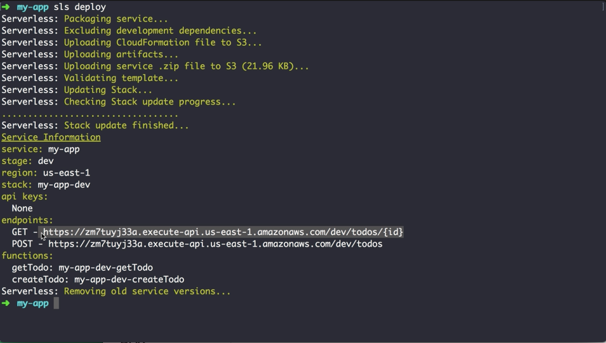
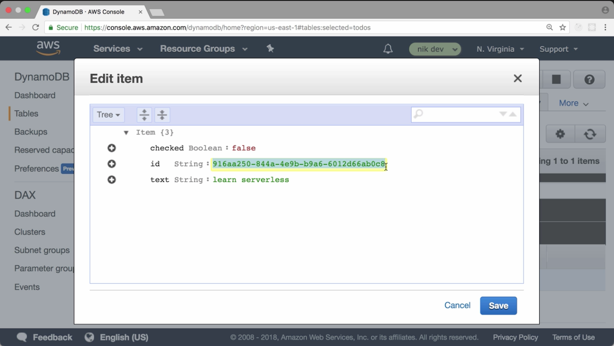
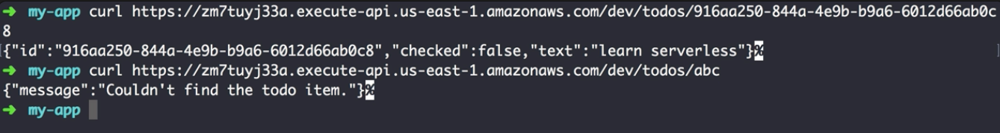
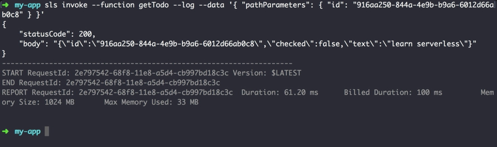

00:00 To retrieve an item from the DynamoDB table, we create a new function in the `serverless.yml` file, `getTodo`, and we attach an `http` event. This time, our path actually should include a path parameter. Using curly braces, we can make it happen.

00:16 The event object then passed to the function will include this parameter `{id}`. Next up, we also need to give the function permissions to actually retrieve an item from DynamoDB. Therefore, we add `dynamodb:GetItem`.

#### serverless.yml
```yml
service: my-app

provider:
  name: aws
  runtime: nodejs8.10
  iamRoleStatements:
    - Effect: Allow
      Action: 
        - dynamodb:PutItem
        - dynamodb:GetItem
      Resource: "arn:aws:dynamodb:us-east-1:853182604221:table/todos"

functions:
  getTodo:
    handler: get.run
    events: 
      - http:
          path: todos/{id}
          method: get
  createTodo:
    handler: create.run
    events:
      - http:
          path: todos
          method: post
```

00:30 Be aware that with this configuration, every function we deploy in this stack will have the same permissions. To lock them down, you need to create custom confirmation EM permissions. Since this isn't that convenient in `serverless.yml`, we're going to skip it for now.

00:47 Our configuration is complete, and we can move on to the code part. We create the file, `get.js`, and fill in our function.

#### Terminal
```bash
$ my-app touch get.js
```

01:13 As previously mentioned, we can access the Key `id` and get it from the `pathParameters.id` inside the event. Then we get the `result`. In case we found an `item`, we're going to return a response with the `statusCode: 200`. In case no item was found, we return a `404` with an error message.

#### get.js
```javascript
const AWS = require("aws-sdk");

const dynamoDb = new AWS.DynamoDB.DocumentClient();

module.exports.run = async (event) => {
  const params = {
    TableName: "todos",
    Key: {
      id: event.pathParameters.id
    }
  };

  const result = await dynamoDb.get(params).promise();
  if (result.Item) {
    return {
      statusCode:200,
      body: JSON.stringify(result.Item)
    };
  } else {
    return {
      statusCode: 404,
      body: JSON.stringify({ message: "Couldn't find the todo item." })
    };
  }
}
```

01:36 Everything is in place, and we can redeploy with our new function.

#### Terminal
```bash
$ my-app sls deploy
```
01:41 Once the deploy was successful, we can retrieve the todo we previously created.





02:19 In the case we provide an id from an entry that doesn't exist, we get a 404, as expected. 



Keep in mind, as an alternative, we can still invoke the function using `sls invoke`. This comes in especially handy in case you added logging statements for debugging.

