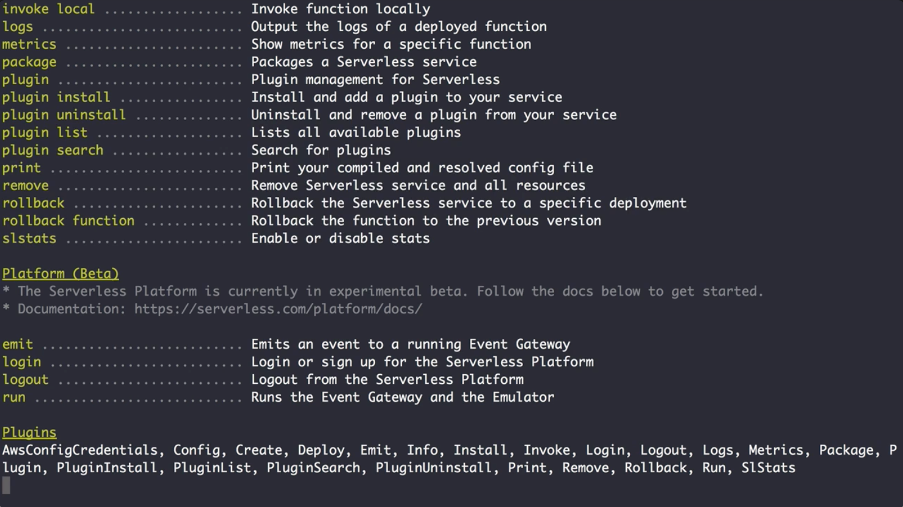
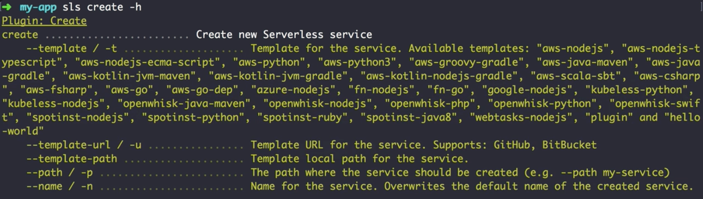

00:00 We install the serverless framework by running `npm install -g serverless`. 

#### Terminal
```bash
$ my-app npm install -g serverless
```

Once it's installed, we can run serverless in our terminal. 

```bash
$ my-app serverless
```
Running the command will show us all the available commands like deploy or invoke.



Since typing out Serverless all the time might get tedious, instead we can use the shortened `sls`.

00:28 In order to get started, Serverless ships a create command providing multiple templates. You can see them after running `sls create -h` for help. 

```bash
$ my-app sls create -h
```



In our case, we're not going to use the create command, but instead create all the necessary configuration in code by hand and explain it on the way.