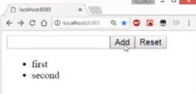

We start off with a bare-bones React-type script application. We are simply rendering the text, "Hello world", from our application component.

#### app.tsx

```typescript
import * as React from 'react';
import * as ReactDOM from 'react-dom';

class Application extends React.Component {
  render() {
    return (
      <div>
        Hello world
      </div>
    );
  }
}

ReactDOM.render(
  <Application />,
  document.getElementById('root')
);
```

To maintain the state logic of your application, we create an `appState.ts`. We bring in the usual suspects from `mobx`, which are the `observable` and `action`.

#### appState.ts

```typescript
import { observable, action } from 'mobx';
```

Now we write down our application requirements. We want to store a list of items as strings, maintain a current string for the user, ability to add this current string to the list of items, and, finally, add an option to reset the application into its initial state.

We can model these requirements as a simple `ApplicationState` class. We store a list of `items`, keep track of a `currentItem`, provide a method to change `this.currentItem`, provide another method to add this `currentItem` to the list of `items`, and, finally, `reset` the application to the initial state.

```typescript
class ApplicationState {
  @observable
  items: string[] = [];

  @observable
  currentItem = '';

  @action
  changeCurrentItem(newValue: string) {
    this.currentItem = newValue;
  }

  @action
  addCurrentItem() {
    this.items.push(this.currentItem);
    this.currentItem = '';
  }

  @action
  reset() {
    this.items = [];
    this.currentItem = '';
  }
}
```
To ensure that our application always has a nice, consistent single state, we create a single instance of the `ApplicationState` class and export that. 

```typescript
export const appState = new ApplicationState();
```
Notice that beyond the non-obtrusive, `@observable` and `@action` annotations, this class is pretty much what anyone with basic knowledge of JavaScript would have written straight out of school.

Let's create a UI for our application that uses features of the state class. You can make your application complex with ideas like provider and connect and even third-party libraries that add more complex concepts and even more boilerplate, but really, with MobX you don't need to.

All you need is the `@observer` annotation. To use the state class, you simply bring in the singleton and use it within the `render` method of your application.

#### app.tsx
```typescript
import { observer } from 'mobx-react';
import { appState } from './appState';

@observer
class Application extends React.Component {
}
```

Within the application `render` method, we go ahead and create a new `<form>`. `onSubmit`, we prevent the browser default of posting back at the URL and simply call `appState.addCurrentItem`.

```typescript
<form onSubmit={e => {
  e.preventDefault();
  appState.addCurrentItem();
}}>
```

We wire an `input` to the `appState.currentItem` and `appState.changeCurrentItem` method. 

```typescript
<input
    value={appState.currentItem}
    onChange={e => appState.changeCurrentItem(e.target.value)} />
```

We provide a `<button>` to add the current item to the list by simply invoking the form Submit.

```typescript
 <button type="submit">
    Add
</button>
```

Next we add a `<button>` that goes ahead and resets the application to the initial state. 

```typescript
<button type="button" onClick={() => appState.reset()}>
    Reset
</button>
```

Finally, we render out an unordered list of all the `items` that are currently in the list. 

```typescript
<ul>
  {appState.items.map((item, index) => {
    return (
        <li key={index}>{item}</li>
    );
  })}
</ul>
```

If we go ahead and run the application, you can see that we can provide a current item value using the input, submit the form using the enter key, also submit the form using the add button.



Finally, reset the application to the initial state. Notice that you use the application state class pattern. We really didn't have to do anything special in the UI beyond the simple `@observer` annotation.

Additionally, we get a nice refactorable-type safe experience, as we know all the ways the app state is used in our UI. This simple application state class pattern is simple to understand and is fundamentally easier to maintain and describe to new developers and maintain for experienced developers in the long run.

Also, if you have complex business logic in this class, you can test this single instance without having to wire it up to React.